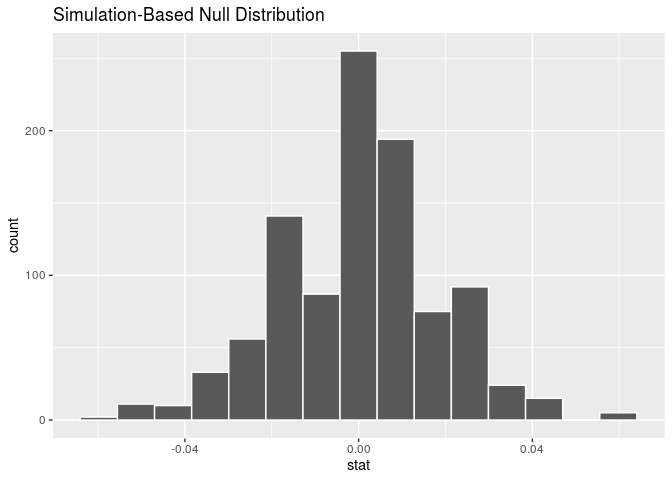

An Analysis of African Systemic Crises
================
Beck Addison, Jerry Lin, Isabella Swigart, Emma Hirschkop
12/3/2019

Your data analysis goes here\!

``` r
#install.packages("countrycode") - already installed
#install.packages("infer")
library(infer)
library(tidyverse)
```

    ## ── Attaching packages ────────────────────────────────────────────────────── tidyverse 1.2.1 ──

    ## ✔ ggplot2 3.2.1     ✔ purrr   0.3.2
    ## ✔ tibble  2.1.3     ✔ dplyr   0.8.3
    ## ✔ tidyr   1.0.0     ✔ stringr 1.4.0
    ## ✔ readr   1.3.1     ✔ forcats 0.4.0

    ## ── Conflicts ───────────────────────────────────────────────────────── tidyverse_conflicts() ──
    ## ✖ dplyr::filter() masks stats::filter()
    ## ✖ dplyr::lag()    masks stats::lag()

``` r
library(countrycode)
```

``` r
africa <- read_csv("../data/african_crises.csv")
```

    ## Parsed with column specification:
    ## cols(
    ##   case = col_double(),
    ##   cc3 = col_character(),
    ##   country = col_character(),
    ##   year = col_double(),
    ##   systemic_crisis = col_double(),
    ##   exch_usd = col_double(),
    ##   domestic_debt_in_default = col_double(),
    ##   sovereign_external_debt_default = col_double(),
    ##   gdp_weighted_default = col_double(),
    ##   inflation_annual_cpi = col_double(),
    ##   independence = col_double(),
    ##   currency_crises = col_double(),
    ##   inflation_crises = col_double(),
    ##   banking_crisis = col_character()
    ## )

``` r
global <- read_csv("../data/global_crisis_data.csv")
```

    ## Parsed with column specification:
    ## cols(
    ##   .default = col_character(),
    ##   Case = col_double(),
    ##   Year = col_double(),
    ##   exch_usd = col_double(),
    ##   exch_usd_alt1 = col_double(),
    ##   exch_usd_alt2 = col_double(),
    ##   exch_usd_alt3 = col_double(),
    ##   `SOVEREIGN EXTERNAL DEBT 2: DEFAULT and RESTRUCTURINGS, 1800-2012--Does not include defaults on WWI debt to United States and United Kingdom but includes post-1975 defaults on Official External Creditors` = col_double()
    ## )

    ## See spec(...) for full column specifications.

    ## Warning: 891 parsing failures.
    ##  row      col expected actual                             file
    ## 1228 exch_usd a double    n/a '../data/global_crisis_data.csv'
    ## 1229 exch_usd a double    n/a '../data/global_crisis_data.csv'
    ## 1230 exch_usd a double    n/a '../data/global_crisis_data.csv'
    ## 1231 exch_usd a double    n/a '../data/global_crisis_data.csv'
    ## 1232 exch_usd a double    n/a '../data/global_crisis_data.csv'
    ## .... ........ ........ ...... ................................
    ## See problems(...) for more details.

``` r
gdps <- read_csv("../data/world_gdp_data.csv")
```

    ## Parsed with column specification:
    ## cols(
    ##   .default = col_double(),
    ##   `Country Name` = col_character(),
    ##   `Country Code` = col_character(),
    ##   `Indicator Name` = col_character(),
    ##   `Indicator Code` = col_character()
    ## )
    ## See spec(...) for full column specifications.

Our analysis begins with two datasets: our original African economic
crises dataset, which contains numerical variables like inflation rate,
exchange rate against the US dollar, and debt vs. GDP ratio. Another
helpful variable to analyze would be each country’s GDP, so we
downloaded world GDP data from the World Bank, and joined this data with
our Africa dataset.

``` r
gdps <- gdps %>%
  pivot_longer(
    cols = c(
      -`Country Name`,
      -`Country Code`,
      -`Indicator Name`,
      -`Indicator Code`),
    names_to = "year"
  ) %>%
  rename(
    cc3 = `Country Code`,
    indicator_code = `Indicator Code`,
    indicator_name = `Indicator Name`,
    country = `Country Name`,
    gdp = value
    )

african_gdps <- gdps %>%
  merge(., africa, by = c("country","cc3","year"))

global <- global[-1,] %>%
  select(-`<`) %>%
  rename(
    case = Case,
    cc3 = CC3,
    country = Country,
    year = Year,
    banking_crisis = `Banking Crisis`,
    systemic_crisis = `Systemic Crisis`,
    gold_standard = `Gold Standard`,
    nat_currency = `national currency`,
    sov_ext_debt = 
    `SOVEREIGN EXTERNAL DEBT 1: DEFAULT and RESTRUCTURINGS, 1800-2012--Does not include defaults on WWI debt to United States and United Kingdom and post-1975 defaults on Official External Creditors`,
    sov_ext_debt_post1975 = `SOVEREIGN EXTERNAL DEBT 2: DEFAULT and RESTRUCTURINGS, 1800-2012--Does not include defaults on WWI debt to United States and United Kingdom but includes post-1975 defaults on Official External Creditors`,
    exc_primary = `exch_primary source code`,
    domest_debt_default = `Domestic_Debt_In_Default`,
    domest_debt_notes = `Domestic_Debt_ Notes/Sources`,
    default_ext_notes = `Defaults_External_Notes`,
    gdp_weighted_default = `GDP_Weighted_default`,
    inflat_aver_consumer_prices = `Inflation, Annual percentages of average consumer prices`,
    curr_crises = `Currency Crises`,
    independence = `Independence`,
    inflat_crises = `Inflation Crises`
) %>%
  mutate(
    banking_crisis = as.logical(as.numeric(
      banking_crisis
      )),
    systemic_crisis = as.logical(as.numeric(
      systemic_crisis
    )),
    gold_standard = as.logical(as.numeric(
      gold_standard
    )),
    domest_debt_default = as.logical(as.numeric(
      domest_debt_default
    )),
    independence = as.logical(as.numeric(
      independence
    )),
    curr_crises = as.logical(as.numeric(
      curr_crises
    )),
    inflat_crises = as.logical(as.numeric(
      inflat_crises
    ))
  )
```

    ## Warning: NAs introduced by coercion
    
    ## Warning: NAs introduced by coercion
    
    ## Warning: NAs introduced by coercion
    
    ## Warning: NAs introduced by coercion
    
    ## Warning: NAs introduced by coercion

## Question 2: Hypothesis Testing

#### Was an economic crisis more likely following n years after decolonization?

Consider the following: for each country, we’ll determine how many years
after independence a country will typically experience its next crisis.

``` r
output <- tibble(country = distinct(africa, country)$country)
output$independence_year <- africa %>%
  filter(independence == 1) %>%
  group_by(country) %>%
  filter(row_number()==1) %>%
  ungroup() %>%
  select(year)
  
output$crisis_year <- africa %>%
  filter(independence == 1) %>%
  group_by(country) %>%
  filter(banking_crisis == "crisis") %>%
  filter(row_number() == 1) %>%
  ungroup() %>%
  select(year)
output <- output %>%
  mutate(difference = (crisis_year$year - independence_year$year))
ggplot(data = output, mapping = aes(y = difference)) +
  geom_boxplot() + 
  labs(
    title = "What's the typical amount of years between a country 
    achieving independence and its next financial crisis?",
    y = "Number of Years")
```

<!-- -->

``` r
output %>%
  summarise(IQR = IQR(difference), median = median(difference), mean = mean(difference))
```

    ## # A tibble: 1 x 3
    ##     IQR median  mean
    ##   <dbl>  <dbl> <dbl>
    ## 1    11     30  31.3

We see that the median amount of years a country will first encounter a
banking crisis after they achieve independence is about 30 years, with
an interquartile range of 11 years and a mean of 31.3 years.

We’re really interested in the economic stability of independent
vs. colonized African countries. In particular, we’re wondering if
post-independence African countries see a higher proportion of systemic
crises (per year) compared to before independence. Let’s examine it:

``` r
crisis_prop <- africa %>%
  group_by(country, independence) %>%
  summarise(crisis_prop = sum(systemic_crisis)/n())
crisis_prop
```

    ## # A tibble: 25 x 3
    ## # Groups:   country [13]
    ##    country                  independence crisis_prop
    ##    <chr>                           <dbl>       <dbl>
    ##  1 Algeria                             0      0.0263
    ##  2 Algeria                             1      0.0638
    ##  3 Angola                              0      0     
    ##  4 Angola                              1      0     
    ##  5 Central African Republic            0      0     
    ##  6 Central African Republic            1      0.345 
    ##  7 Egypt                               1      0.0387
    ##  8 Ivory Coast                         0      0     
    ##  9 Ivory Coast                         1      0.0727
    ## 10 Kenya                               0      0     
    ## # … with 15 more rows

``` r
overall_crisis_prop <- africa %>%
  group_by(independence) %>%
  summarise(overall_crisis_prop = sum(systemic_crisis)/n())
overall_crisis_prop
```

    ## # A tibble: 2 x 2
    ##   independence overall_crisis_prop
    ##          <dbl>               <dbl>
    ## 1            0             0.00422
    ## 2            1             0.0985

Based on our sample, we see that on average, there is a 0.42% chance of
a systemic crisis occurring in any given year for a non-independent
country, while there is a 9.85% chance of a systemic crisis occurring in
any given year for a independent country. The difference in proportions
is 0.094320737.

We’d like to conduct a hypothesis test to see if there is a difference
in proportions of systemic crises between independent and
non-independent countries across all African countries. Our null
hypothesis is that the proportion of systemic crises between independent
and non-independent African countries is the same; the observed
difference is due to chance Our alternative hypothesis is that the
proportion of systemic crises between independent and non-independent
African countries is different.

Since we’re testing for independence, we’ll use permute. We’ll modify
our dataset slightly by factoring success into a categorical variable so
that it’ll work nicely with infer.

Before we run the hypothesis test, we need to quickly factor
systemic\_crisis to be a categorical variable:

``` r
africa <- africa %>%
  mutate(systemic_crisis = factor(systemic_crisis)) %>%
  mutate(independence = factor(independence))
```

``` r
null_dist <- africa %>%
  specify(response = systemic_crisis, explanatory = independence, success = "1") %>%
  hypothesize(null = "independence") %>%
  generate(1000, type = "permute") %>%
  calculate(stat = "diff in props", 
            order = c("1", "0"))
visualize(null_dist)
```

<!-- -->

``` r
get_p_value(null_dist, obs_stat = 0.094320737, direction = "two_sided")
```

    ## # A tibble: 1 x 1
    ##   p_value
    ##     <dbl>
    ## 1       0

Since our p-value of 0 is less than our significance level of 0.05, we
reject the null hypothesis. The data provides convincing evidence that
there is a difference in the proportion of systemic crises between
non-independent and independent African
countries.

#### Is there a difference between GDP of North African and sub-Saharan African countries?

1.  Label the countries
2.  Calculate GDP diff.
3.  Do hypothesis testing.
