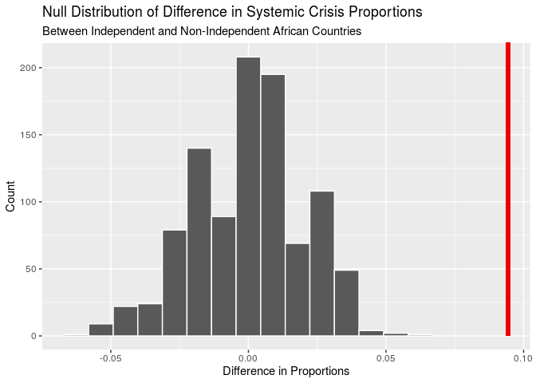
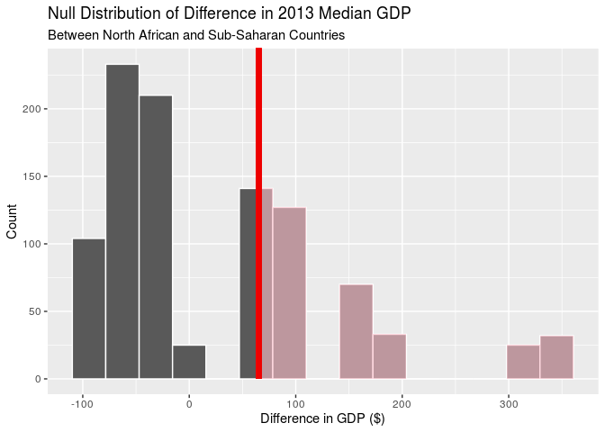

An Analysis of African Systemic Crises
================
Beck Addison, Jerry Lin, Isabella Swigart, Emma Hirschkop
12/3/2019

``` r
#install.packages(c("infer","countrycode","pracma"))
library(infer)
library(tidyverse)
library(countrycode)
library(pracma)
library(broom)
library(knitr)
```

``` r
africa <- read_csv("../data/african_crises.csv")
global <- read_csv("../data/global_crisis_data.csv")
gdps <- read_csv("../data/world_gdp_data.csv")
```

Our analysis begins with two datasets: our original African economic
crises dataset, which contains numerical variables like inflation rate,
exchange rate against the US dollar, and debt vs. GDP ratio. Another
helpful variable to analyze would be each country’s GDP, so we
downloaded world GDP data from the World Bank, and joined this data with
our Africa dataset. We then cleaned up the dataset by renaming some
variables and changing their types from integers to booleans.

``` r
gdps <- gdps %>%
  pivot_longer(
    cols = c(
      -`Country Name`,
      -`Country Code`,
      -`Indicator Name`,
      -`Indicator Code`),
    names_to = "year"
  ) %>%
  rename(
    cc3 = `Country Code`,
    indicator_code = `Indicator Code`,
    indicator_name = `Indicator Name`,
    country = `Country Name`,
    gdp = value
    )

african_gdps <- gdps %>%
  merge(., africa, by = c("country","cc3","year"))

african_gdps$year <- african_gdps$year %>%
  as.numeric()

global <- global[-1,] %>%
  select(-`<`) %>%
  rename(
    case = Case,
    cc3 = CC3,
    country = Country,
    year = Year,
    banking_crisis = `Banking Crisis`,
    systemic_crisis = `Systemic Crisis`,
    gold_standard = `Gold Standard`,
    nat_currency = `national currency`,
    sov_ext_debt = 
    `SOVEREIGN EXTERNAL DEBT 1: DEFAULT and RESTRUCTURINGS, 1800-2012--Does not include defaults on WWI debt to United States and United Kingdom and post-1975 defaults on Official External Creditors`,
    sov_ext_debt_post1975 = `SOVEREIGN EXTERNAL DEBT 2: DEFAULT and RESTRUCTURINGS, 1800-2012--Does not include defaults on WWI debt to United States and United Kingdom but includes post-1975 defaults on Official External Creditors`,
    exc_primary = `exch_primary source code`,
    domest_debt_default = `Domestic_Debt_In_Default`,
    domest_debt_notes = `Domestic_Debt_ Notes/Sources`,
    default_ext_notes = `Defaults_External_Notes`,
    gdp_weighted_default = `GDP_Weighted_default`,
    inflat_aver_consumer_prices = `Inflation, Annual percentages of average consumer prices`,
    curr_crises = `Currency Crises`,
    independence = `Independence`,
    inflat_crises = `Inflation Crises`
) %>%
  mutate(
    banking_crisis = as.logical(as.numeric(
      banking_crisis
      )),
    systemic_crisis = as.logical(as.numeric(
      systemic_crisis
    )),
    gold_standard = as.logical(as.numeric(
      gold_standard
    )),
    domest_debt_default = as.logical(as.numeric(
      domest_debt_default
    )),
    independence = as.logical(as.numeric(
      independence
    )),
    curr_crises = as.logical(as.numeric(
      curr_crises
    )),
    inflat_crises = as.logical(as.numeric(
      inflat_crises
    ))
  )

options(scipen = 999)
```

## Question 1: Hypothesis Testing

#### Was an economic crisis more likely following n years after decolonization?

Consider the following: for each country, we’ll determine how many years
after independence a country will typically experience its next crisis.

``` r
output <- tibble(country = distinct(africa, country)$country)
output$independence_year <- africa %>%
  filter(independence == 1) %>%
  group_by(country) %>%
  filter(row_number()==1) %>%
  ungroup() %>%
  select(year)
  
output$crisis_year <- africa %>%
  filter(independence == 1) %>%
  group_by(country) %>%
  filter(banking_crisis == "crisis") %>%
  filter(row_number() == 1) %>%
  ungroup() %>%
  select(year)
output <- output %>%
  mutate(difference = (crisis_year$year - independence_year$year))
ggplot(data = output, mapping = aes(y = difference)) +
  geom_boxplot() + 
  labs(
    title = "What's the typical amount of years between a country 
    achieving independence and its next financial crisis?",
    y = "Number of Years")
```

<!-- -->

``` r
output %>%
  summarise(IQR = IQR(difference), median = median(difference), mean = mean(difference))
```

    ## # A tibble: 1 x 3
    ##     IQR median  mean
    ##   <dbl>  <dbl> <dbl>
    ## 1    11     30  31.3

We see that the median amount of years a country will first encounter a
banking crisis after they achieve independence is about 30 years, with
an interquartile range of 11 years and a mean of 31.3 years.

We’re really interested in the economic stability of independent
vs. colonized African countries. In particular, we’re wondering if
post-independence African countries see a higher proportion of systemic
crises (per year) compared to before independence. Let’s examine it:

``` r
africa %>%
  group_by(country, independence) %>%
  summarise(crisis_prop = sum(systemic_crisis)/n())
```

    ## # A tibble: 25 x 3
    ## # Groups:   country [13]
    ##    country                  independence crisis_prop
    ##    <chr>                           <dbl>       <dbl>
    ##  1 Algeria                             0      0.0263
    ##  2 Algeria                             1      0.0638
    ##  3 Angola                              0      0     
    ##  4 Angola                              1      0     
    ##  5 Central African Republic            0      0     
    ##  6 Central African Republic            1      0.345 
    ##  7 Egypt                               1      0.0387
    ##  8 Ivory Coast                         0      0     
    ##  9 Ivory Coast                         1      0.0727
    ## 10 Kenya                               0      0     
    ## # … with 15 more rows

``` r
africa %>%
  group_by(independence) %>%
  summarise(overall_crisis_prop = sum(systemic_crisis)/n())
```

    ## # A tibble: 2 x 2
    ##   independence overall_crisis_prop
    ##          <dbl>               <dbl>
    ## 1            0             0.00422
    ## 2            1             0.0985

Based on our sample, we see that on average, there is a 0.42% chance of
a systemic crisis occurring in any given year for a non-independent
country, while there is a 9.85% chance of a systemic crisis occurring in
any given year for a independent country. The difference in these
proportions is 0.094320737.

We’d like to conduct a hypothesis test to see if there is a significant
difference in proportions of systemic crises between independent and
non-independent countries across all African countries. Our null
hypothesis is that the proportion of systemic crises between independent
and non-independent African countries is the same; the observed
difference is due to chance. Our alternative hypothesis is that the
proportion of systemic crises between independent and non-independent
African countries is different.

Since we’re testing for independence, we’ll use permutation. We’ll
modify our dataset slightly by factoring success into a categorical
variable so that it’ll work nicely with infer.

Before we run the hypothesis test, we need to quickly factor
systemic\_crisis to be a categorical variable:

``` r
fct_africa <- africa %>%
  mutate(systemic_crisis = factor(systemic_crisis)) %>%
  mutate(independence = factor(independence))
```

``` r
set.seed(1)
null_dist <- fct_africa %>%
  specify(response = systemic_crisis, explanatory = independence, 
          success = "1") %>%
  hypothesize(null = "independence") %>%
  generate(1000, type = "permute") %>%
  calculate(stat = "diff in props", 
            order = c("1", "0"))
get_p_value(null_dist, obs_stat = 0.094320737, direction = "both")
```

    ## # A tibble: 1 x 1
    ##   p_value
    ##     <dbl>
    ## 1       0

``` r
visualize(null_dist) +
  shade_p_value(0.094320737, "both") +
  labs(title = "Null Distribution of Difference in Systemic Crisis Proportions", subtitle = "Between Independent and Non-Independent African Countries", x = "Difference in Proportions", 
       y = "Count")
```

<!-- -->

Since our p-value of 0 is less than our significance level of 0.05, we
reject the null hypothesis. The data provides convincing evidence that
there is a difference in the proportion of systemic crises between
non-independent and independent African
countries.

## Question 2: Hypothesis Testing

#### Is there a difference between GDP and systemic crises in North African and sub-Saharan African countries?

We’re interested in seeing if there’s a noticeable difference in
economic stability and prosperity between North African and sub-Saharan
African countries. We can evaluate this using data for GDP and systemic
crises.

To answer this question, we need to label North African and sub-Saharan
countries in our Africa dataset.

``` r
fct_africa <- fct_africa %>%
  mutate(region = case_when(
    country == "Algeria" ~ "n",
    country == "Angola" ~ "s",
    country == "Central African Republic" ~ "s",
    country == "Egypt" ~ "n",
    country == "Ivory Coast" ~ "s",
    country == "Kenya" ~ "s",
    country == "Mauritius" ~ "s",
    country == "Morocco" ~ "n",
    country == "Nigeria" ~ "s",
    country == "South Africa" ~ "s",
    country == "Tunisia" ~ "n",
    country == "Zambia" ~ "s",
    country == "Zimbabwe" ~ "s"
  ))
africa <- africa %>%
  mutate(region = case_when(
    country == "Algeria" ~ "n",
    country == "Angola" ~ "s",
    country == "Central African Republic" ~ "s",
    country == "Egypt" ~ "n",
    country == "Ivory Coast" ~ "s",
    country == "Kenya" ~ "s",
    country == "Mauritius" ~ "s",
    country == "Morocco" ~ "n",
    country == "Nigeria" ~ "s",
    country == "South Africa" ~ "s",
    country == "Tunisia" ~ "n",
    country == "Zambia" ~ "s",
    country == "Zimbabwe" ~ "s"
  ))
african_gdps <- african_gdps %>%
  mutate(region = case_when(
    country == "Algeria" ~ "n",
    country == "Angola" ~ "s",
    country == "Central African Republic" ~ "s",
    country == "Egypt" ~ "n",
    country == "Ivory Coast" ~ "s",
    country == "Kenya" ~ "s",
    country == "Mauritius" ~ "s",
    country == "Morocco" ~ "n",
    country == "Nigeria" ~ "s",
    country == "South Africa" ~ "s",
    country == "Tunisia" ~ "n",
    country == "Zambia" ~ "s",
    country == "Zimbabwe" ~ "s"
  ))
```

Let’s calculate the median GDP for North African and sub-Saharan
countries.

When calculating GDP by region, we’ll use 2014 GDP data since it’s
recent and available for all 13 African countries in our dataset.

``` r
regional_mean_gdps <- african_gdps %>%
  filter(year == 2014) %>%
  group_by(region) %>%
  summarise(avg_gdp = median(gdp))

regional_mean_gdps
```

    ## # A tibble: 2 x 2
    ##   region       avg_gdp
    ##   <chr>          <dbl>
    ## 1 n      110081000000 
    ## 2 s       44299338704.

``` r
rmg <- regional_mean_gdps %>%
  pull(avg_gdp)
```

The average GDP for North African countries is 110081000000; the average
GDP for sub-Saharan countries is 44299338704.5. Therefore, the
difference in median GDP between North African and sub-Saharan countries
is 65781661295.5.

The first research question we’ll ask is: is there a difference in
median GDP among all North African and sub-Saharan countries?

Our null hypothesis is that the median GDP of North African and
sub-Saharan countries is the same; the observed difference is due to
chance. Our alternative hypothesis is that the median GDP of independent
and non-independent African countries is different.

Since we’re testing for independence, we’ll use permute.

``` r
set.seed(1)
gdp_2014 <- african_gdps %>%
  filter(year == 2014)

null_dist2 <- gdp_2014 %>%
  specify(response = gdp, explanatory = region) %>%
  hypothesize(null = "independence") %>%
  generate(1000, type = "permute") %>%
  calculate(stat = "diff in medians", 
            order = c("n", "s"))
get_p_value(null_dist2, obs_stat = rmg[1] - rmg[2], direction = "two_sided")
```

    ## # A tibble: 1 x 1
    ##   p_value
    ##     <dbl>
    ## 1   0.614

``` r
visualize(null_dist2) +
  shade_p_value(65781661296, "both") +
  labs(title = "Null Distribution of Difference in 2014 Median GDP", subtitle = "Between North African and Sub-Saharan Countries", x = "Difference in GDP ($)", 
       y = "Count")
```

<!-- -->

Since our p-value of 0.528 is greater than our significance level of
0.05, we fail to reject the null hypothesis. The data does not provide
convincing evidence that there is a significant difference between the
median GDP of North African countries comapred to sub-Saharan countries.

Next, let’s calculate the proportion of systemic crises for North
African and sub-Saharan countries.

``` r
africa %>%
  group_by(region) %>%
  summarise(overall_crisis_prop = sum(systemic_crisis)/n())
```

    ## # A tibble: 2 x 2
    ##   region overall_crisis_prop
    ##   <chr>                <dbl>
    ## 1 n                   0.0436
    ## 2 s                   0.0972

The proportion of systemic crises for North African countries is 0.0436;
the proportion of systemic crises for sub-Saharan countries is 0.0971.
The difference is 0.0535702.

The second research question we’ll ask is: is there a difference in
proportion of systemic crises between all North African and sub-Saharan
countries?

Our null hypothesis is that the proportion of systemic crises between
North African and sub-Saharan countries is the same; the observed
difference is due to chance. Our alternative hypothesis is that the
proportion of systemic crises between North African and sub-Saharan
countries is different.

Since we’re testing for independence, we’ll use permute.

``` r
set.seed(1)
null_dist3 <- fct_africa %>%
  specify(response = systemic_crisis, explanatory = region, success = "1") %>%
  hypothesize(null = "independence") %>%
  generate(1000, type = "permute") %>%
  calculate(stat = "diff in props", 
            order = c("n", "s"))
get_p_value(null_dist3, obs_stat = 0.0535702, direction = "two_sided")
```

    ## # A tibble: 1 x 1
    ##   p_value
    ##     <dbl>
    ## 1       0

``` r
visualize(null_dist3) +
  shade_p_value(0.0535702, "both") +
  labs(title = "Null Distribution of Difference in Proportion of Systemic 
  Crises", subtitle = "Between North African and Sub-Saharan Countries", x = "Difference in Proportion", y = "Count")
```

<!-- -->

Since our p-value of 0 is less than the significance level of 0.05, we
reject the null hypothesis. The data provides convincing evidence that
there is a difference in proportion of systemic crises between North
African countries and sub-Saharan countries.

### Question 3: Fitting a linear regression model

Finally, we want to see what factors influence a country’s GDP the most,
as we want to by extension understand what factors most strongly predict
economic crises in Africa. Since we cannot (currently) use a binary
factor such as `systemic crisis` to determine whether an economy is in
crisis or not, we will define “crisis” in terms of GDP growth. If
year-on-year GDP growth is negative, we can say that the economy is
either recessing or in crisis; for the sake of this examination, we will
take both of these to indicate crisis. There is past evidence to show
that negative GDP growth is indicative of a crisis, as the 2008
recession saw widespread GDP stagnation or decline. Therefore, we will
optimize our model to increase “negative GDP growth”.

First and foremost, we must find the difference in GDP growth between
every year in the dataset, for each country.

``` r
african_gdps <- african_gdps %>%
  group_by(country) %>%
  mutate(
    gdpdelta = gdp - lag(gdp, default = gdp[1])
  ) %>%
  mutate(
    neg_gdpdelta = -gdpdelta
  ) %>%
  select(-gdpdelta)
```

Notice that the gdpdelta has been negated - for our model, we want to
optimize for an increasingly negative delta GDP, which indicates
decline.

Before we perform a backwards step to see which factors are most
influential in an increasingly negative delta GDP, we have our “full”
model, with all of the variables. Additionally, we have examined the
interaction between the `crisis` variables, and the interaction between
sovereign and domestic debt in default.

``` r
full_neg_deltaGDP_model <- lm(
  neg_gdpdelta ~ 
    year +
    gdp +
    systemic_crisis +
    exch_usd +
    domestic_debt_in_default +
    sovereign_external_debt_default +
    gdp_weighted_default +
    inflation_annual_cpi +
    independence +
    currency_crises +
    inflation_crises +
    banking_crisis +
    banking_crisis*inflation_crises*currency_crises*systemic_crisis +
    domestic_debt_in_default*sovereign_external_debt_default,
  african_gdps
    )
```

Now we can perform our backwards step function, optimizing for a higher
value for AIC.

``` r
best_aic <- step(full_neg_deltaGDP_model, direction = "backward")
```

    ## Start:  AIC=24947.64
    ## neg_gdpdelta ~ year + gdp + systemic_crisis + exch_usd + domestic_debt_in_default + 
    ##     sovereign_external_debt_default + gdp_weighted_default + 
    ##     inflation_annual_cpi + independence + currency_crises + inflation_crises + 
    ##     banking_crisis + banking_crisis * inflation_crises * currency_crises * 
    ##     systemic_crisis + domestic_debt_in_default * sovereign_external_debt_default
    ## 
    ## 
    ## Step:  AIC=24947.64
    ## neg_gdpdelta ~ year + gdp + systemic_crisis + exch_usd + domestic_debt_in_default + 
    ##     sovereign_external_debt_default + gdp_weighted_default + 
    ##     inflation_annual_cpi + independence + currency_crises + inflation_crises + 
    ##     banking_crisis + inflation_crises:banking_crisis + currency_crises:banking_crisis + 
    ##     currency_crises:inflation_crises + systemic_crisis:banking_crisis + 
    ##     systemic_crisis:inflation_crises + systemic_crisis:currency_crises + 
    ##     domestic_debt_in_default:sovereign_external_debt_default + 
    ##     currency_crises:inflation_crises:banking_crisis + systemic_crisis:inflation_crises:banking_crisis + 
    ##     systemic_crisis:currency_crises:banking_crisis + systemic_crisis:currency_crises:inflation_crises
    ## 
    ## 
    ## Step:  AIC=24947.64
    ## neg_gdpdelta ~ year + gdp + systemic_crisis + exch_usd + domestic_debt_in_default + 
    ##     sovereign_external_debt_default + gdp_weighted_default + 
    ##     inflation_annual_cpi + independence + currency_crises + inflation_crises + 
    ##     banking_crisis + inflation_crises:banking_crisis + currency_crises:banking_crisis + 
    ##     currency_crises:inflation_crises + systemic_crisis:banking_crisis + 
    ##     systemic_crisis:inflation_crises + systemic_crisis:currency_crises + 
    ##     domestic_debt_in_default:sovereign_external_debt_default + 
    ##     currency_crises:inflation_crises:banking_crisis + systemic_crisis:inflation_crises:banking_crisis + 
    ##     systemic_crisis:currency_crises:banking_crisis
    ## 
    ## 
    ## Step:  AIC=24947.64
    ## neg_gdpdelta ~ year + gdp + systemic_crisis + exch_usd + domestic_debt_in_default + 
    ##     sovereign_external_debt_default + gdp_weighted_default + 
    ##     inflation_annual_cpi + independence + currency_crises + inflation_crises + 
    ##     banking_crisis + inflation_crises:banking_crisis + currency_crises:banking_crisis + 
    ##     currency_crises:inflation_crises + systemic_crisis:banking_crisis + 
    ##     systemic_crisis:inflation_crises + systemic_crisis:currency_crises + 
    ##     domestic_debt_in_default:sovereign_external_debt_default + 
    ##     currency_crises:inflation_crises:banking_crisis + systemic_crisis:currency_crises:banking_crisis
    ## 
    ## 
    ## Step:  AIC=24947.64
    ## neg_gdpdelta ~ year + gdp + systemic_crisis + exch_usd + domestic_debt_in_default + 
    ##     sovereign_external_debt_default + gdp_weighted_default + 
    ##     inflation_annual_cpi + independence + currency_crises + inflation_crises + 
    ##     banking_crisis + inflation_crises:banking_crisis + currency_crises:banking_crisis + 
    ##     currency_crises:inflation_crises + systemic_crisis:banking_crisis + 
    ##     systemic_crisis:inflation_crises + systemic_crisis:currency_crises + 
    ##     currency_crises:inflation_crises:banking_crisis + systemic_crisis:currency_crises:banking_crisis
    ## 
    ##                                                   Df
    ## - sovereign_external_debt_default                  1
    ## - inflation_annual_cpi                             1
    ## - independence                                     1
    ## - systemic_crisis:inflation_crises                 1
    ## - domestic_debt_in_default                         1
    ## - systemic_crisis:currency_crises:banking_crisis   1
    ## - year                                             1
    ## - exch_usd                                         1
    ## - gdp_weighted_default                             1
    ## - currency_crises:inflation_crises:banking_crisis  1
    ## <none>                                              
    ## - gdp                                              1
    ##                                                                 Sum of Sq
    ## - sovereign_external_debt_default                       20555205934317568
    ## - inflation_annual_cpi                                 535612308072693760
    ## - independence                                        2003301036789334016
    ## - systemic_crisis:inflation_crises                    5609551338934370304
    ## - domestic_debt_in_default                            7385238961574117376
    ## - systemic_crisis:currency_crises:banking_crisis     14532049582143045632
    ## - year                                               43123327571138183168
    ## - exch_usd                                           45681536647185825792
    ## - gdp_weighted_default                              137411620075070291968
    ## - currency_crises:inflation_crises:banking_crisis   149792768688151068672
    ## <none>                                                                   
    ## - gdp                                             16982949890558173118464
    ##                                                                       RSS
    ## - sovereign_external_debt_default                 49026054519409778622464
    ## - inflation_annual_cpi                            49026569576511916998656
    ## - independence                                    49028037265240633638912
    ## - systemic_crisis:inflation_crises                49031643515542778675200
    ## - domestic_debt_in_default                        49033419203165418422272
    ## - systemic_crisis:currency_crises:banking_crisis  49040566013785987350528
    ## - year                                            49069157291774982488064
    ## - exch_usd                                        49071715500851030130688
    ## - gdp_weighted_default                            49163445584278914596864
    ## - currency_crises:inflation_crises:banking_crisis 49175826732891995373568
    ## <none>                                            49026033964203844304896
    ## - gdp                                             66008983854762017423360
    ##                                                     AIC
    ## - sovereign_external_debt_default                 24946
    ## - inflation_annual_cpi                            24946
    ## - independence                                    24946
    ## - systemic_crisis:inflation_crises                24946
    ## - domestic_debt_in_default                        24946
    ## - systemic_crisis:currency_crises:banking_crisis  24946
    ## - year                                            24946
    ## - exch_usd                                        24946
    ## - gdp_weighted_default                            24947
    ## - currency_crises:inflation_crises:banking_crisis 24947
    ## <none>                                            24948
    ## - gdp                                             25107
    ## 
    ## Step:  AIC=24945.64
    ## neg_gdpdelta ~ year + gdp + systemic_crisis + exch_usd + domestic_debt_in_default + 
    ##     gdp_weighted_default + inflation_annual_cpi + independence + 
    ##     currency_crises + inflation_crises + banking_crisis + inflation_crises:banking_crisis + 
    ##     currency_crises:banking_crisis + currency_crises:inflation_crises + 
    ##     systemic_crisis:banking_crisis + systemic_crisis:inflation_crises + 
    ##     systemic_crisis:currency_crises + currency_crises:inflation_crises:banking_crisis + 
    ##     systemic_crisis:currency_crises:banking_crisis
    ## 
    ##                                                   Df
    ## - inflation_annual_cpi                             1
    ## - independence                                     1
    ## - systemic_crisis:inflation_crises                 1
    ## - domestic_debt_in_default                         1
    ## - systemic_crisis:currency_crises:banking_crisis   1
    ## - year                                             1
    ## - exch_usd                                         1
    ## - currency_crises:inflation_crises:banking_crisis  1
    ## <none>                                              
    ## - gdp_weighted_default                             1
    ## - gdp                                              1
    ##                                                                 Sum of Sq
    ## - inflation_annual_cpi                                 539409438981750784
    ## - independence                                        2007407453930520576
    ## - systemic_crisis:inflation_crises                    5623721967677865984
    ## - domestic_debt_in_default                           12464315127044243456
    ## - systemic_crisis:currency_crises:banking_crisis     14567204170705666048
    ## - year                                               43113463905114914816
    ## - exch_usd                                           68269717785476595712
    ## - currency_crises:inflation_crises:banking_crisis   153301358049786593280
    ## <none>                                                                   
    ## - gdp_weighted_default                              191626385051174830080
    ## - gdp                                             17361383805010768297984
    ##                                                                       RSS
    ## - inflation_annual_cpi                            49026593928848760373248
    ## - independence                                    49028061926863709143040
    ## - systemic_crisis:inflation_crises                49031678241377456488448
    ## - domestic_debt_in_default                        49038518834536822865920
    ## - systemic_crisis:currency_crises:banking_crisis  49040621723580484288512
    ## - year                                            49069167983314893537280
    ## - exch_usd                                        49094324237195255218176
    ## - currency_crises:inflation_crises:banking_crisis 49179355877459565215744
    ## <none>                                            49026054519409778622464
    ## - gdp_weighted_default                            49217680904460953452544
    ## - gdp                                             66387438324420546920448
    ##                                                     AIC
    ## - inflation_annual_cpi                            24944
    ## - independence                                    24944
    ## - systemic_crisis:inflation_crises                24944
    ## - domestic_debt_in_default                        24944
    ## - systemic_crisis:currency_crises:banking_crisis  24944
    ## - year                                            24944
    ## - exch_usd                                        24944
    ## - currency_crises:inflation_crises:banking_crisis 24945
    ## <none>                                            24946
    ## - gdp_weighted_default                            24946
    ## - gdp                                             25108
    ## 
    ## Step:  AIC=24943.65
    ## neg_gdpdelta ~ year + gdp + systemic_crisis + exch_usd + domestic_debt_in_default + 
    ##     gdp_weighted_default + independence + currency_crises + inflation_crises + 
    ##     banking_crisis + inflation_crises:banking_crisis + currency_crises:banking_crisis + 
    ##     currency_crises:inflation_crises + systemic_crisis:banking_crisis + 
    ##     systemic_crisis:inflation_crises + systemic_crisis:currency_crises + 
    ##     currency_crises:inflation_crises:banking_crisis + systemic_crisis:currency_crises:banking_crisis
    ## 
    ##                                                   Df
    ## - independence                                     1
    ## - systemic_crisis:inflation_crises                 1
    ## - domestic_debt_in_default                         1
    ## - systemic_crisis:currency_crises:banking_crisis   1
    ## - year                                             1
    ## - exch_usd                                         1
    ## - currency_crises:inflation_crises:banking_crisis  1
    ## <none>                                              
    ## - gdp_weighted_default                             1
    ## - gdp                                              1
    ##                                                                 Sum of Sq
    ## - independence                                        1981726758143000576
    ## - systemic_crisis:inflation_crises                    5633789702050938880
    ## - domestic_debt_in_default                           13188805476785061888
    ## - systemic_crisis:currency_crises:banking_crisis     14295954473229484032
    ## - year                                               42811339760044343296
    ## - exch_usd                                           67982168924090269696
    ## - currency_crises:inflation_crises:banking_crisis   152972588895581503488
    ## <none>                                                                   
    ## - gdp_weighted_default                              191814412445335683072
    ## - gdp                                             17361766845365484519424
    ##                                                                       RSS
    ## - independence                                    49028575655606903373824
    ## - systemic_crisis:inflation_crises                49032227718550811312128
    ## - domestic_debt_in_default                        49039782734325545435136
    ## - systemic_crisis:currency_crises:banking_crisis  49040889883321989857280
    ## - year                                            49069405268608804716544
    ## - exch_usd                                        49094576097772850642944
    ## - currency_crises:inflation_crises:banking_crisis 49179566517744341876736
    ## <none>                                            49026593928848760373248
    ## - gdp_weighted_default                            49218408341294096056320
    ## - gdp                                             66388360774214244892672
    ##                                                     AIC
    ## - independence                                    24942
    ## - systemic_crisis:inflation_crises                24942
    ## - domestic_debt_in_default                        24942
    ## - systemic_crisis:currency_crises:banking_crisis  24942
    ## - year                                            24942
    ## - exch_usd                                        24942
    ## - currency_crises:inflation_crises:banking_crisis 24943
    ## <none>                                            24944
    ## - gdp_weighted_default                            24944
    ## - gdp                                             25106
    ## 
    ## Step:  AIC=24941.67
    ## neg_gdpdelta ~ year + gdp + systemic_crisis + exch_usd + domestic_debt_in_default + 
    ##     gdp_weighted_default + currency_crises + inflation_crises + 
    ##     banking_crisis + inflation_crises:banking_crisis + currency_crises:banking_crisis + 
    ##     currency_crises:inflation_crises + systemic_crisis:banking_crisis + 
    ##     systemic_crisis:inflation_crises + systemic_crisis:currency_crises + 
    ##     currency_crises:inflation_crises:banking_crisis + systemic_crisis:currency_crises:banking_crisis
    ## 
    ##                                                   Df
    ## - systemic_crisis:inflation_crises                 1
    ## - domestic_debt_in_default                         1
    ## - systemic_crisis:currency_crises:banking_crisis   1
    ## - year                                             1
    ## - exch_usd                                         1
    ## - currency_crises:inflation_crises:banking_crisis  1
    ## <none>                                              
    ## - gdp_weighted_default                             1
    ## - gdp                                              1
    ##                                                                 Sum of Sq
    ## - systemic_crisis:inflation_crises                    5655308410137083904
    ## - domestic_debt_in_default                           13641885010314133504
    ## - systemic_crisis:currency_crises:banking_crisis     14298027764026966016
    ## - year                                               40923328611474210816
    ## - exch_usd                                           67959016370615615488
    ## - currency_crises:inflation_crises:banking_crisis   152484839684768268288
    ## <none>                                                                   
    ## - gdp_weighted_default                              190853643649358495744
    ## - gdp                                             17381970389622402842624
    ##                                                                       RSS
    ## - systemic_crisis:inflation_crises                49034230964017032069120
    ## - domestic_debt_in_default                        49042217540617209118720
    ## - systemic_crisis:currency_crises:banking_crisis  49042873683370921951232
    ## - year                                            49069498984218369196032
    ## - exch_usd                                        49096534671977510600704
    ## - currency_crises:inflation_crises:banking_crisis 49181060495291663253504
    ## <none>                                            49028575655606894985216
    ## - gdp_weighted_default                            49219429299256253480960
    ## - gdp                                             66410546045229297827840
    ##                                                     AIC
    ## - systemic_crisis:inflation_crises                24940
    ## - domestic_debt_in_default                        24940
    ## - systemic_crisis:currency_crises:banking_crisis  24940
    ## - year                                            24940
    ## - exch_usd                                        24940
    ## - currency_crises:inflation_crises:banking_crisis 24941
    ## <none>                                            24942
    ## - gdp_weighted_default                            24942
    ## - gdp                                             25104
    ## 
    ## Step:  AIC=24939.73
    ## neg_gdpdelta ~ year + gdp + systemic_crisis + exch_usd + domestic_debt_in_default + 
    ##     gdp_weighted_default + currency_crises + inflation_crises + 
    ##     banking_crisis + inflation_crises:banking_crisis + currency_crises:banking_crisis + 
    ##     currency_crises:inflation_crises + systemic_crisis:banking_crisis + 
    ##     systemic_crisis:currency_crises + currency_crises:inflation_crises:banking_crisis + 
    ##     systemic_crisis:currency_crises:banking_crisis
    ## 
    ##                                                   Df
    ## - systemic_crisis:currency_crises:banking_crisis   1
    ## - domestic_debt_in_default                         1
    ## - year                                             1
    ## - exch_usd                                         1
    ## - currency_crises:inflation_crises:banking_crisis  1
    ## <none>                                              
    ## - gdp_weighted_default                             1
    ## - gdp                                              1
    ##                                                                 Sum of Sq
    ## - systemic_crisis:currency_crises:banking_crisis      9049451890219155456
    ## - domestic_debt_in_default                           13172176833501724672
    ## - year                                               40464659827514146816
    ## - exch_usd                                           65532862222269677568
    ## - currency_crises:inflation_crises:banking_crisis   146879554491961573376
    ## <none>                                                                   
    ## - gdp_weighted_default                              186068467976090157056
    ## - gdp                                             17388047329699068641280
    ##                                                                       RSS
    ## - systemic_crisis:currency_crises:banking_crisis  49043280415907259613184
    ## - domestic_debt_in_default                        49047403140850542182400
    ## - year                                            49074695623844554604544
    ## - exch_usd                                        49099763826239310135296
    ## - currency_crises:inflation_crises:banking_crisis 49181110518509002031104
    ## <none>                                            49034230964017040457728
    ## - gdp_weighted_default                            49220299431993130614784
    ## - gdp                                             66422278293716109099008
    ##                                                     AIC
    ## - systemic_crisis:currency_crises:banking_crisis  24938
    ## - domestic_debt_in_default                        24938
    ## - year                                            24938
    ## - exch_usd                                        24938
    ## - currency_crises:inflation_crises:banking_crisis 24939
    ## <none>                                            24940
    ## - gdp_weighted_default                            24940
    ## - gdp                                             25102
    ## 
    ## Step:  AIC=24937.83
    ## neg_gdpdelta ~ year + gdp + systemic_crisis + exch_usd + domestic_debt_in_default + 
    ##     gdp_weighted_default + currency_crises + inflation_crises + 
    ##     banking_crisis + inflation_crises:banking_crisis + currency_crises:banking_crisis + 
    ##     currency_crises:inflation_crises + systemic_crisis:banking_crisis + 
    ##     systemic_crisis:currency_crises + currency_crises:inflation_crises:banking_crisis
    ## 
    ##                                                   Df
    ## - systemic_crisis:currency_crises                  1
    ## - domestic_debt_in_default                         1
    ## - systemic_crisis:banking_crisis                   1
    ## - year                                             1
    ## - exch_usd                                         1
    ## - currency_crises:inflation_crises:banking_crisis  1
    ## <none>                                              
    ## - gdp_weighted_default                             1
    ## - gdp                                              1
    ##                                                                 Sum of Sq
    ## - systemic_crisis:currency_crises                     1778823423359713280
    ## - domestic_debt_in_default                           14665641311772606464
    ## - systemic_crisis:banking_crisis                     18706085468927164416
    ## - year                                               41273853006103707648
    ## - exch_usd                                           67474079315929333760
    ## - currency_crises:inflation_crises:banking_crisis   139558023545036472320
    ## <none>                                                                   
    ## - gdp_weighted_default                              190497440438425747456
    ## - gdp                                             17401549028368419127296
    ##                                                                       RSS
    ## - systemic_crisis:currency_crises                 49045059239330619326464
    ## - domestic_debt_in_default                        49057946057219032219648
    ## - systemic_crisis:banking_crisis                  49061986501376186777600
    ## - year                                            49084554268913363320832
    ## - exch_usd                                        49110754495223188946944
    ## - currency_crises:inflation_crises:banking_crisis 49182838439452296085504
    ## <none>                                            49043280415907259613184
    ## - gdp_weighted_default                            49233777856345685360640
    ## - gdp                                             66444829444275678740480
    ##                                                     AIC
    ## - systemic_crisis:currency_crises                 24936
    ## - domestic_debt_in_default                        24936
    ## - systemic_crisis:banking_crisis                  24936
    ## - year                                            24936
    ## - exch_usd                                        24937
    ## - currency_crises:inflation_crises:banking_crisis 24937
    ## <none>                                            24938
    ## - gdp_weighted_default                            24938
    ## - gdp                                             25100
    ## 
    ## Step:  AIC=24935.85
    ## neg_gdpdelta ~ year + gdp + systemic_crisis + exch_usd + domestic_debt_in_default + 
    ##     gdp_weighted_default + currency_crises + inflation_crises + 
    ##     banking_crisis + inflation_crises:banking_crisis + currency_crises:banking_crisis + 
    ##     currency_crises:inflation_crises + systemic_crisis:banking_crisis + 
    ##     currency_crises:inflation_crises:banking_crisis
    ## 
    ##                                                   Df
    ## - domestic_debt_in_default                         1
    ## - systemic_crisis:banking_crisis                   1
    ## - year                                             1
    ## - exch_usd                                         1
    ## - currency_crises:inflation_crises:banking_crisis  1
    ## <none>                                              
    ## - gdp_weighted_default                             1
    ## - gdp                                              1
    ##                                                                 Sum of Sq
    ## - domestic_debt_in_default                           13808619556119248896
    ## - systemic_crisis:banking_crisis                     17525233163410866176
    ## - year                                               41001677160729018368
    ## - exch_usd                                           66743930887413432320
    ## - currency_crises:inflation_crises:banking_crisis   148953296421894750208
    ## <none>                                                                   
    ## - gdp_weighted_default                              188778957846129672192
    ## - gdp                                             17416460904669827301376
    ##                                                                       RSS
    ## - domestic_debt_in_default                        49058867858886738575360
    ## - systemic_crisis:banking_crisis                  49062584472494030192640
    ## - year                                            49086060916491348344832
    ## - exch_usd                                        49111803170218032758784
    ## - currency_crises:inflation_crises:banking_crisis 49194012535752514076672
    ## <none>                                            49045059239330619326464
    ## - gdp_weighted_default                            49233838197176748998656
    ## - gdp                                             66461520144000446627840
    ##                                                     AIC
    ## - domestic_debt_in_default                        24934
    ## - systemic_crisis:banking_crisis                  24934
    ## - year                                            24934
    ## - exch_usd                                        24935
    ## - currency_crises:inflation_crises:banking_crisis 24936
    ## <none>                                            24936
    ## - gdp_weighted_default                            24936
    ## - gdp                                             25099
    ## 
    ## Step:  AIC=24934.01
    ## neg_gdpdelta ~ year + gdp + systemic_crisis + exch_usd + gdp_weighted_default + 
    ##     currency_crises + inflation_crises + banking_crisis + inflation_crises:banking_crisis + 
    ##     currency_crises:banking_crisis + currency_crises:inflation_crises + 
    ##     systemic_crisis:banking_crisis + currency_crises:inflation_crises:banking_crisis
    ## 
    ##                                                   Df
    ## - systemic_crisis:banking_crisis                   1
    ## - year                                             1
    ## - exch_usd                                         1
    ## - currency_crises:inflation_crises:banking_crisis  1
    ## <none>                                              
    ## - gdp_weighted_default                             1
    ## - gdp                                              1
    ##                                                                 Sum of Sq
    ## - systemic_crisis:banking_crisis                     19821740166746210304
    ## - year                                               40818753610398564352
    ## - exch_usd                                           68101268933598773248
    ## - currency_crises:inflation_crises:banking_crisis   152322640958176886784
    ## <none>                                                                   
    ## - gdp_weighted_default                              196910065272141905920
    ## - gdp                                             17426528534599856816128
    ##                                                                       RSS
    ## - systemic_crisis:banking_crisis                  49078689599053484785664
    ## - year                                            49099686612497137139712
    ## - exch_usd                                        49126969127820337348608
    ## - currency_crises:inflation_crises:banking_crisis 49211190499844915462144
    ## <none>                                            49058867858886738575360
    ## - gdp_weighted_default                            49255777924158880481280
    ## - gdp                                             66485396393486595391488
    ##                                                     AIC
    ## - systemic_crisis:banking_crisis                  24932
    ## - year                                            24932
    ## - exch_usd                                        24933
    ## - currency_crises:inflation_crises:banking_crisis 24934
    ## <none>                                            24934
    ## - gdp_weighted_default                            24934
    ## - gdp                                             25097
    ## 
    ## Step:  AIC=24932.23
    ## neg_gdpdelta ~ year + gdp + systemic_crisis + exch_usd + gdp_weighted_default + 
    ##     currency_crises + inflation_crises + banking_crisis + inflation_crises:banking_crisis + 
    ##     currency_crises:banking_crisis + currency_crises:inflation_crises + 
    ##     currency_crises:inflation_crises:banking_crisis
    ## 
    ##                                                   Df
    ## - systemic_crisis                                  1
    ## - year                                             1
    ## - exch_usd                                         1
    ## - currency_crises:inflation_crises:banking_crisis  1
    ## <none>                                              
    ## - gdp_weighted_default                             1
    ## - gdp                                              1
    ##                                                                 Sum of Sq
    ## - systemic_crisis                                       14233270824730624
    ## - year                                               37583980736773357568
    ## - exch_usd                                           63265581747765510144
    ## - currency_crises:inflation_crises:banking_crisis   141100902499664003072
    ## <none>                                                                   
    ## - gdp_weighted_default                              193160230251754684416
    ## - gdp                                             17434545361703745355776
    ##                                                                       RSS
    ## - systemic_crisis                                 49078703832324317904896
    ## - year                                            49116273579790266531840
    ## - exch_usd                                        49141955180801258684416
    ## - currency_crises:inflation_crises:banking_crisis 49219790501553157177344
    ## <none>                                            49078689599053493174272
    ## - gdp_weighted_default                            49271849829305247858688
    ## - gdp                                             66513234960757238530048
    ##                                                     AIC
    ## - systemic_crisis                                 24930
    ## - year                                            24931
    ## - exch_usd                                        24931
    ## - currency_crises:inflation_crises:banking_crisis 24932
    ## <none>                                            24932
    ## - gdp_weighted_default                            24932
    ## - gdp                                             25095
    ## 
    ## Step:  AIC=24930.23
    ## neg_gdpdelta ~ year + gdp + exch_usd + gdp_weighted_default + 
    ##     currency_crises + inflation_crises + banking_crisis + inflation_crises:banking_crisis + 
    ##     currency_crises:banking_crisis + currency_crises:inflation_crises + 
    ##     currency_crises:inflation_crises:banking_crisis
    ## 
    ##                                                   Df
    ## - year                                             1
    ## - exch_usd                                         1
    ## - currency_crises:inflation_crises:banking_crisis  1
    ## <none>                                              
    ## - gdp_weighted_default                             1
    ## - gdp                                              1
    ##                                                                 Sum of Sq
    ## - year                                               37775582707551567872
    ## - exch_usd                                           63447556740006019072
    ## - currency_crises:inflation_crises:banking_crisis   142875521863903084544
    ## <none>                                                                   
    ## - gdp_weighted_default                              193692501077200470016
    ## - gdp                                             17451553778131026313216
    ##                                                                       RSS
    ## - year                                            49116479415031869472768
    ## - exch_usd                                        49142151389064323923968
    ## - currency_crises:inflation_crises:banking_crisis 49221579354188220989440
    ## <none>                                            49078703832324317904896
    ## - gdp_weighted_default                            49272396333401518374912
    ## - gdp                                             66530257610455344218112
    ##                                                     AIC
    ## - year                                            24929
    ## - exch_usd                                        24929
    ## - currency_crises:inflation_crises:banking_crisis 24930
    ## <none>                                            24930
    ## - gdp_weighted_default                            24930
    ## - gdp                                             25093
    ## 
    ## Step:  AIC=24928.64
    ## neg_gdpdelta ~ gdp + exch_usd + gdp_weighted_default + currency_crises + 
    ##     inflation_crises + banking_crisis + inflation_crises:banking_crisis + 
    ##     currency_crises:banking_crisis + currency_crises:inflation_crises + 
    ##     currency_crises:inflation_crises:banking_crisis
    ## 
    ##                                                   Df
    ## - exch_usd                                         1
    ## - currency_crises:inflation_crises:banking_crisis  1
    ## <none>                                              
    ## - gdp_weighted_default                             1
    ## - gdp                                              1
    ##                                                                 Sum of Sq
    ## - exch_usd                                           41444646732026609664
    ## - currency_crises:inflation_crises:banking_crisis   133327471094343401472
    ## <none>                                                                   
    ## - gdp_weighted_default                              191547051322388774912
    ## - gdp                                             21730192893536376979456
    ##                                                                       RSS
    ## - exch_usd                                        49157924061763896082432
    ## - currency_crises:inflation_crises:banking_crisis 49249806886126212874240
    ## <none>                                            49116479415031869472768
    ## - gdp_weighted_default                            49308026466354258247680
    ## - gdp                                             70846672308568246452224
    ##                                                     AIC
    ## - exch_usd                                        24927
    ## - currency_crises:inflation_crises:banking_crisis 24928
    ## <none>                                            24929
    ## - gdp_weighted_default                            24929
    ## - gdp                                             25125
    ## 
    ## Step:  AIC=24927.1
    ## neg_gdpdelta ~ gdp + gdp_weighted_default + currency_crises + 
    ##     inflation_crises + banking_crisis + inflation_crises:banking_crisis + 
    ##     currency_crises:banking_crisis + currency_crises:inflation_crises + 
    ##     currency_crises:inflation_crises:banking_crisis
    ## 
    ##                                                   Df
    ## - currency_crises:inflation_crises:banking_crisis  1
    ## <none>                                              
    ## - gdp_weighted_default                             1
    ## - gdp                                              1
    ##                                                                 Sum of Sq
    ## - currency_crises:inflation_crises:banking_crisis   128120663303063076864
    ## <none>                                                                   
    ## - gdp_weighted_default                              203224756831656083456
    ## - gdp                                             21709702207213592903680
    ##                                                                       RSS
    ## - currency_crises:inflation_crises:banking_crisis 49286044725066959159296
    ## <none>                                            49157924061763896082432
    ## - gdp_weighted_default                            49361148818595552165888
    ## - gdp                                             70867626268977488986112
    ##                                                     AIC
    ## - currency_crises:inflation_crises:banking_crisis 24926
    ## <none>                                            24927
    ## - gdp_weighted_default                            24927
    ## - gdp                                             25123
    ## 
    ## Step:  AIC=24926.51
    ## neg_gdpdelta ~ gdp + gdp_weighted_default + currency_crises + 
    ##     inflation_crises + banking_crisis + inflation_crises:banking_crisis + 
    ##     currency_crises:banking_crisis + currency_crises:inflation_crises
    ## 
    ##                                    Df               Sum of Sq
    ## - inflation_crises:banking_crisis   1     1668370269678338048
    ## - currency_crises:banking_crisis    1     5017021542228295680
    ## <none>                                                       
    ## - gdp_weighted_default              1   204715926384841588736
    ## - currency_crises:inflation_crises  1   601401775183871606784
    ## - gdp                               1 21592669786098869731328
    ##                                                        RSS   AIC
    ## - inflation_crises:banking_crisis  49287713095336637497344 24924
    ## - currency_crises:banking_crisis   49291061746609187454976 24925
    ## <none>                             49286044725066959159296 24926
    ## - gdp_weighted_default             49490760651451800748032 24927
    ## - currency_crises:inflation_crises 49887446500250830766080 24931
    ## - gdp                              70878714511165828890624 25121
    ## 
    ## Step:  AIC=24924.53
    ## neg_gdpdelta ~ gdp + gdp_weighted_default + currency_crises + 
    ##     inflation_crises + banking_crisis + currency_crises:banking_crisis + 
    ##     currency_crises:inflation_crises
    ## 
    ##                                    Df               Sum of Sq
    ## - currency_crises:banking_crisis    1     3353283703831789568
    ## <none>                                                       
    ## - gdp_weighted_default              1   204624084315467153408
    ## - currency_crises:inflation_crises  1   626202376530535907328
    ## - gdp                               1 21610900021342904516608
    ##                                                        RSS   AIC
    ## - currency_crises:banking_crisis   49291066379040469286912 24923
    ## <none>                             49287713095336637497344 24924
    ## - gdp_weighted_default             49492337179652104650752 24925
    ## - currency_crises:inflation_crises 49913915471867173404672 24929
    ## - gdp                              70898613116679542013952 25120
    ## 
    ## Step:  AIC=24922.57
    ## neg_gdpdelta ~ gdp + gdp_weighted_default + currency_crises + 
    ##     inflation_crises + banking_crisis + currency_crises:inflation_crises
    ## 
    ##                                    Df               Sum of Sq
    ## - banking_crisis                    1      196303536772874240
    ## <none>                                                       
    ## - gdp_weighted_default              1   203087074776970166272
    ## - currency_crises:inflation_crises  1   674828181674754310144
    ## - gdp                               1 21812998442697082535936
    ##                                                        RSS   AIC
    ## - banking_crisis                   49291262682577250549760 24921
    ## <none>                             49291066379040477675520 24923
    ## - gdp_weighted_default             49494153453817447841792 24923
    ## - currency_crises:inflation_crises 49965894560715231985664 24928
    ## - gdp                              71104064821737560211456 25119
    ## 
    ## Step:  AIC=24920.57
    ## neg_gdpdelta ~ gdp + gdp_weighted_default + currency_crises + 
    ##     inflation_crises + currency_crises:inflation_crises
    ## 
    ##                                    Df               Sum of Sq
    ## <none>                                                       
    ## - gdp_weighted_default              1   203360168880145170432
    ## - currency_crises:inflation_crises  1   674634636485483036672
    ## - gdp                               1 21969330810606164377600
    ##                                                        RSS   AIC
    ## <none>                             49291262682577250549760 24921
    ## - gdp_weighted_default             49494622851457395720192 24921
    ## - currency_crises:inflation_crises 49965897319062733586432 24926
    ## - gdp                              71260593493183414927360 25118

``` r
glance(best_aic)
```

    ## # A tibble: 1 x 11
    ##   r.squared adj.r.squared  sigma statistic  p.value    df  logLik    AIC
    ##       <dbl>         <dbl>  <dbl>     <dbl>    <dbl> <int>   <dbl>  <dbl>
    ## 1     0.323         0.316 9.59e9      51.1 2.67e-43     6 -13223. 26461.
    ## # … with 3 more variables: BIC <dbl>, deviance <dbl>, df.residual <int>

``` r
tidy(best_aic) %>%
  select(term, estimate) %>%
  kable(format = "markdown", digits = 3)
```

| term                               |         estimate |
| :--------------------------------- | ---------------: |
| (Intercept)                        |  \-349243503.389 |
| gdp                                |          \-0.088 |
| gdp\_weighted\_default             |  13979988059.138 |
| currency\_crises                   |   4789654129.605 |
| inflation\_crises                  |   3374940870.905 |
| currency\_crises:inflation\_crises | \-6866136676.216 |
