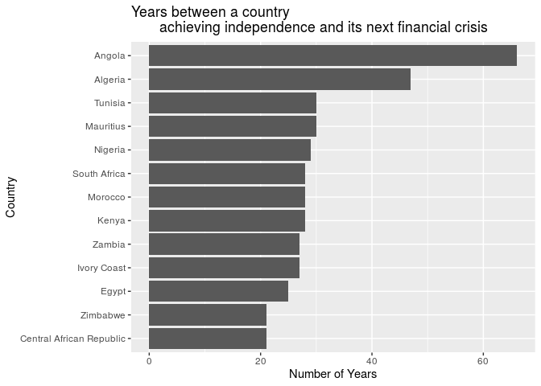

An Analysis of African Systemic Crises
================
Beck Addison, Jerry Lin, Isabella Swigart, Emma Hirschkop
12/3/2019

``` r
#install.packages(c("infer","countrycode","pracma", "plotly"))
library(infer)
library(tidyverse)
library(countrycode)
library(pracma)
library(broom)
library(knitr)
library(plotly)
```

``` r
africa <- read_csv("../data/african_crises.csv")
global <- read_csv("../data/global_crisis_data.csv")
gdps <- read_csv("../data/world_gdp_data.csv")
```

Our analysis begins with two datasets: our original African economic
crises dataset, which contains numerical variables like inflation rate,
exchange rate against the US dollar, and debt vs. GDP ratio. Another
helpful variable to analyze would be each country’s GDP, so we
downloaded world GDP data from the World Bank, and joined this data with
our Africa dataset. We then cleaned up the dataset by renaming some
variables and changing their types from integers to booleans.

``` r
gdps <- gdps %>%
  pivot_longer(
    cols = c(
      -`Country Name`,
      -`Country Code`,
      -`Indicator Name`,
      -`Indicator Code`),
    names_to = "year"
  ) %>%
  rename(
    cc3 = `Country Code`,
    indicator_code = `Indicator Code`,
    indicator_name = `Indicator Name`,
    country = `Country Name`,
    gdp = value
    )

african_gdps <- gdps %>%
  merge(., africa, by = c("country","cc3","year"))


african_gdps <- african_gdps %>%
  mutate(
    year = as.numeric(year),
    systemic_crisis = factor(systemic_crisis),
    domestic_debt_in_default = factor(domestic_debt_in_default),
    sovereign_external_debt_default = factor(sovereign_external_debt_default),
    independence = factor(independence),
    currency_crises = factor(case_when(
      currency_crises < 1 ~ 0,
      TRUE ~ 1
    )),
    inflation_crises = factor(inflation_crises),
    banking_crisis = factor(banking_crisis)
  )

global <- global[-1,] %>%
  select(-`<`) %>%
  rename(
    case = Case,
    cc3 = CC3,
    country = Country,
    year = Year,
    banking_crisis = `Banking Crisis`,
    systemic_crisis = `Systemic Crisis`,
    gold_standard = `Gold Standard`,
    nat_currency = `national currency`,
    sov_ext_debt = 
    `SOVEREIGN EXTERNAL DEBT 1: DEFAULT and RESTRUCTURINGS, 1800-2012--Does not include defaults on WWI debt to United States and United Kingdom and post-1975 defaults on Official External Creditors`,
    sov_ext_debt_post1975 = `SOVEREIGN EXTERNAL DEBT 2: DEFAULT and RESTRUCTURINGS, 1800-2012--Does not include defaults on WWI debt to United States and United Kingdom but includes post-1975 defaults on Official External Creditors`,
    exc_primary = `exch_primary source code`,
    domest_debt_default = `Domestic_Debt_In_Default`,
    domest_debt_notes = `Domestic_Debt_ Notes/Sources`,
    default_ext_notes = `Defaults_External_Notes`,
    gdp_weighted_default = `GDP_Weighted_default`,
    inflat_aver_consumer_prices = `Inflation, Annual percentages of average consumer prices`,
    curr_crises = `Currency Crises`,
    independence = `Independence`,
    inflat_crises = `Inflation Crises`
) %>%
  mutate(
    banking_crisis = as.logical(as.numeric(
      banking_crisis
      )),
    systemic_crisis = as.logical(as.numeric(
      systemic_crisis
    )),
    gold_standard = as.logical(as.numeric(
      gold_standard
    )),
    domest_debt_default = as.logical(as.numeric(
      domest_debt_default
    )),
    independence = as.logical(as.numeric(
      independence
    )),
    curr_crises = as.logical(as.numeric(
      curr_crises
    )),
    inflat_crises = as.logical(as.numeric(
      inflat_crises
    ))
  )

options(scipen = 999)
```

## Question 1: Hypothesis Testing

#### Was an economic crisis more likely following n years after decolonization?

From history, we’ve known that Consider the following: for each country,
we’ll determine how many years after independence a country will
typically experience its next crisis.

``` r
output <- tibble(country = distinct(africa, country)$country)
output$independence_year <- africa %>%
  filter(independence == 1) %>%
  group_by(country) %>%
  filter(row_number()==1) %>%
  ungroup() %>%
  select(year)
  
output$crisis_year <- africa %>%
  filter(independence == 1) %>%
  group_by(country) %>%
  filter(banking_crisis == "crisis") %>%
  filter(row_number() == 1) %>%
  ungroup() %>%
  select(year)
output <- output %>%
  mutate(difference = (crisis_year$year - independence_year$year))
ggplot(data = output, mapping = aes(y = difference)) +
  geom_boxplot() + 
  labs(
    title = "What's the typical amount of years between a country 
    achieving independence and its next financial crisis?",
    y = "Number of Years")
```

<!-- -->

``` r
output %>%
  summarise(IQR = IQR(difference), median = median(difference), mean = mean(difference))
```

    ## # A tibble: 1 x 3
    ##     IQR median  mean
    ##   <dbl>  <dbl> <dbl>
    ## 1    11     30  31.3

We see that the median amount of years a country will first encounter a
banking crisis after they achieve independence is about 30 years, with
an interquartile range of 11 years and a mean of 31.3 years.

We’re really interested in the economic stability of independent
vs. colonized African countries. In particular, we’re wondering if
post-independence African countries see a higher proportion of systemic
crises (per year) compared to before independence. Let’s examine it:

``` r
africa %>%
  group_by(country, independence) %>%
  summarise(crisis_prop = sum(systemic_crisis)/n())
```

    ## # A tibble: 25 x 3
    ## # Groups:   country [13]
    ##    country                  independence crisis_prop
    ##    <chr>                           <dbl>       <dbl>
    ##  1 Algeria                             0      0.0263
    ##  2 Algeria                             1      0.0638
    ##  3 Angola                              0      0     
    ##  4 Angola                              1      0     
    ##  5 Central African Republic            0      0     
    ##  6 Central African Republic            1      0.345 
    ##  7 Egypt                               1      0.0387
    ##  8 Ivory Coast                         0      0     
    ##  9 Ivory Coast                         1      0.0727
    ## 10 Kenya                               0      0     
    ## # … with 15 more rows

``` r
africa %>%
  group_by(independence) %>%
  summarise(overall_crisis_prop = sum(systemic_crisis)/n())
```

    ## # A tibble: 2 x 2
    ##   independence overall_crisis_prop
    ##          <dbl>               <dbl>
    ## 1            0             0.00422
    ## 2            1             0.0985

Based on our sample, we see that on average, there is a 0.42% chance of
a systemic crisis occurring in any given year for a non-independent
country, while there is a 9.85% chance of a systemic crisis occurring in
any given year for a independent country. The difference in these
proportions is 0.094320737.

We’d like to conduct a hypothesis test to see if there is a significant
difference in the proportion of years with systemic crises between
independent and non-independent countries across all African countries.
Our null hypothesis is that the proportion of years with systemic crises
between independent and non-independent African countries is the same;
the observed difference is due to chance. Our alternative hypothesis is
that the proportion of years with systemic crises between independent
and non-independent African countries is different.

Since we’re testing for independence, we’ll use permutation. We’ll
modify our dataset slightly by factoring success into a categorical
variable so that it’ll work nicely with infer.

Before we run the hypothesis test, we need to quickly factor
systemic\_crisis to be a categorical variable:

``` r
fct_africa <- africa %>%
  mutate(systemic_crisis = factor(systemic_crisis)) %>%
  mutate(independence = factor(independence))
```

``` r
set.seed(1)
null_dist <- fct_africa %>%
  specify(response = systemic_crisis, explanatory = independence, 
          success = "1") %>%
  hypothesize(null = "independence") %>%
  generate(1000, type = "permute") %>%
  calculate(stat = "diff in props", 
            order = c("1", "0"))
get_p_value(null_dist, obs_stat = 0.094320737, direction = "both")
```

    ## # A tibble: 1 x 1
    ##   p_value
    ##     <dbl>
    ## 1       0

``` r
visualize(null_dist) +
  shade_p_value(0.094320737, "both") +
  labs(title = "Null Distribution of Difference in Systemic Crisis Proportions", subtitle = "Between Independent and Non-Independent African Countries", x = "Difference in Proportions", 
       y = "Count")
```

<!-- -->

Since our p-value of 0 is less than our significance level of 0.05, we
reject the null hypothesis. The data provides convincing evidence that
there is a difference in the proportion of years with systemic crises
between non-independent and independent African
countries.

## Question 2: Hypothesis Testing

#### Is there a difference between GDP and systemic crises in North African and sub-Saharan African countries?

Today, many newspapers, academics, and policymakers classify Africa into
two broad regions. There’s North Africa, consisting of nations like
Algeria and Morocco, and sub-Saharan Africa, which conists of countries
ranging from the Central African Republic to Botswana. Traditionally,
people associate sub-Saharan Africa with being less developed and more
impoverished compared to the rest of the continent. In recent years,
reports by the World Bank have claimed that more and more of the world’s
poor are being concentrated into a few sub-Saharan countries.

We set out to see if this is claim is true; that is, if there’s a
noticeable difference in economic stability and prosperity between North
African and sub-Saharan African countries. We can evaluate these claims
by analyzing our data on each country’s GDP and the proportion of years
with systemic crises for each country.

To answer this question, we need to label North African and sub-Saharan
countries in our Africa dataset.

``` r
fct_africa <- fct_africa %>%
  mutate(region = case_when(
    country == "Algeria" ~ "n",
    country == "Angola" ~ "s",
    country == "Central African Republic" ~ "s",
    country == "Egypt" ~ "n",
    country == "Ivory Coast" ~ "s",
    country == "Kenya" ~ "s",
    country == "Mauritius" ~ "s",
    country == "Morocco" ~ "n",
    country == "Nigeria" ~ "s",
    country == "South Africa" ~ "s",
    country == "Tunisia" ~ "n",
    country == "Zambia" ~ "s",
    country == "Zimbabwe" ~ "s"
  ))
africa <- africa %>%
  mutate(region = case_when(
    country == "Algeria" ~ "n",
    country == "Angola" ~ "s",
    country == "Central African Republic" ~ "s",
    country == "Egypt" ~ "n",
    country == "Ivory Coast" ~ "s",
    country == "Kenya" ~ "s",
    country == "Mauritius" ~ "s",
    country == "Morocco" ~ "n",
    country == "Nigeria" ~ "s",
    country == "South Africa" ~ "s",
    country == "Tunisia" ~ "n",
    country == "Zambia" ~ "s",
    country == "Zimbabwe" ~ "s"
  ))
african_gdps <- african_gdps %>%
  mutate(region = case_when(
    country == "Algeria" ~ "n",
    country == "Angola" ~ "s",
    country == "Central African Republic" ~ "s",
    country == "Egypt" ~ "n",
    country == "Ivory Coast" ~ "s",
    country == "Kenya" ~ "s",
    country == "Mauritius" ~ "s",
    country == "Morocco" ~ "n",
    country == "Nigeria" ~ "s",
    country == "South Africa" ~ "s",
    country == "Tunisia" ~ "n",
    country == "Zambia" ~ "s",
    country == "Zimbabwe" ~ "s"
  ))
```

Let’s calculate the median GDP for North African and sub-Saharan
countries.

When calculating GDP by region, we’ll use 2014 GDP data since it’s
recent and available for all 13 African countries in our dataset.

``` r
regional_mean_gdps <- african_gdps %>%
  filter(year == 2014) %>%
  group_by(region) %>%
  summarise(avg_gdp = median(gdp))

regional_mean_gdps
```

    ## # A tibble: 2 x 2
    ##   region       avg_gdp
    ##   <chr>          <dbl>
    ## 1 n      110081000000 
    ## 2 s       44299338704.

``` r
rmg <- regional_mean_gdps %>%
  pull(avg_gdp)
```

The average GDP for North African countries is 110081000000; the average
GDP for sub-Saharan countries is 44299338704.5. Therefore, the
difference in median GDP between North African and sub-Saharan countries
is 65781661295.5.

The first research question we’ll ask is: is there a difference in
median GDP among all North African and sub-Saharan countries?

Our null hypothesis is that the median GDP of North African and
sub-Saharan countries is the same; the observed difference is due to
chance. Our alternative hypothesis is that the median GDP of North
African and sub-Saharan African countries is different.

Since we’re testing for independence, we’ll use permute.

``` r
set.seed(1)
gdp_2014 <- african_gdps %>%
  filter(year == 2014)

null_dist2 <- gdp_2014 %>%
  specify(response = gdp, explanatory = region) %>%
  hypothesize(null = "independence") %>%
  generate(1000, type = "permute") %>%
  calculate(stat = "diff in medians", 
            order = c("n", "s"))
get_p_value(null_dist2, obs_stat = rmg[1] - rmg[2], direction = "two_sided")
```

    ## # A tibble: 1 x 1
    ##   p_value
    ##     <dbl>
    ## 1   0.614

``` r
visualize(null_dist2) +
  shade_p_value(65781661296, "both") +
  labs(title = "Null Distribution of Difference in 2014 Median GDP", subtitle = "Between North African and Sub-Saharan Countries", x = "Difference in GDP ($)", 
       y = "Count")
```

<!-- -->

Since our p-value of 0.528 is greater than our significance level of
0.05, we fail to reject the null hypothesis. The data does not provide
convincing evidence that there is a significant difference between the
median GDP of North African countries comapred to sub-Saharan countries.

Next, let’s calculate the proportion of years with systemic crises for
North African and sub-Saharan countries.

``` r
africa %>%
  group_by(region) %>%
  summarise(overall_crisis_prop = sum(systemic_crisis)/n())
```

    ## # A tibble: 2 x 2
    ##   region overall_crisis_prop
    ##   <chr>                <dbl>
    ## 1 n                   0.0436
    ## 2 s                   0.0972

The proportion of years with systemic crises for North African countries
is 0.0436; the proportion of years with systemic crises for sub-Saharan
countries is 0.0971. The difference is 0.0535702.

The second research question we’ll ask is: is there a difference in the
proportion of years with systemic crises between all North African and
sub-Saharan countries?

Our null hypothesis is that the proportion of years with systemic crises
between North African and sub-Saharan countries is the same; the
observed difference is due to chance. Our alternative hypothesis is that
the proportion of years with systemic crises between North African and
sub-Saharan countries is different.

Since we’re testing for independence, we’ll use permute.

``` r
set.seed(1)
null_dist3 <- fct_africa %>%
  specify(response = systemic_crisis, explanatory = region, success = "1") %>%
  hypothesize(null = "independence") %>%
  generate(1000, type = "permute") %>%
  calculate(stat = "diff in props", 
            order = c("n", "s"))
get_p_value(null_dist3, obs_stat = 0.0535702, direction = "two_sided")
```

    ## # A tibble: 1 x 1
    ##   p_value
    ##     <dbl>
    ## 1       0

``` r
visualize(null_dist3) +
  shade_p_value(0.0535702, "both") +
  labs(title = "Null Distribution of Difference in Proportion of Systemic 
  Crises", subtitle = "Between North African and Sub-Saharan Countries", x = "Difference in Proportion", y = "Count")
```

<!-- -->

Since our p-value of 0 is less than the significance level of 0.05, we
reject the null hypothesis. The data provides convincing evidence that
there is a difference in the proportion of years with systemic crises
between North African countries and sub-Saharan countries.

From our results, we can conclude that historically — when accounting
for all years from the 19th century to today — sub-Saharan African
countries have been more prone to systemic crises than North African
countries. Yet we failed to find a difference in the 2014 GDP between
North African countries and sub-Saharan African countries. That’s a
positive sign, because it shows that even though there have been
historical disparities, in the 21st century, sub-Saharan Africa is
catching up, if not meeting, to the economies of North Africa.

### Question 3: Fitting a linear regression model

Finally, we want to see what factors influence a country’s GDP the most,
as we want to by extension understand what factors most strongly predict
economic crises in Africa. Since we cannot (currently) use a binary
factor such as `systemic crisis` to determine whether an economy is in
crisis or not, we will define “crisis” in terms of GDP growth. If
year-on-year GDP growth is negative, we can say that the economy is
either recessing or in crisis; for the sake of this examination, we will
take both of these to indicate crisis. There is past evidence to show
that negative GDP growth is indicative of a crisis, as the 2008
recession saw widespread GDP stagnation or decline. Therefore, we will
optimize our model to increase “negative GDP growth”.

First and foremost, we must find the difference in GDP growth between
every year in the dataset, for each country.

``` r
african_gdps <- african_gdps %>%
  group_by(country) %>%
  mutate(
    deltagdp = gdp - lag(gdp, default = gdp[1])
  ) %>%
  mutate(
    neg_deltagdp = -deltagdp
    ) %>%
  select(-deltagdp)
```

Notice that the gdpdelta has been negated - for our model, we want to
optimize for an increasingly negative delta GDP, which indicates
decline.

Before we perform a backwards step to see which factors are most
influential in an increasingly negative delta GDP, we have our “full”
model, with all of the variables. Additionally, we have examined the
interaction between the `crisis` variables, and the interaction between
sovereign and domestic debt in default.

``` r
full_neg_deltaGDP_model <- lm(
  neg_deltagdp ~ 
    year +
    gdp +
    systemic_crisis +
    exch_usd +
    domestic_debt_in_default +
    sovereign_external_debt_default +
    gdp_weighted_default +
    inflation_annual_cpi +
    independence +
    currency_crises +
    inflation_crises +
    banking_crisis +
    banking_crisis*inflation_crises*currency_crises*systemic_crisis +
    domestic_debt_in_default*sovereign_external_debt_default,
  filter(african_gdps, !is.na(neg_deltagdp))
    )
```

Now we can perform our backwards step function, optimizing for a higher
value for AIC.

``` r
best_aic <- step(full_neg_deltaGDP_model, direction = "backward")
```

    ## Start:  AIC=24946.48
    ## neg_deltagdp ~ year + gdp + systemic_crisis + exch_usd + domestic_debt_in_default + 
    ##     sovereign_external_debt_default + gdp_weighted_default + 
    ##     inflation_annual_cpi + independence + currency_crises + inflation_crises + 
    ##     banking_crisis + banking_crisis * inflation_crises * currency_crises * 
    ##     systemic_crisis + domestic_debt_in_default * sovereign_external_debt_default
    ## 
    ## 
    ## Step:  AIC=24946.48
    ## neg_deltagdp ~ year + gdp + systemic_crisis + exch_usd + domestic_debt_in_default + 
    ##     sovereign_external_debt_default + gdp_weighted_default + 
    ##     inflation_annual_cpi + independence + currency_crises + inflation_crises + 
    ##     banking_crisis + inflation_crises:banking_crisis + currency_crises:banking_crisis + 
    ##     currency_crises:inflation_crises + systemic_crisis:banking_crisis + 
    ##     systemic_crisis:inflation_crises + systemic_crisis:currency_crises + 
    ##     domestic_debt_in_default:sovereign_external_debt_default + 
    ##     currency_crises:inflation_crises:banking_crisis + systemic_crisis:inflation_crises:banking_crisis + 
    ##     systemic_crisis:currency_crises:banking_crisis + systemic_crisis:currency_crises:inflation_crises
    ## 
    ## 
    ## Step:  AIC=24946.48
    ## neg_deltagdp ~ year + gdp + systemic_crisis + exch_usd + domestic_debt_in_default + 
    ##     sovereign_external_debt_default + gdp_weighted_default + 
    ##     inflation_annual_cpi + independence + currency_crises + inflation_crises + 
    ##     banking_crisis + inflation_crises:banking_crisis + currency_crises:banking_crisis + 
    ##     currency_crises:inflation_crises + systemic_crisis:banking_crisis + 
    ##     systemic_crisis:inflation_crises + systemic_crisis:currency_crises + 
    ##     domestic_debt_in_default:sovereign_external_debt_default + 
    ##     currency_crises:inflation_crises:banking_crisis + systemic_crisis:inflation_crises:banking_crisis + 
    ##     systemic_crisis:currency_crises:banking_crisis
    ## 
    ## 
    ## Step:  AIC=24946.48
    ## neg_deltagdp ~ year + gdp + systemic_crisis + exch_usd + domestic_debt_in_default + 
    ##     sovereign_external_debt_default + gdp_weighted_default + 
    ##     inflation_annual_cpi + independence + currency_crises + inflation_crises + 
    ##     banking_crisis + inflation_crises:banking_crisis + currency_crises:banking_crisis + 
    ##     currency_crises:inflation_crises + systemic_crisis:banking_crisis + 
    ##     systemic_crisis:inflation_crises + systemic_crisis:currency_crises + 
    ##     domestic_debt_in_default:sovereign_external_debt_default + 
    ##     currency_crises:inflation_crises:banking_crisis + systemic_crisis:currency_crises:banking_crisis
    ## 
    ## 
    ## Step:  AIC=24946.48
    ## neg_deltagdp ~ year + gdp + systemic_crisis + exch_usd + domestic_debt_in_default + 
    ##     sovereign_external_debt_default + gdp_weighted_default + 
    ##     inflation_annual_cpi + independence + currency_crises + inflation_crises + 
    ##     banking_crisis + inflation_crises:banking_crisis + currency_crises:banking_crisis + 
    ##     currency_crises:inflation_crises + systemic_crisis:banking_crisis + 
    ##     systemic_crisis:inflation_crises + systemic_crisis:currency_crises + 
    ##     currency_crises:inflation_crises:banking_crisis + systemic_crisis:currency_crises:banking_crisis
    ## 
    ##                                                   Df
    ## - sovereign_external_debt_default                  1
    ## - inflation_annual_cpi                             1
    ## - systemic_crisis:inflation_crises                 1
    ## - independence                                     1
    ## - systemic_crisis:currency_crises:banking_crisis   1
    ## - domestic_debt_in_default                         1
    ## - year                                             1
    ## - exch_usd                                         1
    ## - gdp_weighted_default                             1
    ## - currency_crises:inflation_crises:banking_crisis  1
    ## <none>                                              
    ## - gdp                                              1
    ##                                                                 Sum of Sq
    ## - sovereign_external_debt_default                       37628496687661056
    ## - inflation_annual_cpi                                 419392338553470976
    ## - systemic_crisis:inflation_crises                    1394731754098524160
    ## - independence                                        1643092511155027968
    ## - systemic_crisis:currency_crises:banking_crisis      7183130453866446848
    ## - domestic_debt_in_default                           11949245899089117184
    ## - year                                               38411656112818356224
    ## - exch_usd                                           45416724183551836160
    ## - gdp_weighted_default                              132058192757796110336
    ## - currency_crises:inflation_crises:banking_crisis   177206056310211084288
    ## <none>                                                                   
    ## - gdp                                             17001277190156517900288
    ##                                                                       RSS
    ## - sovereign_external_debt_default                 48920787070231127261184
    ## - inflation_annual_cpi                            48921168834072993071104
    ## - systemic_crisis:inflation_crises                48922144173488538124288
    ## - independence                                    48922392534245594628096
    ## - systemic_crisis:currency_crises:banking_crisis  48927932572188306046976
    ## - domestic_debt_in_default                        48932698687633528717312
    ## - year                                            48959161097847257956352
    ## - exch_usd                                        48966166165917991436288
    ## - gdp_weighted_default                            49052807634492235710464
    ## - currency_crises:inflation_crises:banking_crisis 49097955498044650684416
    ## <none>                                            48920749441734439600128
    ## - gdp                                             65922026631890957500416
    ##                                                     AIC
    ## - sovereign_external_debt_default                 24944
    ## - inflation_annual_cpi                            24944
    ## - systemic_crisis:inflation_crises                24944
    ## - independence                                    24944
    ## - systemic_crisis:currency_crises:banking_crisis  24945
    ## - domestic_debt_in_default                        24945
    ## - year                                            24945
    ## - exch_usd                                        24945
    ## - gdp_weighted_default                            24946
    ## - currency_crises:inflation_crises:banking_crisis 24946
    ## <none>                                            24946
    ## - gdp                                             25106
    ## 
    ## Step:  AIC=24944.48
    ## neg_deltagdp ~ year + gdp + systemic_crisis + exch_usd + domestic_debt_in_default + 
    ##     gdp_weighted_default + inflation_annual_cpi + independence + 
    ##     currency_crises + inflation_crises + banking_crisis + inflation_crises:banking_crisis + 
    ##     currency_crises:banking_crisis + currency_crises:inflation_crises + 
    ##     systemic_crisis:banking_crisis + systemic_crisis:inflation_crises + 
    ##     systemic_crisis:currency_crises + currency_crises:inflation_crises:banking_crisis + 
    ##     systemic_crisis:currency_crises:banking_crisis
    ## 
    ##                                                   Df
    ## - inflation_annual_cpi                             1
    ## - systemic_crisis:inflation_crises                 1
    ## - independence                                     1
    ## - systemic_crisis:currency_crises:banking_crisis   1
    ## - domestic_debt_in_default                         1
    ## - year                                             1
    ## - exch_usd                                         1
    ## - currency_crises:inflation_crises:banking_crisis  1
    ## <none>                                              
    ## - gdp_weighted_default                             1
    ## - gdp                                              1
    ##                                                                 Sum of Sq
    ## - inflation_annual_cpi                                 415276210315067392
    ## - systemic_crisis:inflation_crises                    1383126289925275648
    ## - independence                                        1638415363123183616
    ## - systemic_crisis:currency_crises:banking_crisis      7295266808292966400
    ## - domestic_debt_in_default                           17793053744225583104
    ## - year                                               38552554830387216384
    ## - exch_usd                                           64429825412265148416
    ## - currency_crises:inflation_crises:banking_crisis   180715786082032025600
    ## <none>                                                                   
    ## - gdp_weighted_default                              190598370440888975360
    ## - gdp                                             17392323382221341720576
    ##                                                                       RSS
    ## - inflation_annual_cpi                            48921202346441442328576
    ## - systemic_crisis:inflation_crises                48922170196521052536832
    ## - independence                                    48922425485594250444800
    ## - systemic_crisis:currency_crises:banking_crisis  48928082337039420227584
    ## - domestic_debt_in_default                        48938580123975352844288
    ## - year                                            48959339625061514477568
    ## - exch_usd                                        48985216895643392409600
    ## - currency_crises:inflation_crises:banking_crisis 49101502856313159286784
    ## <none>                                            48920787070231127261184
    ## - gdp_weighted_default                            49111385440672016236544
    ## - gdp                                             66313110452452468981760
    ##                                                     AIC
    ## - inflation_annual_cpi                            24942
    ## - systemic_crisis:inflation_crises                24942
    ## - independence                                    24942
    ## - systemic_crisis:currency_crises:banking_crisis  24943
    ## - domestic_debt_in_default                        24943
    ## - year                                            24943
    ## - exch_usd                                        24943
    ## - currency_crises:inflation_crises:banking_crisis 24944
    ## <none>                                            24944
    ## - gdp_weighted_default                            24945
    ## - gdp                                             25107
    ## 
    ## Step:  AIC=24942.48
    ## neg_deltagdp ~ year + gdp + systemic_crisis + exch_usd + domestic_debt_in_default + 
    ##     gdp_weighted_default + independence + currency_crises + inflation_crises + 
    ##     banking_crisis + inflation_crises:banking_crisis + currency_crises:banking_crisis + 
    ##     currency_crises:inflation_crises + systemic_crisis:banking_crisis + 
    ##     systemic_crisis:inflation_crises + systemic_crisis:currency_crises + 
    ##     currency_crises:inflation_crises:banking_crisis + systemic_crisis:currency_crises:banking_crisis
    ## 
    ##                                                   Df
    ## - systemic_crisis:inflation_crises                 1
    ## - independence                                     1
    ## - systemic_crisis:currency_crises:banking_crisis   1
    ## - domestic_debt_in_default                         1
    ## - year                                             1
    ## - exch_usd                                         1
    ## - currency_crises:inflation_crises:banking_crisis  1
    ## <none>                                              
    ## - gdp_weighted_default                             1
    ## - gdp                                              1
    ##                                                                 Sum of Sq
    ## - systemic_crisis:inflation_crises                    1376840370171674624
    ## - independence                                        1618187999449710592
    ## - systemic_crisis:currency_crises:banking_crisis      7127741785962446848
    ## - domestic_debt_in_default                           18608372718017445888
    ## - year                                               38307264580540170240
    ## - exch_usd                                           64189891159869358080
    ## - currency_crises:inflation_crises:banking_crisis   180675252527489351680
    ## <none>                                                                   
    ## - gdp_weighted_default                              190762617409441366016
    ## - gdp                                             17392982585321361244160
    ##                                                                       RSS
    ## - systemic_crisis:inflation_crises                48922579186811605614592
    ## - independence                                    48922820534440883650560
    ## - systemic_crisis:currency_crises:banking_crisis  48928330088227396386816
    ## - domestic_debt_in_default                        48939810719159451385856
    ## - year                                            48959509611021974110208
    ## - exch_usd                                        48985392237601303298048
    ## - currency_crises:inflation_crises:banking_crisis 49101877598968923291648
    ## <none>                                            48921202346441433939968
    ## - gdp_weighted_default                            49111964963850875305984
    ## - gdp                                             66314184931762795184128
    ##                                                     AIC
    ## - systemic_crisis:inflation_crises                24940
    ## - independence                                    24940
    ## - systemic_crisis:currency_crises:banking_crisis  24941
    ## - domestic_debt_in_default                        24941
    ## - year                                            24941
    ## - exch_usd                                        24941
    ## - currency_crises:inflation_crises:banking_crisis 24942
    ## <none>                                            24942
    ## - gdp_weighted_default                            24943
    ## - gdp                                             25105
    ## 
    ## Step:  AIC=24940.5
    ## neg_deltagdp ~ year + gdp + systemic_crisis + exch_usd + domestic_debt_in_default + 
    ##     gdp_weighted_default + independence + currency_crises + inflation_crises + 
    ##     banking_crisis + inflation_crises:banking_crisis + currency_crises:banking_crisis + 
    ##     currency_crises:inflation_crises + systemic_crisis:banking_crisis + 
    ##     systemic_crisis:currency_crises + currency_crises:inflation_crises:banking_crisis + 
    ##     systemic_crisis:currency_crises:banking_crisis
    ## 
    ##                                                   Df
    ## - independence                                     1
    ## - systemic_crisis:currency_crises:banking_crisis   1
    ## - domestic_debt_in_default                         1
    ## - year                                             1
    ## - exch_usd                                         1
    ## - currency_crises:inflation_crises:banking_crisis  1
    ## <none>                                              
    ## - gdp_weighted_default                             1
    ## - gdp                                              1
    ##                                                                 Sum of Sq
    ## - independence                                        1619288410042662912
    ## - systemic_crisis:currency_crises:banking_crisis      6201124991774228480
    ## - domestic_debt_in_default                           18989257993217900544
    ## - year                                               38089122259929137152
    ## - exch_usd                                           63234186560720076800
    ## - currency_crises:inflation_crises:banking_crisis   180048169977499353088
    ## <none>                                                                   
    ## - gdp_weighted_default                              189399359773082648576
    ## - gdp                                             17411983429047035101184
    ##                                                                       RSS
    ## - independence                                    48924198475221648277504
    ## - systemic_crisis:currency_crises:banking_crisis  48928780311803379843072
    ## - domestic_debt_in_default                        48941568444804823515136
    ## - year                                            48960668309071534751744
    ## - exch_usd                                        48985813373372325691392
    ## - currency_crises:inflation_crises:banking_crisis 49102627356789104967680
    ## <none>                                            48922579186811605614592
    ## - gdp_weighted_default                            49111978546584688263168
    ## - gdp                                             66334562615858640715776
    ##                                                     AIC
    ## - independence                                    24938
    ## - systemic_crisis:currency_crises:banking_crisis  24939
    ## - domestic_debt_in_default                        24939
    ## - year                                            24939
    ## - exch_usd                                        24939
    ## - currency_crises:inflation_crises:banking_crisis 24940
    ## <none>                                            24940
    ## - gdp_weighted_default                            24941
    ## - gdp                                             25104
    ## 
    ## Step:  AIC=24938.52
    ## neg_deltagdp ~ year + gdp + systemic_crisis + exch_usd + domestic_debt_in_default + 
    ##     gdp_weighted_default + currency_crises + inflation_crises + 
    ##     banking_crisis + inflation_crises:banking_crisis + currency_crises:banking_crisis + 
    ##     currency_crises:inflation_crises + systemic_crisis:banking_crisis + 
    ##     systemic_crisis:currency_crises + currency_crises:inflation_crises:banking_crisis + 
    ##     systemic_crisis:currency_crises:banking_crisis
    ## 
    ##                                                   Df
    ## - systemic_crisis:currency_crises:banking_crisis   1
    ## - domestic_debt_in_default                         1
    ## - year                                             1
    ## - exch_usd                                         1
    ## - currency_crises:inflation_crises:banking_crisis  1
    ## <none>                                              
    ## - gdp_weighted_default                             1
    ## - gdp                                              1
    ##                                                                 Sum of Sq
    ## - systemic_crisis:currency_crises:banking_crisis      6182965225029894144
    ## - domestic_debt_in_default                           19479383723034542080
    ## - year                                               36588367529302294528
    ## - exch_usd                                           63209612234264150016
    ## - currency_crises:inflation_crises:banking_crisis   179617632722597445632
    ## <none>                                                                   
    ## - gdp_weighted_default                              188545636461799538688
    ## - gdp                                             17433560671810337374208
    ##                                                                       RSS
    ## - systemic_crisis:currency_crises:banking_crisis  48930381440446669783040
    ## - domestic_debt_in_default                        48943677858944674430976
    ## - year                                            48960786842750942183424
    ## - exch_usd                                        48987408087455904038912
    ## - currency_crises:inflation_crises:banking_crisis 49103816107944237334528
    ## <none>                                            48924198475221639888896
    ## - gdp_weighted_default                            49112744111683439427584
    ## - gdp                                             66357759147031977263104
    ##                                                     AIC
    ## - systemic_crisis:currency_crises:banking_crisis  24937
    ## - domestic_debt_in_default                        24937
    ## - year                                            24937
    ## - exch_usd                                        24937
    ## - currency_crises:inflation_crises:banking_crisis 24938
    ## <none>                                            24938
    ## - gdp_weighted_default                            24939
    ## - gdp                                             25102
    ## 
    ## Step:  AIC=24936.59
    ## neg_deltagdp ~ year + gdp + systemic_crisis + exch_usd + domestic_debt_in_default + 
    ##     gdp_weighted_default + currency_crises + inflation_crises + 
    ##     banking_crisis + inflation_crises:banking_crisis + currency_crises:banking_crisis + 
    ##     currency_crises:inflation_crises + systemic_crisis:banking_crisis + 
    ##     systemic_crisis:currency_crises + currency_crises:inflation_crises:banking_crisis
    ## 
    ##                                                   Df
    ## - systemic_crisis:currency_crises                  1
    ## - systemic_crisis:banking_crisis                   1
    ## - domestic_debt_in_default                         1
    ## - year                                             1
    ## - exch_usd                                         1
    ## - currency_crises:inflation_crises:banking_crisis  1
    ## <none>                                              
    ## - gdp_weighted_default                             1
    ## - gdp                                              1
    ##                                                                 Sum of Sq
    ## - systemic_crisis:currency_crises                     8047527649616068608
    ## - systemic_crisis:banking_crisis                     21861227913189261312
    ## - domestic_debt_in_default                           21914401644061130752
    ## - year                                               37271090566103302144
    ## - exch_usd                                           65207177417383215104
    ## - currency_crises:inflation_crises:banking_crisis   174695821234533302272
    ## <none>                                                                   
    ## - gdp_weighted_default                              193625075935709495296
    ## - gdp                                             17449555572803147661312
    ##                                                                       RSS
    ## - systemic_crisis:currency_crises                 48938428968096285851648
    ## - systemic_crisis:banking_crisis                  48952242668359859044352
    ## - domestic_debt_in_default                        48952295842090730913792
    ## - year                                            48967652531012773085184
    ## - exch_usd                                        48995588617864052998144
    ## - currency_crises:inflation_crises:banking_crisis 49105077261681203085312
    ## <none>                                            48930381440446669783040
    ## - gdp_weighted_default                            49124006516382379278336
    ## - gdp                                             66379937013249817444352
    ##                                                     AIC
    ## - systemic_crisis:currency_crises                 24935
    ## - systemic_crisis:banking_crisis                  24935
    ## - domestic_debt_in_default                        24935
    ## - year                                            24935
    ## - exch_usd                                        24935
    ## - currency_crises:inflation_crises:banking_crisis 24936
    ## <none>                                            24937
    ## - gdp_weighted_default                            24937
    ## - gdp                                             25100
    ## 
    ## Step:  AIC=24934.67
    ## neg_deltagdp ~ year + gdp + systemic_crisis + exch_usd + domestic_debt_in_default + 
    ##     gdp_weighted_default + currency_crises + inflation_crises + 
    ##     banking_crisis + inflation_crises:banking_crisis + currency_crises:banking_crisis + 
    ##     currency_crises:inflation_crises + systemic_crisis:banking_crisis + 
    ##     currency_crises:inflation_crises:banking_crisis
    ## 
    ##                                                   Df
    ## - domestic_debt_in_default                         1
    ## - systemic_crisis:banking_crisis                   1
    ## - year                                             1
    ## - exch_usd                                         1
    ## <none>                                              
    ## - currency_crises:inflation_crises:banking_crisis  1
    ## - gdp_weighted_default                             1
    ## - gdp                                              1
    ##                                                                 Sum of Sq
    ## - domestic_debt_in_default                           18904787814593855488
    ## - systemic_crisis:banking_crisis                     19072856315987492864
    ## - year                                               36851812646141296640
    ## - exch_usd                                           63441974382041235456
    ## <none>                                                                   
    ## - currency_crises:inflation_crises:banking_crisis   181706598177189134336
    ## - gdp_weighted_default                              188299967390107566080
    ## - gdp                                             17448342123847767556096
    ##                                                                       RSS
    ## - domestic_debt_in_default                        48957333755910879707136
    ## - systemic_crisis:banking_crisis                  48957501824412273344512
    ## - year                                            48975280780742427148288
    ## - exch_usd                                        49001870942478327087104
    ## <none>                                            48938428968096285851648
    ## - currency_crises:inflation_crises:banking_crisis 49120135566273474985984
    ## - gdp_weighted_default                            49126728935486393417728
    ## - gdp                                             66386771091944053407744
    ##                                                     AIC
    ## - domestic_debt_in_default                        24933
    ## - systemic_crisis:banking_crisis                  24933
    ## - year                                            24933
    ## - exch_usd                                        24933
    ## <none>                                            24935
    ## - currency_crises:inflation_crises:banking_crisis 24935
    ## - gdp_weighted_default                            24935
    ## - gdp                                             25098
    ## 
    ## Step:  AIC=24932.88
    ## neg_deltagdp ~ year + gdp + systemic_crisis + exch_usd + gdp_weighted_default + 
    ##     currency_crises + inflation_crises + banking_crisis + inflation_crises:banking_crisis + 
    ##     currency_crises:banking_crisis + currency_crises:inflation_crises + 
    ##     systemic_crisis:banking_crisis + currency_crises:inflation_crises:banking_crisis
    ## 
    ##                                                   Df
    ## - systemic_crisis:banking_crisis                   1
    ## - year                                             1
    ## - exch_usd                                         1
    ## <none>                                              
    ## - currency_crises:inflation_crises:banking_crisis  1
    ## - gdp_weighted_default                             1
    ## - gdp                                              1
    ##                                                                 Sum of Sq
    ## - systemic_crisis:banking_crisis                     22191281876544520192
    ## - year                                               36504417999867871232
    ## - exch_usd                                           64923279829824962560
    ## <none>                                                                   
    ## - currency_crises:inflation_crises:banking_crisis   183275134921931227136
    ## - gdp_weighted_default                              197873650191277490176
    ## - gdp                                             17449476679389442736128
    ##                                                                       RSS
    ## - systemic_crisis:banking_crisis                  48979525037787424227328
    ## - year                                            48993838173910747578368
    ## - exch_usd                                        49022257035740704669696
    ## <none>                                            48957333755910879707136
    ## - currency_crises:inflation_crises:banking_crisis 49140608890832810934272
    ## - gdp_weighted_default                            49155207406102157197312
    ## - gdp                                             66406810435300322443264
    ##                                                     AIC
    ## - systemic_crisis:banking_crisis                  24931
    ## - year                                            24931
    ## - exch_usd                                        24932
    ## <none>                                            24933
    ## - currency_crises:inflation_crises:banking_crisis 24933
    ## - gdp_weighted_default                            24933
    ## - gdp                                             25096
    ## 
    ## Step:  AIC=24931.13
    ## neg_deltagdp ~ year + gdp + systemic_crisis + exch_usd + gdp_weighted_default + 
    ##     currency_crises + inflation_crises + banking_crisis + inflation_crises:banking_crisis + 
    ##     currency_crises:banking_crisis + currency_crises:inflation_crises + 
    ##     currency_crises:inflation_crises:banking_crisis
    ## 
    ##                                                   Df
    ## - systemic_crisis                                  1
    ## - year                                             1
    ## - exch_usd                                         1
    ## - currency_crises:inflation_crises:banking_crisis  1
    ## <none>                                              
    ## - gdp_weighted_default                             1
    ## - gdp                                              1
    ##                                                                 Sum of Sq
    ## - systemic_crisis                                        8241398230810624
    ## - year                                               33254421955088482304
    ## - exch_usd                                           60009600627798704128
    ## - currency_crises:inflation_crises:banking_crisis   171779032501220016128
    ## <none>                                                                   
    ## - gdp_weighted_default                              194180865949287055360
    ## - gdp                                             17454076532187016986624
    ##                                                                       RSS
    ## - systemic_crisis                                 48979533279185655037952
    ## - year                                            49012779459742512709632
    ## - exch_usd                                        49039534638415222931456
    ## - currency_crises:inflation_crises:banking_crisis 49151304070288644243456
    ## <none>                                            48979525037787424227328
    ## - gdp_weighted_default                            49173705903736711282688
    ## - gdp                                             66433601569974441213952
    ##                                                     AIC
    ## - systemic_crisis                                 24929
    ## - year                                            24930
    ## - exch_usd                                        24930
    ## - currency_crises:inflation_crises:banking_crisis 24931
    ## <none>                                            24931
    ## - gdp_weighted_default                            24931
    ## - gdp                                             25094
    ## 
    ## Step:  AIC=24929.13
    ## neg_deltagdp ~ year + gdp + exch_usd + gdp_weighted_default + 
    ##     currency_crises + inflation_crises + banking_crisis + inflation_crises:banking_crisis + 
    ##     currency_crises:banking_crisis + currency_crises:inflation_crises + 
    ##     currency_crises:inflation_crises:banking_crisis
    ## 
    ##                                                   Df
    ## - year                                             1
    ## - exch_usd                                         1
    ## - currency_crises:inflation_crises:banking_crisis  1
    ## <none>                                              
    ## - gdp_weighted_default                             1
    ## - gdp                                              1
    ##                                                                 Sum of Sq
    ## - year                                               33402259754553704448
    ## - exch_usd                                           60211442704139157504
    ## - currency_crises:inflation_crises:banking_crisis   173254139280730619904
    ## <none>                                                                   
    ## - gdp_weighted_default                              194715885497263063040
    ## - gdp                                             17469485012791949524992
    ##                                                                       RSS
    ## - year                                            49012935538940208742400
    ## - exch_usd                                        49039744721889794195456
    ## - currency_crises:inflation_crises:banking_crisis 49152787418466385657856
    ## <none>                                            48979533279185655037952
    ## - gdp_weighted_default                            49174249164682918100992
    ## - gdp                                             66449018291977604562944
    ##                                                     AIC
    ## - year                                            24928
    ## - exch_usd                                        24928
    ## - currency_crises:inflation_crises:banking_crisis 24929
    ## <none>                                            24929
    ## - gdp_weighted_default                            24929
    ## - gdp                                             25092
    ## 
    ## Step:  AIC=24927.5
    ## neg_deltagdp ~ gdp + exch_usd + gdp_weighted_default + currency_crises + 
    ##     inflation_crises + banking_crisis + inflation_crises:banking_crisis + 
    ##     currency_crises:banking_crisis + currency_crises:inflation_crises + 
    ##     currency_crises:inflation_crises:banking_crisis
    ## 
    ##                                                   Df
    ## - exch_usd                                         1
    ## - currency_crises:inflation_crises:banking_crisis  1
    ## <none>                                              
    ## - gdp_weighted_default                             1
    ## - gdp                                              1
    ##                                                                 Sum of Sq
    ## - exch_usd                                           40117258721391804416
    ## - currency_crises:inflation_crises:banking_crisis   164437929036601098240
    ## <none>                                                                   
    ## - gdp_weighted_default                              192656351988958625792
    ## - gdp                                             21791779812040010366976
    ##                                                                       RSS
    ## - exch_usd                                        49053052797661600546816
    ## - currency_crises:inflation_crises:banking_crisis 49177373467976809840640
    ## <none>                                            49012935538940208742400
    ## - gdp_weighted_default                            49205591890929167368192
    ## - gdp                                             70804715350980219109376
    ##                                                     AIC
    ## - exch_usd                                        24926
    ## - currency_crises:inflation_crises:banking_crisis 24927
    ## <none>                                            24928
    ## - gdp_weighted_default                            24928
    ## - gdp                                             25125
    ## 
    ## Step:  AIC=24925.94
    ## neg_deltagdp ~ gdp + gdp_weighted_default + currency_crises + 
    ##     inflation_crises + banking_crisis + inflation_crises:banking_crisis + 
    ##     currency_crises:banking_crisis + currency_crises:inflation_crises + 
    ##     currency_crises:inflation_crises:banking_crisis
    ## 
    ##                                                   Df
    ## - currency_crises:inflation_crises:banking_crisis  1
    ## <none>                                              
    ## - gdp_weighted_default                             1
    ## - gdp                                              1
    ##                                                                 Sum of Sq
    ## - currency_crises:inflation_crises:banking_crisis   158717616104465760256
    ## <none>                                                                   
    ## - gdp_weighted_default                              204137952716097847296
    ## - gdp                                             21772823430857247162368
    ##                                                                       RSS
    ## - currency_crises:inflation_crises:banking_crisis 49211770413766066307072
    ## <none>                                            49053052797661600546816
    ## - gdp_weighted_default                            49257190750377698394112
    ## - gdp                                             70825876228518847709184
    ##                                                     AIC
    ## - currency_crises:inflation_crises:banking_crisis 24926
    ## <none>                                            24926
    ## - gdp_weighted_default                            24926
    ## - gdp                                             25123
    ## 
    ## Step:  AIC=24925.69
    ## neg_deltagdp ~ gdp + gdp_weighted_default + currency_crises + 
    ##     inflation_crises + banking_crisis + inflation_crises:banking_crisis + 
    ##     currency_crises:banking_crisis + currency_crises:inflation_crises
    ## 
    ##                                    Df               Sum of Sq
    ## - inflation_crises:banking_crisis   1     1605635808788742144
    ## - currency_crises:banking_crisis    1     4481536214108733440
    ## <none>                                                       
    ## - gdp_weighted_default              1   205050588357237669888
    ## - currency_crises:inflation_crises  1   617027844859980939264
    ## - gdp                               1 21636813041511002275840
    ##                                                        RSS   AIC
    ## - inflation_crises:banking_crisis  49213376049574855049216 24924
    ## - currency_crises:banking_crisis   49216251949980175040512 24924
    ## <none>                             49211770413766066307072 24926
    ## - gdp_weighted_default             49416821002123303976960 24926
    ## - currency_crises:inflation_crises 49828798258626047246336 24930
    ## - gdp                              70848583455277068582912 25121
    ## 
    ## Step:  AIC=24923.71
    ## neg_deltagdp ~ gdp + gdp_weighted_default + currency_crises + 
    ##     inflation_crises + banking_crisis + currency_crises:banking_crisis + 
    ##     currency_crises:inflation_crises
    ## 
    ##                                    Df               Sum of Sq
    ## - currency_crises:banking_crisis    1     2876135973907857408
    ## <none>                                                       
    ## - gdp_weighted_default              1   204925036846391492608
    ## - currency_crises:inflation_crises  1   640591150078559780864
    ## - gdp                               1 21651516203408031744000
    ##                                                        RSS   AIC
    ## - currency_crises:banking_crisis   49216252185548762906624 24922
    ## <none>                             49213376049574855049216 24924
    ## - gdp_weighted_default             49418301086421246541824 24924
    ## - currency_crises:inflation_crises 49853967199653414830080 24929
    ## - gdp                              70864892252982886793216 25119
    ## 
    ## Step:  AIC=24921.74
    ## neg_deltagdp ~ gdp + gdp_weighted_default + currency_crises + 
    ##     inflation_crises + banking_crisis + currency_crises:inflation_crises
    ## 
    ##                                    Df               Sum of Sq
    ## - banking_crisis                    1      154248703849267200
    ## <none>                                                       
    ## - gdp_weighted_default              1   203470871786543906816
    ## - currency_crises:inflation_crises  1   683900807704903417856
    ## - gdp                               1 21867940863114234298368
    ##                                                        RSS   AIC
    ## - banking_crisis                   49216406434252612173824 24920
    ## <none>                             49216252185548762906624 24922
    ## - gdp_weighted_default             49419723057335306813440 24922
    ## - currency_crises:inflation_crises 49900152993253666324480 24927
    ## - gdp                              71084193048662997204992 25119
    ## 
    ## Step:  AIC=24919.74
    ## neg_deltagdp ~ gdp + gdp_weighted_default + currency_crises + 
    ##     inflation_crises + currency_crises:inflation_crises
    ## 
    ##                                    Df               Sum of Sq
    ## <none>                                                       
    ## - gdp_weighted_default              1   203718050432772210688
    ## - currency_crises:inflation_crises  1   683746641873656086528
    ## - gdp                               1 22025437610856859828224
    ##                                                        RSS   AIC
    ## <none>                             49216406434252612173824 24920
    ## - gdp_weighted_default             49420124484685384384512 24920
    ## - currency_crises:inflation_crises 49900153076126268260352 24925
    ## - gdp                              71241844045109472002048 25118

``` r
glance(best_aic)
```

    ## # A tibble: 1 x 11
    ##   r.squared adj.r.squared  sigma statistic  p.value    df  logLik    AIC
    ##       <dbl>         <dbl>  <dbl>     <dbl>    <dbl> <int>   <dbl>  <dbl>
    ## 1     0.324         0.317 9.58e9      51.3 1.79e-43     6 -13223. 26460.
    ## # … with 3 more variables: BIC <dbl>, deviance <dbl>, df.residual <int>

``` r
tidy(best_aic) %>%
  select(term, estimate) %>%
  kable(format = "markdown", digits = 3)
```

| term                                 |         estimate |
| :----------------------------------- | ---------------: |
| (Intercept)                          |  \-366494257.942 |
| gdp                                  |          \-0.088 |
| gdp\_weighted\_default               |  13990989692.545 |
| currency\_crises1                    |   5105526938.416 |
| inflation\_crises1                   |   3493307347.953 |
| currency\_crises1:inflation\_crises1 | \-7405531522.450 |
