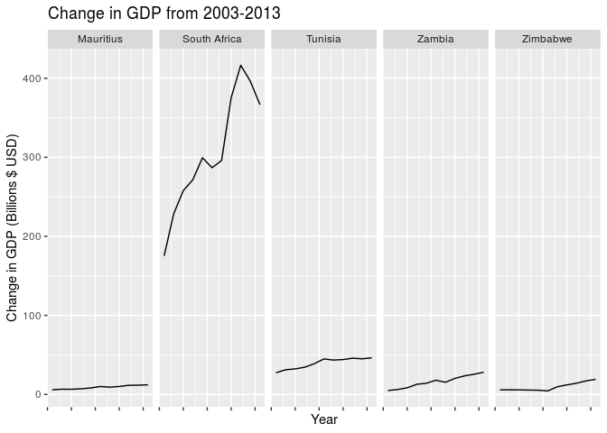
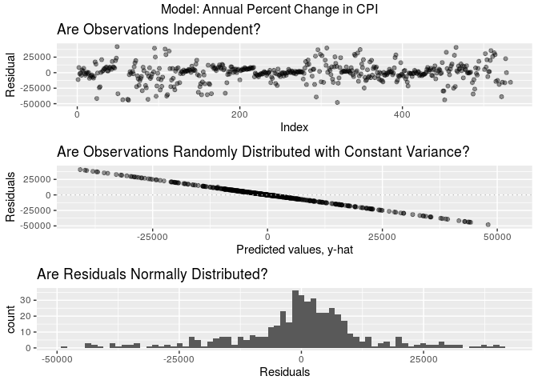

An Analysis of African Systemic Crises
================
Beck Addison, Jerry Lin, Isabella Swigart, Emma Hirschkop
12/3/2019

``` r
#install.packages(c("infer","countrycode","tmap", "plotly", "gridExtra"))
library(infer)
library(tidyverse)
library(countrycode)
library(gridExtra)
library(broom)
library(knitr)
library(plotly)
library(tmap)
library(sf)
```

``` r
load("../data/african_gdps.RData")

tests <- 1000
options(scipen = 999)
```

Our analysis begins with two datasets: our original African economic
crises dataset, which contains numerical variables like inflation rate,
exchange rate against the US dollar, and debt vs. GDP ratio. Another
helpful variable to analyze would be each country’s GDP, so we
downloaded world GDP data from the World Bank, and joined this data with
our Africa dataset. We then cleaned up the dataset by renaming some
variables and changing their types from integers to
booleans.

## Question 1: How does independence impact a country’s economic stability?

As African countries made a transition to becoming independent states,
many were plagued by violence or political unrest. A bloody 10-year war
in Algeria culminated in its independence; lengthy wars were fought in
Angola and Mozambique, sectional divides fraught the Congo, and a
political revolt ocurred in Kenya. Many of these movements brought
economic instability to their countries. However, at the same time,
these independence movements were fought in the hopes that establishing
an independent nation would bring greater economic prosperity and
stability to their country.

Thus, on a broad level, we’d like to determine how these independence
movements ultimately affected the stability of their countries’
economies.

Let’s first do some exploratory data anlysis. For each country, let’s
ask: how many years after independence will a country typically
experience its next crisis?

``` r
countries <- tibble(country = distinct(african_gdps, country)$country)
countries$independence_year <- african_gdps %>%
  filter(independence == 1) %>%
  group_by(country) %>%
  arrange(year) %>%
  filter(row_number()==1) %>%
  ungroup() %>%
  select(year)
  
countries$crisis_year <- african_gdps %>%
  filter(independence == 1) %>%
  group_by(country) %>%
  arrange(year) %>%
  filter(banking_crisis == "crisis") %>%
  filter(row_number() == 1) %>%
  ungroup() %>%
  select(year)

countries <- countries %>%
  mutate(difference = (crisis_year$year - independence_year$year))

countries %>%
  ggplot(mapping = aes(x = reorder(country, difference), y =
                         difference)) +
  geom_bar(stat = "identity") + 
  labs(title = "Years between a country 
       achieving independence and its next financial crisis",
    x = "Country",
    y = "Number of Years") + 
  coord_flip()
```

<!-- -->

``` r
countries %>%
  summarise(IQR = IQR(difference), median = median(difference), mean = mean(difference))
```

    ## # A tibble: 1 x 3
    ##     IQR median  mean
    ##   <dbl>  <dbl> <dbl>
    ## 1     3     28  31.3

``` r
rm(countries)
```

We see that the median amount of years a country will first encounter a
banking crisis after they achieve independence is about 30 years, with
an interquartile range of 11 years and a mean of 31.3 years.

This is fascinating, but we’re more interested in seeing if there’s a
difference in the economic stability of independent vs. colonized
African countries. In particular, we’re wondering if post-independence
African countries see a higher proportion of systemic crises (per year)
compared to before independence, when they were colonized. Let’s examine
it:

``` r
african_gdps %>%
  group_by(country, independence) %>%
  summarise(
    crisis_prop = mean(systemic_crisis == 1)
  )
```

    ## # A tibble: 25 x 3
    ## # Groups:   country [13]
    ##    country                  independence crisis_prop
    ##    <chr>                    <fct>              <dbl>
    ##  1 Algeria                  0                 0.0263
    ##  2 Algeria                  1                 0.0638
    ##  3 Angola                   0                 0     
    ##  4 Angola                   1                 0     
    ##  5 Central African Republic 0                 0     
    ##  6 Central African Republic 1                 0.345 
    ##  7 Egypt                    1                 0.0387
    ##  8 Ivory Coast              0                 0     
    ##  9 Ivory Coast              1                 0.0727
    ## 10 Kenya                    0                 0     
    ## # … with 15 more rows

``` r
african_gdps %>%
  group_by(independence) %>%
  summarise(
    overall_crisis_prop = mean(systemic_crisis == 1)
  )
```

    ## # A tibble: 2 x 2
    ##   independence overall_crisis_prop
    ##   <fct>                      <dbl>
    ## 1 0                        0.00422
    ## 2 1                        0.0985

Based on our sample, we see that on average, there is a 0.42% chance of
a systemic crisis occurring in any given year for a non-independent
(i.e. colonized) country, while there is a 9.85% chance of a systemic
crisis occurring in any given year for an independent country. The
difference in these proportions is 0.094320737.

We’d like to conduct a hypothesis test to see if the proportion of years
with systemic crises for African countries is higher post-independence
compared to pre-independence. Our null hypothesis is that the proportion
of years with systemic crises between African countries
post-independence and pre-independence is the same; the observed
difference is due to chance. Our alternative hypothesis is that the
proportion of years with systemic crises for African countries is higher
post-independence than pre-independence.

Since we’re testing for independence, we’ll use permutation. We’ll
modify our dataset slightly by factoring success into a categorical
variable so that it’ll work nicely with infer. We also need to quickly
factor systemic\_crisis to be a categorical variable. We’ve done this in
our `data-cleaning` file.

``` r
set.seed(1)
null_dist<- african_gdps %>%
  specify(response = systemic_crisis, explanatory = independence, 
          success = "1") %>%
  hypothesize(null = "independence") %>%
  generate(tests, type = "permute") %>%
  calculate(stat = "diff in props", 
            order = c("1", "0"))
get_p_value(null_dist, obs_stat = 0.094320737, direction = "greater")
```

    ## # A tibble: 1 x 1
    ##   p_value
    ##     <dbl>
    ## 1       0

``` r
visualize(null_dist) +
  shade_p_value(0.094320737, "greater") +
  labs(
    title = "Null Distribution of Difference in Systemic Crisis Proportions",
    subtitle = "Between Independent and Non-Independent African Countries",
    x = "Difference in Proportions", 
    y = "Count")
```

<!-- -->

``` r
rm(null_dist)
```

Since our p-value of 0 is less than our significance level of 0.05, we
reject the null hypothesis. The data provides convincing evidence that
the proportion of years with systemic crises for African countries is
higher post-independence than pre-independence.

Ultimately, we can conclude that after gaining independence, African
countries experience greater economic instability compared to when they
were under colonial
rule.

## Question 2: Are there differences in economic development and stability between North African and sub-Saharan African Countries?

#### Is there a difference in GDP and frequency of systemic crises between North African and sub-Saharan African countries?

Today, many newspapers, academics, and policymakers classify Africa into
two broad regions. There’s North Africa, consisting of nations like
Algeria and Morocco, and sub-Saharan Africa, which conists of countries
ranging from the Central African Republic to Botswana. Traditionally,
people associate sub-Saharan Africa with being less developed and more
impoverished compared to the rest of the continent. In recent years,
reports by the World Bank have claimed that more and more of the world’s
poor are being concentrated into a few sub-Saharan countries.

We set out to see if this is claim is true; that is, if there’s a
noticeable difference in economic stability and prosperity between North
African and sub-Saharan African countries. We can evaluate these claims
in two ways: by analyzing our data on each country’s GDP and the
proportion of years with systemic crises for each country.

To answer this question, we need to label North African and sub-Saharan
countries in our Africa dataset. We’ve done this in our `data-cleaning`
file.

Let’s calculate the median GDP for North African and sub-Saharan
countries.

When calculating GDP by region, we’ll use 2013 GDP data since it’s
recent and available for 11 of the 13 African countries in our dataset.
We can also perform some exploratory data analysis by visualising sample
median GDP.

``` r
regional_med_gdps <- african_gdps %>%
  filter(!is.na(gdp)) %>%
  filter(year == 2013) %>%
  group_by(region) %>%
  summarise(med_gdp_billions = median(gdp))

rmg <- regional_med_gdps %>%
  pull(med_gdp_billions)


regional_med_gdps
```

    ## # A tibble: 2 x 2
    ##   region       med_gdp_billions
    ##   <fct>                   <dbl>
    ## 1 North Africa            107. 
    ## 2 Sub-Saharan              41.6

``` r
african_gdps %>%
  filter(year == 2013) %>%
  ggplot( mapping = aes(x = region, y = gdp)) +
  geom_boxplot() +
  labs(title = "Median 2013 GDP by Region", x = "Region", y = "Median GDP (Billion $ USD)")
```

<!-- -->

``` r
rm(regional_med_gdps)
```

The IQR for sub-Saharan countries is much larger than the IQR for North
African countries, demonstrating larger variability. The country with
the greatest GDP is a sub-Saharan country, which is an outlier for its
region. However, the median 2014 GDP for sub-Saharan countries is less
than North African countries.

The median GDP for North African countries is 106.826 billion; the
median GDP for sub-Saharan countries is 41.5710942 billion. Therefore,
the difference in median GDP between North African and sub-Saharan
countries is 65.2549058 billion.

The first research question we’ll ask is: is the median GDP of North
African countries greater than the median GDP of sub-Saharan countries?

Our null hypothesis is that the median GDP of North African and
sub-Saharan countries is the same; the observed difference is due to
chance. Our alternative hypothesis is that the median GDP of North
African countries is greater than the median GDP of sub-Saharan African
countries.

Since we’re testing for independence, we’ll use permute.

``` r
set.seed(1)

null_dist <- african_gdps %>%
  filter(!is.na(gdp)) %>%
  filter(year == 2013) %>%
  specify(response = gdp, explanatory = region) %>%
  hypothesize(null = "independence") %>%
  generate(tests, type = "permute") %>%
  calculate(stat = "diff in medians", 
            order = c("North Africa", "Sub-Saharan"))
get_p_value(null_dist, obs_stat = rmg[1] - rmg[2], direction = "greater")
```

    ## # A tibble: 1 x 1
    ##   p_value
    ##     <dbl>
    ## 1   0.339

``` r
visualize(null_dist) +
  shade_p_value(rmg[1] - rmg[2], "greater") +
  labs(title = "Null Distribution of Difference in 2013 Median GDP", subtitle = "Between North African and Sub-Saharan Countries", x = "Difference in GDP ($)", 
       y = "Count")
```

<!-- -->

``` r
rm(null_dist)
rm(rmg)
```

Since our p-value of 0.339 is greater than our significance level of
0.05, we fail to reject the null hypothesis. The data does not provide
convincing evidence that the median 2013 GDP of North African countries
is greater than the median GDP of sub-Saharan countries.

Next, let’s calculate the proportion of years with systemic crises for
North African and sub-Saharan countries.

``` r
african_gdps %>%
  group_by(region) %>%
  summarise(overall_crisis_prop = mean(systemic_crisis == 1))
```

    ## # A tibble: 2 x 2
    ##   region       overall_crisis_prop
    ##   <fct>                      <dbl>
    ## 1 North Africa              0.0436
    ## 2 Sub-Saharan               0.0972

The proportion of years with systemic crises for North African countries
is 0.0436; the proportion of years with systemic crises for sub-Saharan
countries is 0.0971. The difference is 0.0535702.

The second research question we’ll ask is: do sub-Saharan countries have
a greater proportion of years with systemic crises than North African
countries?

Our null hypothesis is that the proportion of years with systemic crises
between North African and sub-Saharan countries is the same; the
observed difference is due to chance. Our alternative hypothesis is that
the proportion of years with systemic crises for sub-Saharan countries
is greater than for North African countries.

Since we’re testing for independence, we’ll use permute.

``` r
set.seed(1)
null_dist <- african_gdps %>%
  specify(response = systemic_crisis, explanatory = region, success = "1") %>%
  hypothesize(null = "independence") %>%
  generate(tests, type = "permute") %>%
  calculate(stat = "diff in props", 
            order = c("Sub-Saharan", "North Africa"))

get_p_value(null_dist, obs_stat = 0.0535702, direction = "greater")
```

    ## # A tibble: 1 x 1
    ##   p_value
    ##     <dbl>
    ## 1       0

``` r
visualize(null_dist) +
  shade_p_value(0.0535702, "greater") +
  labs(title = "Null Distribution of Difference in Proportion of Systemic 
  Crises", subtitle = "Between North African and Sub-Saharan Countries", x = "Difference in Proportion", y = "Count")
```

<!-- -->

``` r
rm(null_dist)
```

Since our p-value of 0 is less than the significance level of 0.05, we
reject the null hypothesis. The data provides convincing evidence that
sub-Saharan countries have a greater proportion of years with systemic
crises compared to North African countries.

From our results, we can conclude that historically — when accounting
for all years from the 19th century to today — sub-Saharan African
countries have been more prone to systemic crises than North African
countries. However, the data did not provide convincing evidence that
the median 2013 GDP of North African countries was greater than the
median 2013 GDP of sub-Saharan countries. That’s a positive sign; it
demonstrates that even though there have been historical disparities
between these two regions, in the 21st century, sub-Saharan Africa is
catching up, if not matching up to, North African economies.

## Question 3: What factors influence a country’s GDP the most?

Finally, we want to see what factors influence a country’s GDP the most,
as we want to by extension understand what factors most strongly predict
economic crises in Africa. Since we cannot (currently) use a binary
factor such as `systemic crisis` to determine whether an economy is in
crisis or not, we will define “crisis” in terms of GDP growth. If
year-on-year GDP growth is negative, we can say that the economy is
either recessing or in crisis; for the sake of this examination, we will
take both of these to indicate crisis. There is past evidence to show
that negative GDP growth is indicative of a crisis, as the 2008
recession saw widespread GDP stagnation or decline. Therefore, we will
optimize our model to increase “negative GDP growth”.

#### Modifying the dataset and exploratory data analysis

First and foremost, we will perform some exploratory data analysis on
the change in GDP of African countries in the decade between 2003 and
2013.

``` r
african_gdps %>%
  filter(year >= 2003 & year <= 2013) %>%
  filter(country %in% c("Algeria", "Angola", "Central African Republic", "Kenya")) %>%
  ggplot(mapping = aes(x = year, y = gdp)) +
  facet_grid(. ~ country) +
  geom_line() +
  labs(title = "Change in GDP from 2003-2013", x = "Year", y = "Change in GDP ($ USD)") +
  theme(axis.text.x = element_blank())
```

<!-- -->

``` r
african_gdps %>%
  filter(year >= 2003 & year <= 2013) %>%
  filter(country %in% c("Mauritius", "Morrocco", "South Africa", "Tunisia", "Zambia", "Zimbabwe")) %>%
  ggplot(mapping = aes(x = year, y = gdp)) +
  facet_grid(. ~ country) +
  geom_line() +
  labs(title = "Change in GDP from 2003-2013", x = "Year", y = "Change in GDP (Billions $ USD)") +
  theme(axis.text.x = element_blank())
```

<!-- -->

Next, we must find the difference in GDP growth between every year in
the dataset, for each country. We’ve done this below:

``` r
african_gdps <- african_gdps %>%
  group_by(country) %>%
  mutate(
    percentchange_gdp = (gdp - lag(gdp, default = gdp[1]))/gdp,
    percentchange_cpi = 
      (
        inflation_annual_cpi -
          lag(inflation_annual_cpi,default = inflation_annual_cpi[1])
      )
    /inflation_annual_cpi
  ) %>%
  filter(is.finite(percentchange_cpi))
```

Now, while we can’t show with our current stats knowledge whether the
occurrence of a systemic crisis and GDP growth are related through
direct means (this would require a binary hypothesis test), we can at
least show anecdotally that, during times of crisis, there is a
difference between GDP and CPI.

``` r
african_gdps %>%
  filter(!is.na(percentchange_gdp)) %>%
  group_by(systemic_crisis) %>%
  summarise(
    median_pcGDP = median(percentchange_gdp),
    iqr_pcGDP = IQR(percentchange_gdp),
    median_pcCPI = median(percentchange_cpi),
    iqr_pcCPI = IQR(percentchange_cpi)
  )
```

    ## # A tibble: 2 x 5
    ##   systemic_crisis median_pcGDP iqr_pcGDP median_pcCPI iqr_pcCPI
    ##   <fct>                  <dbl>     <dbl>        <dbl>     <dbl>
    ## 1 0                     0.0738     0.132       0.0437     0.726
    ## 2 1                     0.0322     0.182       0.113      0.813

While there is still evidence of positive growth during times of
systemic crisis, it is clear that at least within our sample, the median
percent change in GDP growth is less positive during crisis than out of
crisis; similarly, the median percent change in CPI is substantially
higher for crisis, indicating that African economic crises are marked by
increased rate of currency inflation.

#### Creation, refinement, and analysis of a regression model

Before we perform a backwards step to see which factors are most
influential in the percent change in GDP and CPI, we build our “full”
models, with all of the variables apart from the response variables
themselves. Additionally, we have examined the interaction between the
`crisis` variables, and the interaction between sovereign and domestic
debt in default.

``` r
full_pcGDP_model <- lm(
  percentchange_gdp ~ 
    (year +
    gdp +
    exch_usd +
    domestic_debt_in_default +
    sovereign_external_debt_default +
    gdp_weighted_default +
    inflation_annual_cpi +
    percentchange_cpi +
    independence +
    region +
    currency_crises +
    inflation_crises +
    banking_crisis)^2,
  african_gdps)

full_pcCPI_model <- lm(
    percentchange_cpi ~ 
    (year +
    gdp +
    exch_usd +
    domestic_debt_in_default +
    sovereign_external_debt_default +
    gdp_weighted_default +
    inflation_annual_cpi +
    percentchange_gdp +
    independence +
    region +
    currency_crises +
    inflation_crises +
    banking_crisis)^2,
    african_gdps)
```

Now we can perform our backwards step function, optimizing for a lower
value for AIC.

``` r
best_aic_pcGDP <- step(full_pcGDP_model, direction = "backward")
best_aic_pcCPI <- step(full_pcCPI_model, direction = "backward")

rm(full_pcCPI_model, full_pcGDP_model)
```

``` r
glance(best_aic_pcGDP)
```

    ## # A tibble: 1 x 11
    ##   r.squared adj.r.squared sigma statistic  p.value    df logLik   AIC   BIC
    ##       <dbl>         <dbl> <dbl>     <dbl>    <dbl> <int>  <dbl> <dbl> <dbl>
    ## 1     0.292         0.229 0.124      4.68 6.54e-18    44   379. -669. -476.
    ## # … with 2 more variables: deviance <dbl>, df.residual <int>

``` r
glance(best_aic_pcCPI)
```

    ## # A tibble: 1 x 11
    ##   r.squared adj.r.squared  sigma statistic   p.value    df logLik    AIC
    ##       <dbl>         <dbl>  <dbl>     <dbl>     <dbl> <int>  <dbl>  <dbl>
    ## 1     0.890         0.879 43180.      85.1 1.78e-202    47 -6420. 12937.
    ## # … with 3 more variables: BIC <dbl>, deviance <dbl>, df.residual <int>

``` r
tidy(best_aic_pcGDP) %>%
  select(term, estimate, p.value) %>%
  arrange(p.value) %>%
  kable(format = "markdown", digits = 3)
```

| term                                                          | estimate | p.value |
| :------------------------------------------------------------ | -------: | ------: |
| inflation\_crises1                                            | \-21.490 |   0.000 |
| year:inflation\_crises1                                       |    0.011 |   0.000 |
| inflation\_crises1:banking\_crisisno\_crisis                  |    0.216 |   0.000 |
| sovereign\_external\_debt\_default1:banking\_crisisno\_crisis |    0.153 |   0.000 |
| inflation\_annual\_cpi                                        |    0.020 |   0.001 |
| sovereign\_external\_debt\_default1:currency\_crises1         |  \-0.161 |   0.001 |
| year:inflation\_annual\_cpi                                   |    0.000 |   0.001 |
| currency\_crises1                                             |  \-0.066 |   0.003 |
| gdp:domestic\_debt\_in\_default1                              |    0.024 |   0.011 |
| gdp:banking\_crisisno\_crisis                                 |    0.001 |   0.012 |
| exch\_usd:currency\_crises1                                   |  \-0.001 |   0.014 |
| gdp\_weighted\_default:regionSub-Saharan                      |  \-5.542 |   0.014 |
| gdp\_weighted\_default:inflation\_annual\_cpi                 |    0.101 |   0.018 |
| gdp:gdp\_weighted\_default                                    |    0.042 |   0.019 |
| exch\_usd:inflation\_crises1                                  |    0.001 |   0.023 |
| sovereign\_external\_debt\_default1:inflation\_crises1        |    0.136 |   0.024 |
| gdp:inflation\_annual\_cpi                                    |    0.000 |   0.025 |
| year:gdp\_weighted\_default                                   |  \-0.302 |   0.025 |
| gdp\_weighted\_default                                        |  600.837 |   0.025 |
| gdp\_weighted\_default:inflation\_crises1                     |  \-1.977 |   0.026 |
| domestic\_debt\_in\_default1                                  |  \-0.138 |   0.026 |
| sovereign\_external\_debt\_default1                           |  \-0.359 |   0.030 |
| gdp                                                           |  \-0.001 |   0.040 |
| independence1                                                 |    0.247 |   0.051 |
| exch\_usd:percentchange\_cpi                                  |    0.000 |   0.051 |
| sovereign\_external\_debt\_default1:regionSub-Saharan         |    0.299 |   0.052 |
| year:regionSub-Saharan                                        |    0.002 |   0.052 |
| sovereign\_external\_debt\_default1:inflation\_annual\_cpi    |  \-0.002 |   0.060 |
| regionSub-Saharan                                             |  \-3.110 |   0.072 |
| percentchange\_cpi:currency\_crises1                          |  \-0.016 |   0.076 |
| banking\_crisisno\_crisis                                     |   10.893 |   0.081 |
| year:banking\_crisisno\_crisis                                |  \-0.005 |   0.082 |
| sovereign\_external\_debt\_default1:percentchange\_cpi        |  \-0.010 |   0.098 |
| exch\_usd:sovereign\_external\_debt\_default1                 |    0.000 |   0.118 |
| gdp:exch\_usd                                                 |    0.000 |   0.139 |
| domestic\_debt\_in\_default1:percentchange\_cpi               |    0.016 |   0.143 |
| inflation\_annual\_cpi:currency\_crises1                      |    0.001 |   0.149 |
| independence1:regionSub-Saharan                               |  \-0.192 |   0.152 |
| regionSub-Saharan:banking\_crisisno\_crisis                   |  \-0.079 |   0.154 |
| exch\_usd:domestic\_debt\_in\_default1                        |    0.000 |   0.165 |
| percentchange\_cpi                                            |    0.000 |   0.168 |
| (Intercept)                                                   |  \-7.345 |   0.248 |
| year                                                          |    0.004 |   0.261 |
| exch\_usd                                                     |    0.000 |   0.908 |

``` r
tidy(best_aic_pcCPI) %>%
  select(term, estimate, p.value) %>%
  arrange(p.value) %>%
  kable(format = "markdown", digits = 3)
```

| term                                                          |      estimate | p.value |
| :------------------------------------------------------------ | ------------: | ------: |
| exch\_usd:currency\_crises1                                   |      2246.617 |   0.000 |
| domestic\_debt\_in\_default1:banking\_crisisno\_crisis        |  \-735485.207 |   0.000 |
| domestic\_debt\_in\_default1:currency\_crises1                |    394592.308 |   0.000 |
| inflation\_annual\_cpi:banking\_crisisno\_crisis              |      2247.004 |   0.000 |
| exch\_usd:inflation\_crises1                                  |    \-1336.807 |   0.000 |
| domestic\_debt\_in\_default1:inflation\_crises1               |  \-608869.999 |   0.000 |
| domestic\_debt\_in\_default1:percentchange\_gdp               |    531416.895 |   0.000 |
| exch\_usd:percentchange\_gdp                                  |      1044.307 |   0.000 |
| domestic\_debt\_in\_default1:inflation\_annual\_cpi           |      2164.987 |   0.000 |
| exch\_usd:domestic\_debt\_in\_default1                        |      1619.425 |   0.000 |
| inflation\_annual\_cpi:currency\_crises1                      |    \-2043.113 |   0.000 |
| domestic\_debt\_in\_default1                                  |  28863048.018 |   0.000 |
| year:domestic\_debt\_in\_default1                             |   \-14291.910 |   0.000 |
| inflation\_annual\_cpi                                        |   \-15355.542 |   0.000 |
| year:inflation\_annual\_cpi                                   |         6.703 |   0.000 |
| sovereign\_external\_debt\_default1:percentchange\_gdp        |  \-176047.049 |   0.000 |
| banking\_crisisno\_crisis                                     |   9743420.161 |   0.000 |
| year:banking\_crisisno\_crisis                                |    \-4897.771 |   0.000 |
| gdp:inflation\_annual\_cpi                                    |         6.761 |   0.000 |
| year                                                          |      4784.186 |   0.000 |
| (Intercept)                                                   | \-9514416.857 |   0.000 |
| percentchange\_gdp:currency\_crises1                          |    122641.601 |   0.000 |
| inflation\_annual\_cpi:inflation\_crises1                     |      1744.019 |   0.001 |
| year:inflation\_crises1                                       |    \-2934.811 |   0.001 |
| inflation\_crises1                                            |   5799030.783 |   0.001 |
| regionSub-Saharan:banking\_crisisno\_crisis                   |   \-53330.772 |   0.005 |
| sovereign\_external\_debt\_default1:banking\_crisisno\_crisis |     50705.299 |   0.006 |
| currency\_crises1:banking\_crisisno\_crisis                   |   \-53029.752 |   0.010 |
| regionSub-Saharan                                             |     48549.867 |   0.010 |
| percentchange\_gdp:banking\_crisisno\_crisis                  |   \-95264.013 |   0.021 |
| gdp:inflation\_crises1                                        |     \-519.162 |   0.039 |
| gdp\_weighted\_default                                        | 170020966.107 |   0.042 |
| year:gdp\_weighted\_default                                   |   \-85193.772 |   0.042 |
| inflation\_crises1:banking\_crisisno\_crisis                  |     41785.838 |   0.051 |
| gdp:banking\_crisisno\_crisis                                 |       217.889 |   0.057 |
| gdp\_weighted\_default:regionSub-Saharan                      | \-1205468.685 |   0.060 |
| year:exch\_usd                                                |       \-3.046 |   0.084 |
| exch\_usd                                                     |      5982.225 |   0.088 |
| currency\_crises1                                             |     37178.901 |   0.092 |
| gdp                                                           |     \-206.157 |   0.099 |
| sovereign\_external\_debt\_default1                           | \-3303654.804 |   0.114 |
| gdp:exch\_usd                                                 |       \-1.005 |   0.118 |
| gdp:gdp\_weighted\_default                                    |      7762.042 |   0.125 |
| year:sovereign\_external\_debt\_default1                      |      1608.202 |   0.128 |
| sovereign\_external\_debt\_default1:regionSub-Saharan         |     76907.402 |   0.128 |
| gdp\_weighted\_default:banking\_crisisno\_crisis              |  \-189736.345 |   0.153 |
| percentchange\_gdp                                            |     50856.185 |   0.230 |

Now, we are going to calculate the r-squared value. We are going to be
using the adjusted r-squared value because these are multiple
regressions.

``` r
glance(best_aic_pcGDP)$adj.r.squared
```

    ## [1] 0.2292906

``` r
glance(best_aic_pcCPI)$adj.r.squared
```

    ## [1] 0.8790931

As calculated above, the adjusted R squared values are 0.2292906 for our
model predicting percent change in GDP, and 0.8790931 for our model
predicting percent change in CPI. This latter value attests to the
precision of the model in explaining CPI changes in African economies,
which by extension

### Checking Assumptions

To make checking the assumptions of our models to ensure they are able
to be used in general inference, we have developed a quick function to
evaluate the two models quickly and without much repetition. In the
function, we test the four main assumptions required to infer on a model
using residual analysis\[1\].

``` r
eval_assumptions <- function(model, lower_bound, upper_bound) {
  restrict_range_lower <- lower_bound
  restrict_range_upper <- upper_bound
  aug <- augment(model)
  
  indep_plot <- ggplot(data = aug, aes(x = 1:nrow(aug), y = .resid)) +
    geom_point(alpha = 0.4) +
    labs(title = "Are Observations Independent?", x = "Index", y = "Residual")
  
  distro_plot <- ggplot(data = aug, aes(x = .fitted, y = .resid)) +
  geom_point(alpha = 0.4) +
  geom_hline(yintercept = 0, lty = 3, color = "gray") +
  labs(
    title = "Are Observations Randomly Distributed with Constant Variance?",
    y = "Residuals",
    x = "Predicted values, y-hat")
  
  normal_dist <- ggplot(data = aug, aes(x = .resid)) +
  geom_histogram(bins = 75) +
  labs(
    title = "Are Residuals Normally Distributed?",
    x = "Residuals")
  
  if (!missing(restrict_range_lower) && !missing(restrict_range_upper)) {
      
      q_resid <- quantile(aug$.resid,probs = c(restrict_range_lower, restrict_range_upper))
      
      q_fitted <- quantile(aug$.fitted, probs = c(restrict_range_lower, restrict_range_upper))
      
      indep_plot <- indep_plot + ylim(q_resid[1], q_resid[2])
      distro_plot <- distro_plot + xlim(q_fitted[1], q_fitted[2]) + ylim(q_resid[1], q_resid[2])
      normal_dist <- normal_dist + xlim(q_resid[1], q_resid[2])

  }
  name <- deparse(substitute(model)) %>%
    substring(., nchar(.) - 2, nchar(.))
  grid.arrange(
    top = paste("Model: Annual Percent Change in", name),
    indep_plot,
    distro_plot,
    normal_dist)
}
```

``` r
eval_assumptions(best_aic_pcGDP, 0.05, 0.95)
```

<!-- -->

For our annual percent change in GDP regression model, it is clear that
all conditions are met to use the model for inference. While it doesn’t
explain the variance of our dataset quite as well as our CPI model, it
has randomly distributed residuals that are constantly variant and
approximately normally distributed.

``` r
eval_assumptions(best_aic_pcCPI, 0.05, 0.95)
```

<!-- -->

In contrast, while our annual percentage change in CPI regression model
explains the variance in the dataset much better than our GDP model when
comparing adjusted R-squared values, it may not be as suited to general
inference. While the observations are independent and approximately
normally distributed, there seems to be a clear trend in the
distribution of observations. This indicates that while the model is
quite precise in repeatedly predicting a similar value for any given
factors, it is increasingly inaccurate in predicting larger changes,
resulting in more residuals. Therefore, while this model is incredibly
effective in predicting changes in CPI when CPI changes are small, it is
not as accurate when CPI changes are large. For the purposes of our
dataset, this is mostly fine - changes in CPI are generally incremental.
In fact, the lack of data for larger changes in CPI can probably explain
the inaccuracy of the model at these extremes.

###### Footnotes

1.  Note - this code has been borrowed from the following slide and
    modified for the purposes of this assignment:
    <https://www2.stat.duke.edu/courses/Fall19/sta199.001/slides/lec-slides/11d-inf-reg.html#40>
