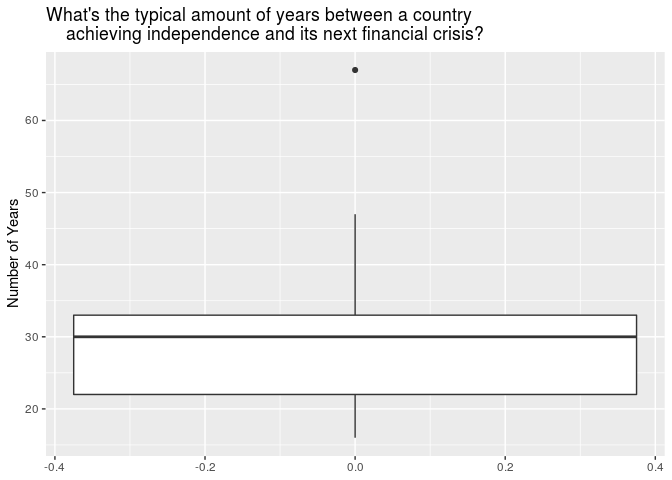

From Cape to Cairo: Following African Economic Crises from the Colonial
Era to through the Modern Age
================
Six-Thirty-Eight
10/22/19

``` r
library(tidyverse)
```

    ## ── Attaching packages ────────────────────────────────────────────────────── tidyverse 1.2.1 ──

    ## ✔ ggplot2 3.2.1     ✔ purrr   0.3.2
    ## ✔ tibble  2.1.3     ✔ dplyr   0.8.3
    ## ✔ tidyr   1.0.0     ✔ stringr 1.4.0
    ## ✔ readr   1.3.1     ✔ forcats 0.4.0

    ## ── Conflicts ───────────────────────────────────────────────────────── tidyverse_conflicts() ──
    ## ✖ dplyr::filter() masks stats::filter()
    ## ✖ dplyr::lag()    masks stats::lag()

### Section 1. Introduction

Beck

### Section 2. Exploratory data analysis

``` r
africa <- read_csv("../data/african_crises.csv")
```

    ## Parsed with column specification:
    ## cols(
    ##   case = col_double(),
    ##   cc3 = col_character(),
    ##   country = col_character(),
    ##   year = col_double(),
    ##   systemic_crisis = col_double(),
    ##   exch_usd = col_double(),
    ##   domestic_debt_in_default = col_double(),
    ##   sovereign_external_debt_default = col_double(),
    ##   gdp_weighted_default = col_double(),
    ##   inflation_annual_cpi = col_double(),
    ##   independence = col_double(),
    ##   currency_crises = col_double(),
    ##   inflation_crises = col_double(),
    ##   banking_crisis = col_character()
    ## )

``` r
global <- read_csv("../data/global_crisis_data.csv")
```

    ## Parsed with column specification:
    ## cols(
    ##   .default = col_character(),
    ##   Case = col_double(),
    ##   Year = col_double(),
    ##   exch_usd = col_double(),
    ##   exch_usd_alt1 = col_double(),
    ##   exch_usd_alt2 = col_double(),
    ##   exch_usd_alt3 = col_double(),
    ##   `SOVEREIGN EXTERNAL DEBT 2: DEFAULT and RESTRUCTURINGS, 1800-2012--Does not include defaults on WWI debt to United States and United Kingdom but includes post-1975 defaults on Official External Creditors` = col_double()
    ## )

    ## See spec(...) for full column specifications.

    ## Warning: 891 parsing failures.
    ##  row      col expected actual                             file
    ## 1228 exch_usd a double    n/a '../data/global_crisis_data.csv'
    ## 1229 exch_usd a double    n/a '../data/global_crisis_data.csv'
    ## 1230 exch_usd a double    n/a '../data/global_crisis_data.csv'
    ## 1231 exch_usd a double    n/a '../data/global_crisis_data.csv'
    ## 1232 exch_usd a double    n/a '../data/global_crisis_data.csv'
    ## .... ........ ........ ...... ................................
    ## See problems(...) for more details.

``` r
gdps <- read_csv("../data/world_gdp_data.csv")
```

    ## Parsed with column specification:
    ## cols(
    ##   .default = col_double(),
    ##   `Country Name` = col_character(),
    ##   `Country Code` = col_character(),
    ##   `Indicator Name` = col_character(),
    ##   `Indicator Code` = col_character()
    ## )
    ## See spec(...) for full column specifications.

``` r
gdpspiv <- gdps %>%
  pivot_longer(
    cols = c(
      -`Country Name`,
      -`Country Code`,
      -`Indicator Name`,
      -`Indicator Code`),
    names_to = "year"
  )
```

To start, we can visualize the number of years with a banking crisis in
African countries as a bar graph.

``` r
ggplot(data = africa, mapping = aes(x = banking_crisis)) +
  geom_bar(fill = "pink") +
  labs(
    x = "Banking Crisis", 
    title = "Number of Years with Banking Crises in African Countries"
    )
```

<!-- -->

We can create a plot of all the countries included in the African
economic dataset and what years data is given for them.

``` r
ggplot(data = africa, mapping = aes(x = year)) +
  geom_histogram(binwidth = 10, fill = "blue", col = "black") +
  labs(
    x = "Year",
    y = "Number of Countries", 
    title = "Increase in Total Number of African
    Country Economic Observations Over Time"
    )
```

<!-- -->

``` r
ggplot(data = africa, mapping = aes(x = country, y = year)) +
  geom_point(size = .75, col = "orange") +
  coord_flip() +
  labs(
  x = "Country",
  y = "Year",
  title = "African Economic Data Observed Each Year by Country"
  )
```

<!-- -->

Overall, observations of African economies greatly increased after 1950.
However, there are some African countries, such as Egypt and South
Africa, whose economies have been monitored for over a century.

Next, we can determine the percentage of systemic crisis years for each
country in the Africa dataset.

``` r
africa %>%
  count(country, systemic_crisis) %>%
  group_by(country) %>%
  mutate(crisis_proportion = 1- (n/sum(n))) %>%
  filter(systemic_crisis == 0) %>%
  select(country, crisis_proportion) %>%
  arrange(desc(crisis_proportion))
```

    ## # A tibble: 13 x 2
    ## # Groups:   country [13]
    ##    country                  crisis_proportion
    ##    <chr>                                <dbl>
    ##  1 Central African Republic            0.328 
    ##  2 Kenya                               0.194 
    ##  3 Nigeria                             0.167 
    ##  4 Zimbabwe                            0.167 
    ##  5 Tunisia                             0.0667
    ##  6 Ivory Coast                         0.0635
    ##  7 Zambia                              0.0556
    ##  8 Algeria                             0.0471
    ##  9 Egypt                               0.0387
    ## 10 Morocco                             0.0267
    ## 11 Angola                              0     
    ## 12 Mauritius                           0     
    ## 13 South Africa                        0

The Central African Republic had the highest proportion of recorded
years with systemic crises, with 32.8% of the years recorded having a
systemic crisis. Out of the 13 African countries in the dataset, only
South Africa, Angola, and Mauritius had no systemic crises.

Now, we’ll explore an interesting question. Independence movements are
tricky - while they might achieve democracy and self-governance for a
country, they often contribute to political and economic instability.
For each country, we’ll determine how many years after independence a
country will typically experience it’s next crisis.

``` r
output <- tibble(country = distinct(africa, country)$country)
output$independence_year <- africa %>%
  filter(independence == 1) %>%
  group_by(country) %>%
  filter(row_number()==1) %>%
  ungroup() %>%
  select(year)
  
output$crisis_year <- africa %>%
  filter(independence == 1) %>%
  group_by(country) %>%
  filter(banking_crisis == "crisis") %>%
  filter(row_number() == 1) %>%
  ungroup() %>%
  select(year)
output <- output %>%
  mutate(difference = (crisis_year$year - independence_year$year))
ggplot(data = output, mapping = aes(y = difference)) +
  geom_boxplot() + 
  labs(
    title = "What's the typical amount of years between a country 
    achieving independence and its next financial crisis?",
    y = "Number of Years")
```

<!-- -->

``` r
output %>%
  summarise(IQR = IQR(difference), median = median(difference))
```

    ## # A tibble: 1 x 2
    ##     IQR median
    ##   <dbl>  <dbl>
    ## 1    11     30

We see that the median amount of years a country will first encounter a
banking crisis after they achieve independence is about 30 years, with
an interquartile range of 11 years. This brings us to an interesting
question - what values characterize countries that had a long period of
economic prosperity after independence, and what characterizes countries
that saw immediate financial crises?

Next, we’ll do a univariate visualization of what the exchange rate
variable looks like:

``` r
ggplot(data = africa, mapping = aes(x = exch_usd)) +
  geom_histogram(bins = 10)
```

<!-- -->

``` r
summary_stats <- africa %>%
  summarise(median = median(exch_usd), std = sd(exch_usd))
```

We see that the median exchange rate against the US dollar is `{r}
summary_stats$median` and the standard deviation is `{r}
summary_stats$std`. The distribution is right-skewed.

Next, let’s analyze if exchange rate against the dollar and inflation
rate correlate with economic crises.

``` r
africa %>%
ggplot(
  aes(
    x = inflation_annual_cpi,
    y = exch_usd,
    color = banking_crisis)) +
  geom_point() + 
  xlim(-10, 100)
```

<!-- -->

We see that high levels of inflation often correspond to banking crises
- but this is not always true. There were many cases of banking crises
that existed even when inflation was lower than typical. Moreover,
banking crises also tended to exist when exchange rates against the
dollar were high. This could point to a pretty interesting research
question - what levels of inflation and exchange rate against the dollar
will signal a banking crisis (or any crisis in general?)

### Section 3. Research questions

Questions:

1.  How did major European economies change with colonialism? How did
    African economies change when colonized? Conversely, how did
    European/African economies change with decolonization of the African
    continent?

<!-- end list -->

  - Danger: there are a lot of factors that affect a European economies,
    and losing a colony might not be that impactful. Concentrate on
    African economies in this analysis.

<!-- end list -->

2.  Was an economic crisis more likely following n years after
    decolonization?

3.  What factors are most associated with a systemic crisis in Africa?
    How can identify a systemic crisis in the dataset? What defines a
    systemic crisis, and how do African systemic crises compare to other
    nations’ crises?

### Section 4. Data

``` r
glimpse(africa)
```

    ## Observations: 1,059
    ## Variables: 14
    ## $ case                            <dbl> 1, 1, 1, 1, 1, 1, 1, 1, 1, 1, 1,…
    ## $ cc3                             <chr> "DZA", "DZA", "DZA", "DZA", "DZA…
    ## $ country                         <chr> "Algeria", "Algeria", "Algeria",…
    ## $ year                            <dbl> 1870, 1871, 1872, 1873, 1874, 18…
    ## $ systemic_crisis                 <dbl> 1, 0, 0, 0, 0, 0, 0, 0, 0, 0, 0,…
    ## $ exch_usd                        <dbl> 0.052264, 0.052798, 0.052274, 0.…
    ## $ domestic_debt_in_default        <dbl> 0, 0, 0, 0, 0, 0, 0, 0, 0, 0, 0,…
    ## $ sovereign_external_debt_default <dbl> 0, 0, 0, 0, 0, 0, 0, 0, 0, 0, 0,…
    ## $ gdp_weighted_default            <dbl> 0, 0, 0, 0, 0, 0, 0, 0, 0, 0, 0,…
    ## $ inflation_annual_cpi            <dbl> 3.441456, 14.149140, -3.718593, …
    ## $ independence                    <dbl> 0, 0, 0, 0, 0, 0, 0, 0, 0, 0, 0,…
    ## $ currency_crises                 <dbl> 0, 0, 0, 0, 0, 0, 0, 0, 0, 0, 0,…
    ## $ inflation_crises                <dbl> 0, 0, 0, 0, 0, 0, 0, 1, 0, 0, 0,…
    ## $ banking_crisis                  <chr> "crisis", "no_crisis", "no_crisi…

``` r
glimpse(global)
```

    ## Observations: 15,191
    ## Variables: 27
    ## $ Case                                                                                                                                                                                                         <dbl> …
    ## $ CC3                                                                                                                                                                                                          <chr> …
    ## $ Country                                                                                                                                                                                                      <chr> …
    ## $ Year                                                                                                                                                                                                         <dbl> …
    ## $ `Banking Crisis`                                                                                                                                                                                             <chr> …
    ## $ Banking_Crisis_Notes                                                                                                                                                                                         <chr> …
    ## $ `Systemic Crisis`                                                                                                                                                                                            <chr> …
    ## $ `Gold Standard`                                                                                                                                                                                              <chr> …
    ## $ exch_usd                                                                                                                                                                                                     <dbl> …
    ## $ exch_usd_alt1                                                                                                                                                                                                <dbl> …
    ## $ exch_usd_alt2                                                                                                                                                                                                <dbl> …
    ## $ exch_usd_alt3                                                                                                                                                                                                <dbl> …
    ## $ conversion_notes                                                                                                                                                                                             <chr> …
    ## $ `national currency`                                                                                                                                                                                          <chr> …
    ## $ `exch_primary source code`                                                                                                                                                                                   <chr> …
    ## $ exch_sources                                                                                                                                                                                                 <chr> …
    ## $ Domestic_Debt_In_Default                                                                                                                                                                                     <chr> …
    ## $ `Domestic_Debt_ Notes/Sources`                                                                                                                                                                               <chr> …
    ## $ `SOVEREIGN EXTERNAL DEBT 1: DEFAULT and RESTRUCTURINGS, 1800-2012--Does not include defaults on WWI debt to United States and United Kingdom and post-1975 defaults on Official External Creditors`          <chr> …
    ## $ `SOVEREIGN EXTERNAL DEBT 2: DEFAULT and RESTRUCTURINGS, 1800-2012--Does not include defaults on WWI debt to United States and United Kingdom but includes post-1975 defaults on Official External Creditors` <dbl> …
    ## $ Defaults_External_Notes                                                                                                                                                                                      <chr> …
    ## $ GDP_Weighted_default                                                                                                                                                                                         <chr> …
    ## $ `<`                                                                                                                                                                                                          <chr> …
    ## $ `Inflation, Annual percentages of average consumer prices`                                                                                                                                                   <chr> …
    ## $ Independence                                                                                                                                                                                                 <chr> …
    ## $ `Currency Crises`                                                                                                                                                                                            <chr> …
    ## $ `Inflation Crises`                                                                                                                                                                                           <chr> …

``` r
glimpse(gdps)
```

    ## Observations: 264
    ## Variables: 63
    ## $ `Country Name`   <chr> "Aruba", "Afghanistan", "Angola", "Albania", "A…
    ## $ `Country Code`   <chr> "ABW", "AFG", "AGO", "ALB", "AND", "ARB", "ARE"…
    ## $ `Indicator Name` <chr> "GDP (current US$)", "GDP (current US$)", "GDP …
    ## $ `Indicator Code` <chr> "NY.GDP.MKTP.CD", "NY.GDP.MKTP.CD", "NY.GDP.MKT…
    ## $ `1960`           <dbl> NA, 537777811, NA, NA, NA, NA, NA, NA, NA, NA, …
    ## $ `1961`           <dbl> NA, 548888896, NA, NA, NA, NA, NA, NA, NA, NA, …
    ## $ `1962`           <dbl> NA, 546666678, NA, NA, NA, NA, NA, 24450604878,…
    ## $ `1963`           <dbl> NA, 751111191, NA, NA, NA, NA, NA, 18272123664,…
    ## $ `1964`           <dbl> NA, 800000044, NA, NA, NA, NA, NA, 25605249382,…
    ## $ `1965`           <dbl> NA, 1006666638, NA, NA, NA, NA, NA, 28344705967…
    ## $ `1966`           <dbl> NA, 1399999967, NA, NA, NA, NA, NA, 28630474728…
    ## $ `1967`           <dbl> NA, 1673333418, NA, NA, NA, NA, NA, 24256667553…
    ## $ `1968`           <dbl> NA, 1373333367, NA, NA, NA, 25800420223, NA, 26…
    ## $ `1969`           <dbl> NA, 1408888922, NA, NA, NA, 28342519494, NA, 31…
    ## $ `1970`           <dbl> NA, 1748886596, NA, NA, 78619206, 31922432897, …
    ## $ `1971`           <dbl> NA, 1831108971, NA, NA, 89409820, 36946286420, …
    ## $ `1972`           <dbl> NA, 1595555476, NA, NA, 113408232, 44066761651,…
    ## $ `1973`           <dbl> NA, 1733333264, NA, NA, 150820103, 55776586531,…
    ## $ `1974`           <dbl> NA, 2155555498, NA, NA, 186558696, 105527000000…
    ## $ `1975`           <dbl> NA, 2366666616, NA, NA, 220127246, 116893000000…
    ## $ `1976`           <dbl> NA, 2555555567, NA, NA, 227281025, 145249000000…
    ## $ `1977`           <dbl> NA, 2953333418, NA, NA, 254020153, 167282000000…
    ## $ `1978`           <dbl> NA, 3300000109, NA, NA, 308008898, 183716000000…
    ## $ `1979`           <dbl> NA, 3697940410, NA, NA, 411578334, 248663000000…
    ## $ `1980`           <dbl> NA, 3641723322, 5930503401, NA, 446416106, 3371…
    ## $ `1981`           <dbl> NA, 3478787909, 5550483036, NA, 388958731, 3476…
    ## $ `1982`           <dbl> NA, NA, 5550483036, NA, 375895956, 326100000000…
    ## $ `1983`           <dbl> NA, NA, 5784341596, NA, 327861833, 306342000000…
    ## $ `1984`           <dbl> NA, NA, 6131475065, 1857338012, 330070689, 3107…
    ## $ `1985`           <dbl> NA, NA, 7553560459, 1897050133, 346737965, 3075…
    ## $ `1986`           <dbl> 405463417, NA, 7072063345, 2097326250, 48200059…
    ## $ `1987`           <dbl> 487602458, NA, 8083872012, 2080796250, 61131639…
    ## $ `1988`           <dbl> 596423607, NA, 8769250550, 2051236250, 72142593…
    ## $ `1989`           <dbl> 695304363, NA, 10201099040, 2253090000, 7954493…
    ## $ `1990`           <dbl> 764887117, NA, 11228764963, 2028553750, 1029048…
    ## $ `1991`           <dbl> 872138731, NA, 10603784541, 1099559028, 1106928…
    ## $ `1992`           <dbl> 958463200, NA, 8307810974, 652174991, 121001365…
    ## $ `1993`           <dbl> 1082979708, NA, 5768720422, 1185315468, 1007025…
    ## $ `1994`           <dbl> 1245688253, NA, 4438321017, 1880951520, 1017549…
    ## $ `1995`           <dbl> 1320474860, NA, 5538749260, 2392764853, 1178738…
    ## $ `1996`           <dbl> 1379960894, NA, 7526446606, 3199642580, 1223945…
    ## $ `1997`           <dbl> 1531944134, NA, 7648377413, 2258515610, 1180597…
    ## $ `1998`           <dbl> 1665100559, NA, 6506229607, 2545967253, 1211932…
    ## $ `1999`           <dbl> 1722798883, NA, 6152922943, 3212119044, 1239876…
    ## $ `2000`           <dbl> 1873452514, NA, 9129594819, 3480355189, 1434429…
    ## $ `2001`           <dbl> 1920111732, NA, 8936063723, 3922099471, 1496912…
    ## $ `2002`           <dbl> 1941340782, 4055176933, 15285594828, 4348070165…
    ## $ `2003`           <dbl> 2021229050, 4515563414, 17812705294, 5611492283…
    ## $ `2004`           <dbl> 2228491620, 5226775163, 23552052408, 7184681399…
    ## $ `2005`           <dbl> 2.330726e+09, 6.209140e+09, 3.697092e+10, 8.052…
    ## $ `2006`           <dbl> 2.424581e+09, 6.971287e+09, 5.238101e+10, 8.896…
    ## $ `2007`           <dbl> 2.615084e+09, 9.747886e+09, 6.526645e+10, 1.067…
    ## $ `2008`           <dbl> 2.745251e+09, 1.010922e+10, 8.853861e+10, 1.288…
    ## $ `2009`           <dbl> 2.498883e+09, 1.243909e+10, 7.030716e+10, 1.204…
    ## $ `2010`           <dbl> 2.390503e+09, 1.585657e+10, 8.379950e+10, 1.192…
    ## $ `2011`           <dbl> 2.549721e+09, 1.780428e+10, 1.117900e+11, 1.289…
    ## $ `2012`           <dbl> 2.534637e+09, 2.000162e+10, 1.280530e+11, 1.231…
    ## $ `2013`           <dbl> 2.581564e+09, 2.056105e+10, 1.367100e+11, 1.277…
    ## $ `2014`           <dbl> 2.649721e+09, 2.048487e+10, 1.457120e+11, 1.322…
    ## $ `2015`           <dbl> 2.691620e+09, 1.990711e+10, 1.161940e+11, 1.138…
    ## $ `2016`           <dbl> 2.646927e+09, 1.936264e+10, 1.011240e+11, 1.186…
    ## $ `2017`           <dbl> 2.700559e+09, 2.019176e+10, 1.221240e+11, 1.302…
    ## $ `2018`           <dbl> NA, 1.936297e+10, 1.057510e+11, 1.505888e+10, 3…
