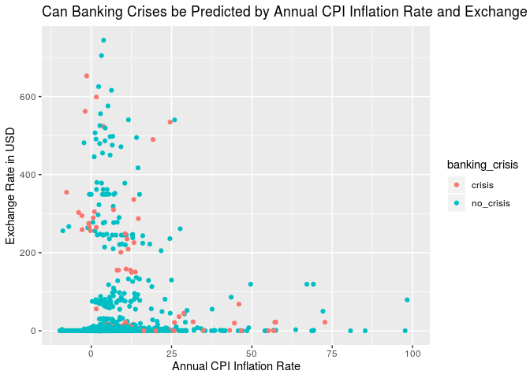

From Cape to Cairo: Following African Economic Crises from the Colonial
Era to through the Modern Age
================
Six-Thirty-Eight
10/22/19

``` r
library(tidyverse)
```

    ## ── Attaching packages ────────────────────────────────────────────────────── tidyverse 1.2.1 ──

    ## ✔ ggplot2 3.2.1     ✔ purrr   0.3.2
    ## ✔ tibble  2.1.3     ✔ dplyr   0.8.3
    ## ✔ tidyr   1.0.0     ✔ stringr 1.4.0
    ## ✔ readr   1.3.1     ✔ forcats 0.4.0

    ## ── Conflicts ───────────────────────────────────────────────────────── tidyverse_conflicts() ──
    ## ✖ dplyr::filter() masks stats::filter()
    ## ✖ dplyr::lag()    masks stats::lag()

### Section 1. Introduction

Beck

### Section 2. Exploratory data analysis

Isabella and Jerry

``` r
africa <- read_csv("../data/african_crises.csv")
```

    ## Parsed with column specification:
    ## cols(
    ##   case = col_double(),
    ##   cc3 = col_character(),
    ##   country = col_character(),
    ##   year = col_double(),
    ##   systemic_crisis = col_double(),
    ##   exch_usd = col_double(),
    ##   domestic_debt_in_default = col_double(),
    ##   sovereign_external_debt_default = col_double(),
    ##   gdp_weighted_default = col_double(),
    ##   inflation_annual_cpi = col_double(),
    ##   independence = col_double(),
    ##   currency_crises = col_double(),
    ##   inflation_crises = col_double(),
    ##   banking_crisis = col_character()
    ## )

``` r
output <- tibble(country = distinct(africa, country)$country)

output$independence_year <- africa %>%
  filter(independence == 1) %>%
  group_by(country) %>%
  filter(row_number()==1) %>%
  ungroup() %>%
  select(year)
  

output$crisis_year <- africa %>%
  filter(independence == 1) %>%
  group_by(country) %>%
  filter(banking_crisis == "crisis") %>%
  filter(row_number() == 1) %>%
  ungroup() %>%
  select(year)

output <- output %>%
  mutate(difference = (crisis_year$year - independence_year$year))

ggplot(data = output, mapping = aes(y = difference)) +
  geom_boxplot()
```

<!-- -->

``` r
output %>%
  summarise(IQR = IQR(difference), median = median(difference))
```

    ## # A tibble: 1 x 2
    ##     IQR median
    ##   <dbl>  <dbl>
    ## 1    11     30

We see that the median amount of years a country will first encounter a
banking crisis after they achieve independence is about 30 years, with
an interquartile range of 11
years.

``` r
ggplot(data = africa, mapping = aes(x = inflation_annual_cpi, y = exch_usd, color = banking_crisis, alpha = 0.5)) +
  geom_point() + 
  xlim(-50, 1000)
```

    ## Warning: Removed 6 rows containing missing values (geom_point).

<!-- -->
We see that in general,

### Section 3. Research questions

Questions:

1.  How did major European economies change with colonialism? How did
    African economies change when colonized? Conversely, how did
    European/African economies change with decolonization of the African
    continent?

<!-- end list -->

  - Danger: there are a lot of factors that affect a European economies,
    and losing a colony might not be that impactful. Concentrate on
    African economies in this analysis.

<!-- end list -->

2.  Was an economic crisis more likely following n years after
    decolonization?

3.  What factors are most associated with a systemic crisis in Africa?
    How can identify a systemic crisis in the dataset? What defines a
    systemic crisis, and how do African systemic crises compare to other
    nations’ crises?

### Section 4. Data

``` r
africa <- read_csv("/cloud/project/data/african_crises.csv")
global <- read_csv("/cloud/project/data/global_crisis_data.csv")

glimpse(africa)
```

    ## Observations: 1,059
    ## Variables: 14
    ## $ case                            <dbl> 1, 1, 1, 1, 1, 1, 1, 1, 1, 1, 1,…
    ## $ cc3                             <chr> "DZA", "DZA", "DZA", "DZA", "DZA…
    ## $ country                         <chr> "Algeria", "Algeria", "Algeria",…
    ## $ year                            <dbl> 1870, 1871, 1872, 1873, 1874, 18…
    ## $ systemic_crisis                 <dbl> 1, 0, 0, 0, 0, 0, 0, 0, 0, 0, 0,…
    ## $ exch_usd                        <dbl> 0.052264, 0.052798, 0.052274, 0.…
    ## $ domestic_debt_in_default        <dbl> 0, 0, 0, 0, 0, 0, 0, 0, 0, 0, 0,…
    ## $ sovereign_external_debt_default <dbl> 0, 0, 0, 0, 0, 0, 0, 0, 0, 0, 0,…
    ## $ gdp_weighted_default            <dbl> 0, 0, 0, 0, 0, 0, 0, 0, 0, 0, 0,…
    ## $ inflation_annual_cpi            <dbl> 3.441456, 14.149140, -3.718593, …
    ## $ independence                    <dbl> 0, 0, 0, 0, 0, 0, 0, 0, 0, 0, 0,…
    ## $ currency_crises                 <dbl> 0, 0, 0, 0, 0, 0, 0, 0, 0, 0, 0,…
    ## $ inflation_crises                <dbl> 0, 0, 0, 0, 0, 0, 0, 1, 0, 0, 0,…
    ## $ banking_crisis                  <chr> "crisis", "no_crisis", "no_crisi…

``` r
glimpse(global)
```

    ## Observations: 15,191
    ## Variables: 27
    ## $ Case                                                                                                                                                                                                         <dbl> …
    ## $ CC3                                                                                                                                                                                                          <chr> …
    ## $ Country                                                                                                                                                                                                      <chr> …
    ## $ Year                                                                                                                                                                                                         <dbl> …
    ## $ `Banking Crisis`                                                                                                                                                                                             <chr> …
    ## $ Banking_Crisis_Notes                                                                                                                                                                                         <chr> …
    ## $ `Systemic Crisis`                                                                                                                                                                                            <chr> …
    ## $ `Gold Standard`                                                                                                                                                                                              <chr> …
    ## $ exch_usd                                                                                                                                                                                                     <dbl> …
    ## $ exch_usd_alt1                                                                                                                                                                                                <dbl> …
    ## $ exch_usd_alt2                                                                                                                                                                                                <dbl> …
    ## $ exch_usd_alt3                                                                                                                                                                                                <dbl> …
    ## $ conversion_notes                                                                                                                                                                                             <chr> …
    ## $ `national currency`                                                                                                                                                                                          <chr> …
    ## $ `exch_primary source code`                                                                                                                                                                                   <chr> …
    ## $ exch_sources                                                                                                                                                                                                 <chr> …
    ## $ Domestic_Debt_In_Default                                                                                                                                                                                     <chr> …
    ## $ `Domestic_Debt_ Notes/Sources`                                                                                                                                                                               <chr> …
    ## $ `SOVEREIGN EXTERNAL DEBT 1: DEFAULT and RESTRUCTURINGS, 1800-2012--Does not include defaults on WWI debt to United States and United Kingdom and post-1975 defaults on Official External Creditors`          <chr> …
    ## $ `SOVEREIGN EXTERNAL DEBT 2: DEFAULT and RESTRUCTURINGS, 1800-2012--Does not include defaults on WWI debt to United States and United Kingdom but includes post-1975 defaults on Official External Creditors` <dbl> …
    ## $ Defaults_External_Notes                                                                                                                                                                                      <chr> …
    ## $ GDP_Weighted_default                                                                                                                                                                                         <chr> …
    ## $ `<`                                                                                                                                                                                                          <chr> …
    ## $ `Inflation, Annual percentages of average consumer prices`                                                                                                                                                   <chr> …
    ## $ Independence                                                                                                                                                                                                 <chr> …
    ## $ `Currency Crises`                                                                                                                                                                                            <chr> …
    ## $ `Inflation Crises`                                                                                                                                                                                           <chr> …
