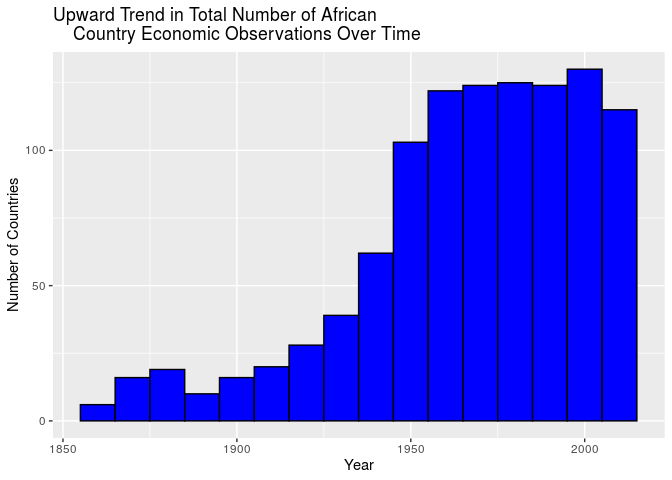
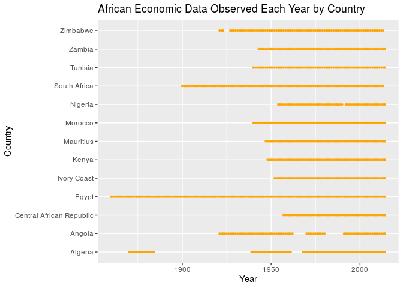
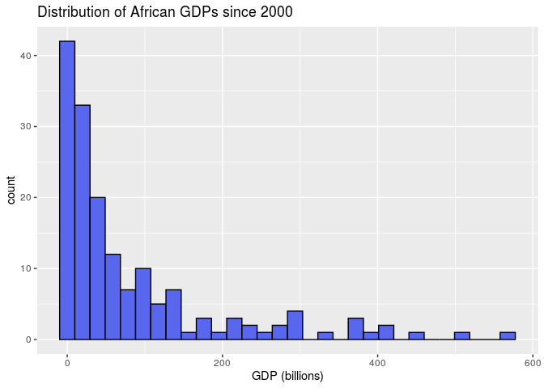
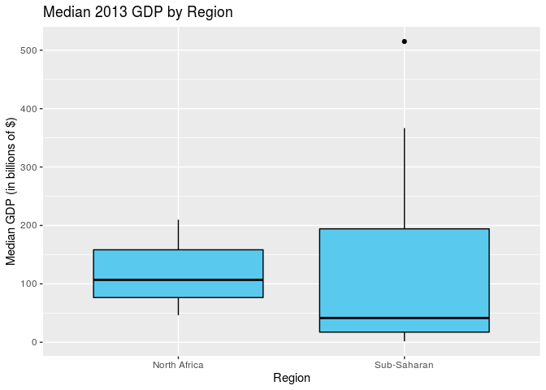

An Analysis of African Systemic Crises
================
Beck Addison, Jerry Lin, Isabella Swigart, Emma Hirschkop
12/13/2019

Your project writeup goes here\! Before you submit, make sure your
chunks are turned off with `echo = FALSE`.

## Introduction

We can visualize what years data for economies in African countries is
given.

<!-- --><!-- -->

We can also look at the distribution of GDP for observations since 2000
through visualization as a histogram and summary statistics.

<!-- -->

| Interquartile Range | Median |
| ------------------: | -----: |
|                94.7 |     37 |

## Data Analysis

## Question 1: How does independence impact a country’s economic stability?

As African countries made a transition to becoming independent states,
many were plagued by violence or political unrest. A bloody 10-year war
in Algeria culminated in its independence; lengthy wars were fought in
Angola and Mozambique, sectional divides fraught the Congo, and a
political revolt ocurred in Kenya. Many of these movements brought
economic instability to their countries. However, at the same time,
these independence movements were fought in the hopes that establishing
an independent nation would bring greater economic prosperity and
stability to their country.

Thus, on a broad level, we’d like to determine how these independence
movements ultimately affected the stability of their countries’
economies.

Let’s first do some exploratory data analysis. For each country, let’s
ask: how many years after independence will a country typically
experience its next crisis?

<!-- -->

| Interquartile Range | Median | Mean |
| ------------------: | -----: | ---: |
|                  11 |     30 | 31.3 |

We see that the median amount of years a country will first encounter a
banking crisis after they achieve independence is about 30 years, with
an interquartile range of 11 years and a mean of 31.3 years.

This is fascinating, but we’re more interested in seeing if there’s a
difference in the economic stability of independent vs. colonized
African countries. In particular, we’re wondering if post-independence
African countries see a higher proportion of systemic crises (per year)
compared to before independence, when they were colonized. Let’s examine
it:

|                           | Proportion of Years with Crises |
| ------------------------- | ------------------------------: |
| Independent Countries     |                          0.0042 |
| Non-independent Countries |                          0.0985 |

Based on our sample, we see that on average, there is a 0.42% chance of
a systemic crisis occurring in any given year for a non-independent
(i.e. colonized) country, while there is a 9.85% chance of a systemic
crisis occurring in any given year for an independent country. The
difference in these proportions is 0.0943; i.e. the chance of a systemic
crises is 9.43 percentage points higher post-independence compared to
pre-independence.

We’d like to see if this relationship is statistically significant and
holds for all African countries. We can do so by conducting a hypothesis
test to see if the proportion of years with systemic crises for African
countries is higher post-independence compared to pre-independence. Our
null hypothesis is that the proportion of years with systemic crises
between African countries post-independence and pre-independence is the
same; the observed difference is due to chance. Our alternative
hypothesis is that the proportion of years with systemic crises for
African countries is higher post-independence than pre-independence.

Since we’re testing for independence, we’ll use permutation.

<!-- -->

| p-value |
| ------: |
|       0 |

The p-value of our hypothesis test is 0. Since our p-value of 0 is less
than our significance level of 0.05, we reject the null hypothesis. The
data provides convincing evidence that the proportion of years with
systemic crises for African countries is higher post-independence than
pre-independence.

Ultimately, we can conclude that after gaining independence, African
countries experience greater economic instability compared to when they
were under colonial
rule.

## Question 2: Are there differences in economic development and stability between North African and sub-Saharan African Countries?

Today, many newspapers, academics, and policymakers classify Africa into
two broad regions. There’s North Africa, consisting of nations like
Algeria and Morocco, and sub-Saharan Africa, which conists of countries
ranging from the Central African Republic to Botswana. Traditionally,
people associate sub-Saharan Africa with being less developed and more
impoverished compared to the rest of the continent. In recent years,
reports by the World Bank have claimed that more and more of the world’s
poor are being concentrated into a few sub-Saharan countries.

We set out to see if this is claim is true; that is, if there’s a
noticeable difference in economic stability and prosperity between North
African and sub-Saharan African countries. We can evaluate these claims
in two ways: by analyzing our data on each country’s GDP and the
proportion of years with systemic crises for each
country.

#### Is the median GDP of North African countries greater than the median GDP of sub-Saharan countries?

To start, let’s calculate the median GDP for North African and
sub-Saharan countries. When calculating GDP by region, we’ll use 2013
GDP data since it’s recent and available for 11 of the 13 African
countries in our dataset.

| Region       | Median GDP (in Billions of $) |
| :----------- | ----------------------------: |
| North Africa |                         106.8 |
| Sub-Saharan  |                          41.6 |

Let’s also visualize the median GDP by region in 2013.

<!-- -->

From our visualization, we see that the interquartile range in median
GDP for sub-Saharan countries is much larger than the interquartile
range for North African countries, demonstrating larger variability. The
country with the greatest GDP is a sub-Saharan country, which is an
outlier for its region. However, the median 2013 GDP for sub-Saharan
countries is less than the median 2013 GDP for North African countries.

The median GDP for North African countries is 106.8 billion dollars; the
median GDP for sub-Saharan countries is 41.6 billion dollars. Therefore,
the difference in median GDP between North African and sub-Saharan
countries is 65.3 billion dollars.

We’d like to see if this relationship is statistically significant and
holds all North African and sub-Saharan countries. Thus, we’ll ask the
research question: is the median GDP of North African countries greater
than the median GDP of sub-Saharan countries?

Our null hypothesis is that the median GDP of North African and
sub-Saharan countries is the same; the observed difference is due to
chance. Our alternative hypothesis is that the median GDP of North
African countries is greater than the median GDP of sub-Saharan African
countries.

Since we’re testing for independence, we’ll use permute.

<!-- -->

| p-value |
| ------: |
|   0.339 |

The p-value of our hypothesis test is 0.339. Since our p-value of 0.339
is greater than our significance level of 0.05, we fail to reject the
null hypothesis. The data does not provide convincing evidence that the
median 2013 GDP of North African countries is greater than the median
GDP of sub-Saharan
countries.

#### Do sub-Saharan countries have a greater proportion of years with systemic crises than North African countries?

From our data sample, let’s calculate the proportion of years with
systemic crises for North African and sub-Saharan countries.

| Region       | Proportion of Years with Crisis |
| :----------- | ------------------------------: |
| North Africa |                          0.0436 |
| Sub-Saharan  |                          0.0972 |

The proportion of years with systemic crises for North African countries
is 0.0436; the proportion of years with systemic crises for sub-Saharan
countries is 0.0971. The difference is 0.0536, i.e. the proportion of
years with systemic crises is 5.36 percentage points higher for
sub-Saharan countries compared to North African countries.

We’d like to see if this relationship is statistically significant and
holds for all North African and sub-Saharan countries. We can do so by
conducting a hypothesis test to see if sub-Saharan countries have a
greater proportion of years with systemic crises than North African
countries.

Our null hypothesis is that the proportion of years with systemic crises
between North African and sub-Saharan countries is the same; the
observed difference is due to chance. Our alternative hypothesis is that
the proportion of years with systemic crises for sub-Saharan countries
is greater than for North African countries.

Since we’re testing for independence, we’ll use permute.

<!-- -->

| p-value |
| ------: |
|       0 |

The p-value of our hypothesis test is 0. Since our p-value of 0 is less
than the significance level of 0.05, we reject the null hypothesis. The
data provides convincing evidence that sub-Saharan countries have a
greater proportion of years with systemic crises compared to North
African countries.

From our results, we can conclude that historically — when accounting
for all years from the 19th century to today — sub-Saharan African
countries have been more prone to systemic crises than North African
countries. However, the data did not provide convincing evidence that
the median 2013 GDP of North African countries was greater than the
median 2013 GDP of sub-Saharan countries. That’s a positive sign; it
demonstrates that even though there have been historical disparities
between these two regions, in the 21st century, sub-Saharan Africa is
catching up, if not matching up to, North African
economies.

## Question 3: Can we produce a model to predict economic crises in African economies?

To determine what factors most impacted African economies, we designed
three linear regression models with the goal of using these to predict
economic crises in African economies. Given the limits of our own
statistical knowledge, we were not able to give a regression model that
directly predicted a systemic crisis, though we used the nation’s change
in CPI (delta CPI) and change in GDP (delta GDP) as indirect and
discrete measures of a country’s state of crisis. We claimed that, if
the delta GDP of a nation was particularly negative, or if the delta
Consumer Price Index (CPI) – a measure used to study a nation’s
inflation rate – was particularly high, we could claim that these
indicated an economic crisis.

After plotting the models and performing backwards selection, optimizing
for AIC, we found that a significant (p \< 0.001) negative correlation
between a country in a currency crisis and whether they faced a systemic
economic crisis overall; on average, a country undergoing a currency
crisis was expected to have a delta GDP of about -4.74 billion USD,
holding all else constant. Interestingly, we did not find a significant
correlation (p = 0.073) between inflation crisis and delta GDP, nor did
we find a significant correlation (p = 0.137) between a country’s
debt-to-GDP ratio and delta GDP. Finally, we found that there was a
significant positive correlation (p \< 0.001) between a country’s GDP
and changes to their GDP, though it was relatively minor – for every
additional $USD in the country’s GDP, their delta GDP was expected to,
on average, be about nine cents higher.

## Conclusion

On the whole, we were able to better understand what affects systemic
crises and GDP growth through our research project. Through hypothesis
tests, we found that whether a country is independent or not greatly
correlates with economic stability — after gaining independence, African
countries experienced greater economic instability compared to when they
were under colonial rule, measured by the proportion of years with
systemic crises. To put this into statistical terms, we found that our
observed difference in the proportion of years with systemic crisis
between independent and non-independent countries would occur by chance
less than 5% of the time (using a significance level of 0.05). Since our
p-value was less than our significance level, we rejected the null
hypothesis (that there was no difference in the proportion of years with
systemic crises) and concluded that the data provides convincing
evidence to support our alternative hypothesis.

We also found that regional differences, such as those between North
Africa and sub-Saharan countries, play a role too. Although our
hypothesis tests led us to conclude that there was no significant
difference in the median 2013 GDP of each region, we did conclude that
sub-Saharan African countries experienced a greater proportion of years
with systemic crises compared to North African countries. This fact
might be the most interesting of all: it demonstrates that even though
there have been historical disparities between these two regions, in the
21st century, sub-Saharan Africa is catching up, if not matching up to,
North African economies.

Our statistical analysis on economic stability used the proportion of
years with systemic crises as a proxy for economic stability. While we
think this is an accurate metric, our predictions could’ve been improved
by using an actual metric of economic stability that combines many
factors of economic health, similar to a former stability index produced
by Lehman Brothers and Eurasia Group.

An assumption of hypothesis tests is that the sample data is randomly
sampled from the population (in this case, all African nations).
However, our dataset, created for the purposes of economics research,
definitely did not do perfectly random sampling to select the 13 African
countries in the dataset. Perhaps these countries had a more thorough
history of economic indicators, or perhaps they were more interesting to
the compilers of the dataset. In any case, we note that this dataset is
biased towards highly populated countries, like South Africa and Egypt.

Moreover, our dataset was also inconsistent in other ways. Different
countries were tracked in the data for different periods of time; data
from South Africa started at 1900 while the first data from Nigeria
occurs around 1955. There were also gaps in our data for some countries
for a couple of years.

We also created a linear regression model to predict economic crises.
While our models provide a fairly significant explanation for the
variation in the dataset, with adjusted r-squared values of 0.3 or
higher, it is difficult to confidently say whether they can predict
economic crisis or not, given that we are not able to directly compare
economic crisis and the explanatory factors of our models. In addition,
our current models look at the change in GDP and CPI, which we believe
to be a better indicator of economic stability than the GDP or CPI
itself, we might improve our models by looking at the change in GDP as a
proportion of the GDP overall. By doing this, we level our comparisons
across countries such that a crisis for a small economy (where hundreds
of millions USD might make the difference between stability and crisis)
can be compared similarly to a crisis for a large economy (where a delta
GDP of hundreds of billions USD might only make a small difference in
the economic productivity of the nation).

Finally, our model could certainly benefit from better generalizability.
Given the constraints of our dataset and the scarcity of economic data
for African countries prior to 1950, the amount of data provided for
some African countries was so sparse that it would be difficult to
confidently say that our model accurately explained their economic
outcomes.

If we were to start over again, we would try to source a general dataset
of economic information on all African countries, with data included for
all the years we’re interested in. This would make our hypothesis tests
and linear regression model much more accurate, and give more accurate
claims into whether there’s truly differences between independence and
non-independence. Of course, however, with the nature of historical
economic data, that’s hard to gather. If we were to continue on this
project, we would be extremely interested in creating a logistic
regression model to predict whether a systemic crisis will occur in any
given year, given a set of economic indicators like inflation rate and
exchange rate. Moreover, we’d also be interested in seeing if we could
create a model that, given the years prior to a systemic crisis, can
actually predict that a crisis will happen in the future. This would be
a very powerful model, because it could help policymakers and business
leaders understand that a crisis is looming, allowing them to prepare,
mitigate, or solve these crises.
