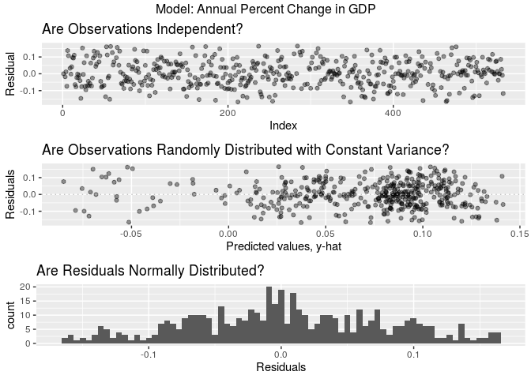
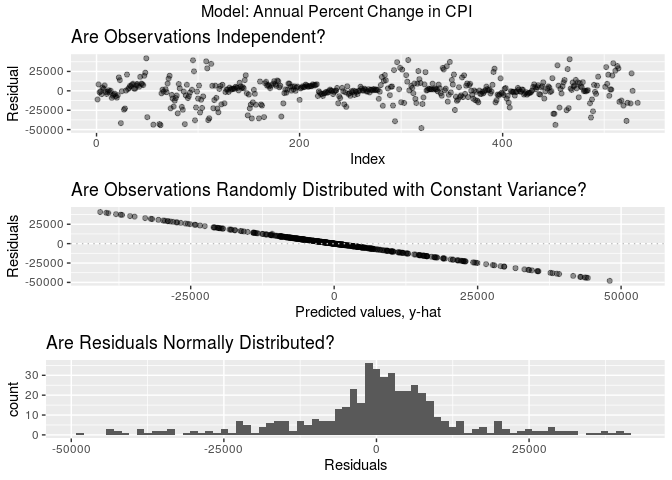

An Analysis of African Systemic Crises
================
Beck Addison, Jerry Lin, Isabella Swigart, Emma Hirschkop
12/13/2019

## Introduction

We chose to examine the stability and development of the economies of
African nations, particularly in the context of colonialism and
decolonialism. After we had read an article about Zimbabwe’s crippling
inflation crisis (in which the nation completely abandoned paper
currencies altogether), we wondered how Africa’s history of colonial
exploitation and unrest has contributed to the continent’s overall
modern day economic instability. In order to better evaluate how factors
of past colonization or exploitation impacted modern economic stability,
or a lack there of, we also questioned what factors were correlated with
an economic crisis in the continent. To answer these questions, we
utilized two datasets.

The first of these datasets is an excellently curated “African Economic
Banking and Systemic Crises Data” from Kaggle user chirin
(<https://www.kaggle.com/chirin/africa-economic-banking-and-systemic-crisis-data/version/1#>),
derived from the global economic crisis dataset created by the Harvard
Business School
(<https://www.hbs.edu/behavioral-finance-and-financial-stability/data/Pages/global.aspx>).
The biggest difference between these two data sets is that the Harvard
Business School data set covers economic information for a larger number
of regions, specifically Europe, than the dataset generated by the
Kaggle user. While this dataset provided insight into instances of
“systemic crisis”, exchange rate, and CPI (which indicates relative
inflation and debt) for thirteen African countries, it critically
omitted the GDP of these nations over time – a fairly modern economic
growth metric that we were only able to find being consistently used
from 1960 onward. Therefore, we sourced and cleaned a second dataset
from the World Bank that recorded global GDP data
(<https://data.worldbank.org/indicator/ny.gdp.mktp.cd>), detailing world
nations’ GDPs in USD from 1960 to the modern day. We believe that this
dataset will be sufficient to detail the impacts of decolonization on
African nations’ GDPs (as most African decolonization efforts took place
in the mid-to-late 1950s and early 1960s) and provide a working
conclusion to our research questions.

We chose to explore three research questions with our data:

1)  How does independence impact a country’s economic stability?
    (hypothesis test of independence)
2)  Are there differences in economic development and stability between
    North African and sub-Saharan African Countries? (hypothesis test of
    independence)
3)  What factors influence a country’s GDP the most? (regression model)

Before getting into some inferential and predictive analysis, we can do
some exploratory data analysis. First, we can visualize what years data
for African economies is given. Over time, we notice that observations
for more countries were recorded. Most of the thirteen countries have
had consistent economic records since 1960, the year we started being
able to join the World Bank GDP
dataset.

<!-- --><!-- -->

We can also look at the distribution of GDP for modern-day observations
(since 2000) through visualization as a histogram and summary
statistics.

| Interquartile Range (billions $) | Median (billions $) | Mean (billions $) |
| -------------------------------: | ------------------: | ----------------: |
|                             94.7 |                  37 |              82.6 |

<!-- -->

Since 2000, the median GDP for African countries is $37 billion with an
interquartile range of $94.7 billion. The histogram is heavily right
skewed, which would indicate that the mean modern GDP is greater than
the median modern GDP. Indeed, the mean modern GDP is $82.6 billion,
much greater than the median, potentially because of high
outliers.

## Data Analysis

## Question 1: How does independence impact a country’s economic stability?

As African countries made a transition to becoming independent states,
many were plagued by violence or political unrest. A bloody 10-year war
in Algeria culminated in its independence; lengthy wars were fought in
Angola and Mozambique, sectional divides fraught the Congo, and a
political revolt ocurred in Kenya. Many of these movements brought
economic instability to their countries. However, at the same time,
these independence movements were fought in the hopes that establishing
an independent nation would bring greater economic prosperity and
stability to their country.

Thus, on a broad level, we’d like to determine how these independence
movements affected the stability of their countries’ economies.

Let’s first do some exploratory data analysis. For each country, let’s
ask: how many years after independence will a country experience its
next banking crisis?

<!-- -->

| Interquartile Range (yrs) | Median (yrs) | Mean (yrs) |
| ------------------------: | -----------: | ---------: |
|                         3 |           28 |     31.308 |

We see that the median amount of years a country will first encounter a
banking crisis after they achieve independence is about 28 years, with
an interquartile range of 3 years and a mean of 31.3 years.

This is fascinating, but we’re more interested in seeing if there’s a
difference in the economic stability of independent vs. colonized
African countries. In particular, we’re wondering if post-independence
African countries see a higher proportion of systemic crises (per year)
compared to before independence, when they were colonized. Let’s examine
it:

|                           | Proportion of Years with Crises |
| ------------------------- | ------------------------------: |
| Independent Countries     |                          0.0042 |
| Non-independent Countries |                          0.0985 |

Based on our sample, we see that on average, there is a 0.42% chance of
a systemic crisis occurring in any given year for a non-independent
(i.e. colonized) country, while there is a 9.85% chance of a systemic
crisis occurring in any given year for an independent country. The
difference in these proportions is 0.0943; i.e. the chance of a systemic
crises is 9.43 percentage points higher post-independence compared to
pre-independence.

We’d like to see if this relationship is statistically significant and
holds for all African countries. We can do so by conducting a hypothesis
test to see if the proportion of years with systemic crises for African
countries is higher post-independence compared to pre-independence. Our
null hypothesis is that the proportion of years with systemic crises
between African countries post-independence and pre-independence is the
same; the observed difference is due to chance. Our alternative
hypothesis is that the proportion of years with systemic crises for
African countries is higher post-independence than pre-independence.

Since we’re testing for independence, we’ll use permutation.

| p-value |
| ------: |
|       0 |

<!-- -->

The p-value of our hypothesis test is 0. Since our p-value of 0 is less
than our significance level of 0.05, we reject the null hypothesis. The
data provides convincing evidence that the proportion of years with
systemic crises for African countries is higher post-independence than
pre-independence.

Ultimately, we can conclude that after gaining independence, African
countries experience greater economic instability compared to when they
were under colonial
rule.

## Question 2: Are there regional differences in economic development and stability between North African and sub-Saharan African Countries?

Today, many newspapers, academics, and policymakers classify Africa into
two broad regions. There’s North Africa, consisting of nations like
Algeria and Morocco, and sub-Saharan Africa, which conists of countries
ranging from the Central African Republic to Botswana. Traditionally,
people associate sub-Saharan Africa with being less developed and more
impoverished compared to the rest of the continent. In recent years,
reports by the World Bank have claimed that more and more of the world’s
poor are being concentrated into a few sub-Saharan countries.

We set out to see if this is claim is true; that is, if there’s a
noticeable difference in economic stability and prosperity between North
African and sub-Saharan African countries. We can evaluate these claims
in two ways: by analyzing our data on each country’s GDP and the
proportion of years with systemic crises for each
country.

#### Is the median 2013 GDP of North African countries greater than sub-Saharan countries?

To start, let’s calculate the median GDP for North African and
sub-Saharan countries. When calculating GDP by region, we’ll use 2013
GDP data since it’s recent and available for 11 of the 13 African
countries in our dataset.

| Region       | Median GDP (billions $) |
| :----------- | ----------------------: |
| North Africa |                 106.826 |
| Sub-Saharan  |                  41.571 |

Let’s also visualize the median GDP by region in 2013.

<!-- -->

From our visualization, we see that the interquartile range in median
GDP for sub-Saharan countries is much larger than the interquartile
range for North African countries, demonstrating larger variability. The
country with the greatest GDP is a sub-Saharan country (South Africa),
which is an outlier for its region. However, the median 2013 GDP for
sub-Saharan countries is less than the median 2013 GDP for North African
countries.The median GDP for North African countries is 106.8 billion
dollars; the median GDP for sub-Saharan countries is 41.6 billion
dollars. Therefore, the difference in median GDP between North African
and sub-Saharan countries is 65.3 billion dollars.

Next, we’d like to see if there is a statistically significant
relationship between region and GDP. Thus, we’ll ask the research
question: is the median 2013 GDP of North African countries greater than
the median 2013 GDP of sub-Saharan countries?

Our null hypothesis is that the median 2013 GDP of North African and
sub-Saharan countries is the same; the observed difference is due to
chance. Our alternative hypothesis is that the median GDP of North
African countries is greater than the median GDP of sub-Saharan African
countries.

Since we’re testing for independence, we’ll use permute.

| p-value |
| ------: |
|   0.339 |

<!-- -->

The p-value of our hypothesis test is 0.339. Since our p-value of 0.339
is greater than our significance level of 0.05, we fail to reject the
null hypothesis. The data does not provide convincing evidence that the
median 2013 GDP of North African countries is greater than the median
GDP of sub-Saharan
countries.

#### Do sub-Saharan countries have a greater proportion of years with systemic crises than North African countries?

From our data sample, let’s calculate the proportion of years with
systemic crises for North African and sub-Saharan countries.

| Region       | Proportion of Years with Crisis |
| :----------- | ------------------------------: |
| North Africa |                          0.0436 |
| Sub-Saharan  |                          0.0972 |

The proportion of years with systemic crises for North African countries
is 0.0436; the proportion of years with systemic crises for sub-Saharan
countries is 0.0971. The difference is 0.0536, i.e. the proportion of
years with systemic crises is 5.36 percentage points higher for
sub-Saharan countries compared to North African countries.

We’d like to see if this relationship is statistically significant and
holds for all North African and sub-Saharan countries. We can do so by
conducting a hypothesis test to see if sub-Saharan countries have a
greater proportion of years with systemic crises than North African
countries.

Our null hypothesis is that the proportion of years with systemic crises
between North African and sub-Saharan countries is the same; the
observed difference is due to chance. Our alternative hypothesis is that
the proportion of years with systemic crises for sub-Saharan countries
is greater than for North African countries.

Since we’re testing for independence, we’ll use permute.

| p-value |
| ------: |
|       0 |

<!-- -->

The p-value of our hypothesis test is 0. Since our p-value of 0 is less
than the significance level of 0.05, we reject the null hypothesis. The
data provides convincing evidence that sub-Saharan countries have a
greater proportion of years with systemic crises compared to North
African countries.

From our results, we can conclude that historically — when accounting
for all years from the 19th century to today — sub-Saharan African
countries have been more prone to systemic crises than North African
countries. However, the data did not provide convincing evidence that
the median 2013 GDP of North African countries was greater than the
median 2013 GDP of sub-Saharan countries. That’s a positive sign; it
demonstrates that even though there have been historical disparities
between these two regions, in the 21st century, sub-Saharan Africa is
catching up, if not matching up to, North African
economies.

## Question 3: Can we produce a model to predict economic crises in African economies?

To determine what factors most impacted African economies, we designed
three linear regression models with the goal of using these to predict
economic crises in African economies. Given the limits of our own
statistical knowledge, we were not able to give a regression model that
directly predicted a systemic crisis, though we used the nation’s change
in CPI (delta CPI) and change in GDP (delta GDP) as indirect and
discrete measures of a country’s state of crisis. We claimed that, if
the delta GDP of a nation was particularly negative, or if the delta
Consumer Price Index (CPI) – a measure used to study a nation’s
inflation rate – was particularly high, we could claim that these
indicated an economic crisis.

To determine what factors most impacted African economies, we designed
two linear regression models with the goal of using these to predict
economic crises in African economies. Given the limits of our own
statistical knowledge, we were not able to give a regression model that
directly predicted a systemic crisis, though we used the nation’s
percent change in CPI and percent change in GDP as indirect and discrete
measures of a country’s state of crisis. We claimed that, if the percent
change in GDP of a nation was particularly negative, or alternatively if
the percent change in Consumer Price Index (CPI) – a measure used to
study a nation’s inflation rate – was particularly high, we could claim
that these indicated an economic crisis. The reasoning for using CPI and
GDP as indicators of economic crisis is sound, according to external
research into what can indicate economic crisis worldwide(Kuosmanen &
Vataja 2013, Meyer & Zaman 2019), so we feel that our proxy metrics for
predicting economic crisis are fairly strong. Even within our dataset,
we can see that in crisis, median CPI is consistently higher, and median
GDP is consistently
lower.

| Systemic Crisis | Median %changeGDP | IQR %changeGDP | Median %changeCPI | IQR %changeCPI |
| :-------------- | ----------------: | -------------: | ----------------: | -------------: |
| 0               |         0.0738183 |      0.1320119 |         0.0436661 |      0.7263437 |
| 1               |         0.0321560 |      0.1823593 |         0.1132106 |      0.8128886 |

For each model, we examined each factor in the dataset and the
two-factor interactions between every factor; we then performed backward
selection on each model to determine the most useful variables for
predicting their respective response variables (optimizing for AIC).

Below, we’ve given a breakdown of the two models: first, %change in GDP,
and second, %change in CPI.

|             | Adjusted R-Squared |
| :---------- | -----------------: |
| %change GDP |              0.229 |
| %change CPI |              0.879 |

| term                                                          | estimate | p.value |
| :------------------------------------------------------------ | -------: | ------: |
| inflation\_crises1                                            | \-21.490 |   0.000 |
| year:inflation\_crises1                                       |    0.011 |   0.000 |
| inflation\_crises1:banking\_crisisno\_crisis                  |    0.216 |   0.000 |
| sovereign\_external\_debt\_default1:banking\_crisisno\_crisis |    0.153 |   0.000 |
| inflation\_annual\_cpi                                        |    0.020 |   0.001 |
| sovereign\_external\_debt\_default1:currency\_crises1         |  \-0.161 |   0.001 |
| year:inflation\_annual\_cpi                                   |    0.000 |   0.001 |
| currency\_crises1                                             |  \-0.066 |   0.003 |
| gdp:domestic\_debt\_in\_default1                              |    0.024 |   0.011 |
| gdp:banking\_crisisno\_crisis                                 |    0.001 |   0.012 |
| exch\_usd:currency\_crises1                                   |  \-0.001 |   0.014 |
| gdp\_weighted\_default:regionSub-Saharan                      |  \-5.542 |   0.014 |
| gdp\_weighted\_default:inflation\_annual\_cpi                 |    0.101 |   0.018 |
| gdp:gdp\_weighted\_default                                    |    0.042 |   0.019 |
| exch\_usd:inflation\_crises1                                  |    0.001 |   0.023 |
| sovereign\_external\_debt\_default1:inflation\_crises1        |    0.136 |   0.024 |
| gdp:inflation\_annual\_cpi                                    |    0.000 |   0.025 |
| year:gdp\_weighted\_default                                   |  \-0.302 |   0.025 |
| gdp\_weighted\_default                                        |  600.837 |   0.025 |
| gdp\_weighted\_default:inflation\_crises1                     |  \-1.977 |   0.026 |
| domestic\_debt\_in\_default1                                  |  \-0.138 |   0.026 |
| sovereign\_external\_debt\_default1                           |  \-0.359 |   0.030 |
| gdp                                                           |  \-0.001 |   0.040 |
| independence1                                                 |    0.247 |   0.051 |
| exch\_usd:percentchange\_cpi                                  |    0.000 |   0.051 |
| sovereign\_external\_debt\_default1:regionSub-Saharan         |    0.299 |   0.052 |
| year:regionSub-Saharan                                        |    0.002 |   0.052 |
| sovereign\_external\_debt\_default1:inflation\_annual\_cpi    |  \-0.002 |   0.060 |
| regionSub-Saharan                                             |  \-3.110 |   0.072 |
| percentchange\_cpi:currency\_crises1                          |  \-0.016 |   0.076 |
| banking\_crisisno\_crisis                                     |   10.893 |   0.081 |
| year:banking\_crisisno\_crisis                                |  \-0.005 |   0.082 |
| sovereign\_external\_debt\_default1:percentchange\_cpi        |  \-0.010 |   0.098 |
| exch\_usd:sovereign\_external\_debt\_default1                 |    0.000 |   0.118 |
| gdp:exch\_usd                                                 |    0.000 |   0.139 |
| domestic\_debt\_in\_default1:percentchange\_cpi               |    0.016 |   0.143 |
| inflation\_annual\_cpi:currency\_crises1                      |    0.001 |   0.149 |
| independence1:regionSub-Saharan                               |  \-0.192 |   0.152 |
| regionSub-Saharan:banking\_crisisno\_crisis                   |  \-0.079 |   0.154 |
| exch\_usd:domestic\_debt\_in\_default1                        |    0.000 |   0.165 |
| percentchange\_cpi                                            |    0.000 |   0.168 |
| (Intercept)                                                   |  \-7.345 |   0.248 |
| year                                                          |    0.004 |   0.261 |
| exch\_usd                                                     |    0.000 |   0.908 |

| term                                                          |      estimate | p.value |
| :------------------------------------------------------------ | ------------: | ------: |
| exch\_usd:currency\_crises1                                   |      2246.617 |   0.000 |
| domestic\_debt\_in\_default1:banking\_crisisno\_crisis        |  \-735485.207 |   0.000 |
| domestic\_debt\_in\_default1:currency\_crises1                |    394592.308 |   0.000 |
| inflation\_annual\_cpi:banking\_crisisno\_crisis              |      2247.004 |   0.000 |
| exch\_usd:inflation\_crises1                                  |    \-1336.807 |   0.000 |
| domestic\_debt\_in\_default1:inflation\_crises1               |  \-608869.999 |   0.000 |
| domestic\_debt\_in\_default1:percentchange\_gdp               |    531416.895 |   0.000 |
| exch\_usd:percentchange\_gdp                                  |      1044.307 |   0.000 |
| domestic\_debt\_in\_default1:inflation\_annual\_cpi           |      2164.987 |   0.000 |
| exch\_usd:domestic\_debt\_in\_default1                        |      1619.425 |   0.000 |
| inflation\_annual\_cpi:currency\_crises1                      |    \-2043.113 |   0.000 |
| domestic\_debt\_in\_default1                                  |  28863048.018 |   0.000 |
| year:domestic\_debt\_in\_default1                             |   \-14291.910 |   0.000 |
| inflation\_annual\_cpi                                        |   \-15355.542 |   0.000 |
| year:inflation\_annual\_cpi                                   |         6.703 |   0.000 |
| sovereign\_external\_debt\_default1:percentchange\_gdp        |  \-176047.049 |   0.000 |
| banking\_crisisno\_crisis                                     |   9743420.161 |   0.000 |
| year:banking\_crisisno\_crisis                                |    \-4897.771 |   0.000 |
| gdp:inflation\_annual\_cpi                                    |         6.761 |   0.000 |
| year                                                          |      4784.186 |   0.000 |
| (Intercept)                                                   | \-9514416.857 |   0.000 |
| percentchange\_gdp:currency\_crises1                          |    122641.601 |   0.000 |
| inflation\_annual\_cpi:inflation\_crises1                     |      1744.019 |   0.001 |
| year:inflation\_crises1                                       |    \-2934.811 |   0.001 |
| inflation\_crises1                                            |   5799030.783 |   0.001 |
| regionSub-Saharan:banking\_crisisno\_crisis                   |   \-53330.772 |   0.005 |
| sovereign\_external\_debt\_default1:banking\_crisisno\_crisis |     50705.299 |   0.006 |
| currency\_crises1:banking\_crisisno\_crisis                   |   \-53029.752 |   0.010 |
| regionSub-Saharan                                             |     48549.867 |   0.010 |
| percentchange\_gdp:banking\_crisisno\_crisis                  |   \-95264.013 |   0.021 |
| gdp:inflation\_crises1                                        |     \-519.162 |   0.039 |
| gdp\_weighted\_default                                        | 170020966.107 |   0.042 |
| year:gdp\_weighted\_default                                   |   \-85193.772 |   0.042 |
| inflation\_crises1:banking\_crisisno\_crisis                  |     41785.838 |   0.051 |
| gdp:banking\_crisisno\_crisis                                 |       217.889 |   0.057 |
| gdp\_weighted\_default:regionSub-Saharan                      | \-1205468.685 |   0.060 |
| year:exch\_usd                                                |       \-3.046 |   0.084 |
| exch\_usd                                                     |      5982.225 |   0.088 |
| currency\_crises1                                             |     37178.901 |   0.092 |
| gdp                                                           |     \-206.157 |   0.099 |
| sovereign\_external\_debt\_default1                           | \-3303654.804 |   0.114 |
| gdp:exch\_usd                                                 |       \-1.005 |   0.118 |
| gdp:gdp\_weighted\_default                                    |      7762.042 |   0.125 |
| year:sovereign\_external\_debt\_default1                      |      1608.202 |   0.128 |
| sovereign\_external\_debt\_default1:regionSub-Saharan         |     76907.402 |   0.128 |
| gdp\_weighted\_default:banking\_crisisno\_crisis              |  \-189736.345 |   0.153 |
| percentchange\_gdp                                            |     50856.185 |   0.230 |

As these tables show, there are a lot of variables that go into
predicting changes in GDP and CPI\! We found several variables that fell
within statistical significance (p \< 0.05) for each variable, as can be
seen above. To name a few interesting finds for each, we found that the
percent change in GDP for African economies was highly negatively
influenced, on average, by whether an inflation crisis was present or
not. Likewise, we also found that, for Sub-Saharan nations, the
debt-to-GDP ratio at the time of a default (`gdp_weighted_default`)
predicted an average decrease in annual %change GDP, indicating a
further crisis. Altogether, however, with an adjusted r-squared value of
only about 23 percent, it is difficult to say whether this model can
give accurate explanations for the variance in the data overall, and
whether this model is truly useful for predicting annual %change GDP.

Conversely, our CPI model was shockingly accurate for such a complex
metric, with an adjusted R-squared value of about 88 percent. That being
said, we must note that the strange and large estimates the model
provides - we found that they are largely the result of the inclusion of
Zimbabwe, whose absolutely incredible currency and inflation crisis
around 2009 onward has made percentages fall way above 100%. Nigeria
also faced a far less extreme inflation crisis in 1972, which has also
pushed annual %change in CPI far above 100%. While we contemplated
making a model without these countries to even out the data, we felt
that this omission would be to omit the realities of the data, extreme
or not. Naturally, the exchange rate in USD and the presence of a
currency crisis in an African economy was highly indicative of a
positive annual %change CPI, on average; interestingly, though,
defaulting on domestic debt without a banking crisis drove predicted a
lower %change in CPI, on average. While we can’t conclusively say why
this is without further analysis, we might hypothesize that this is due
to state amnesty - if a nation has to default on its domestic debt, the
domestic banks responsible for the bailout might be incentivized to
decrease the production of more currency to mitigate the losses of the
debt.

Considering whether these models can be used for inference according to
the Central Limit Theorem, we checked the four essential assumptions
being made about the normality, spread, and independence of residuals
and observations. Our residual graphs for each model are below.

<!-- -->

For our annual percent change in GDP regression model, it is clear that
all conditions are met to use the model for inference. While it doesn’t
explain the variance of our dataset quite as well as our CPI model, it
has randomly distributed residuals that are constantly variant and
approximately normally distributed.

<!-- -->

In contrast, while our annual percentage change in CPI regression model
explains the variance in the dataset much better than our GDP model when
comparing adjusted R-squared values, it may not be as suited to general
inference. While the observations are independent and approximately
normally distributed, there seems to be a clear trend in the
distribution of observations. This indicates that while the model is
quite precise in repeatedly predicting a similar value for any given
factors, it is increasingly inaccurate in predicting larger changes,
resulting in more residuals. Therefore, while this model is incredibly
effective in predicting changes in CPI when CPI changes are small, it is
not as accurate when CPI changes are large. For the purposes of our
dataset, this is mostly fine - changes in CPI are generally incremental.
In fact, the lack of data for larger changes in CPI can probably explain
the inaccuracy of the model at these extremes.

## Conclusion

On the whole, we were able to better understand what affects systemic
crises and GDP growth through our research project. Through hypothesis
tests, we found that whether a country is independent or not greatly
correlates with economic stability — after gaining independence, African
countries experienced greater economic instability compared to when they
were under colonial rule, measured by the proportion of years with
systemic crises. To put this into statistical terms, we found that our
observed difference in the proportion of years with systemic crisis
between independent and non-independent countries would occur by chance
less than 5% of the time (using a significance level of 0.05). Since our
p-value was less than our significance level, we rejected the null
hypothesis (that there was no difference in the proportion of years with
systemic crises) and concluded that the data provides convincing
evidence to support our alternative hypothesis.

We also found that regional differences, such as those between North
Africa and sub-Saharan countries, play a role too. Although our
hypothesis tests led us to conclude that there was no significant
difference in the median 2013 GDP of each region, we did conclude that
sub-Saharan African countries experienced a greater proportion of years
with systemic crises compared to North African countries. This fact
might be the most interesting of all: it demonstrates that even though
there have been historical disparities between these two regions, in the
21st century, sub-Saharan Africa is catching up, if not matching up to,
North African economies.

Our statistical analysis on economic stability used the proportion of
years with systemic crises as a proxy for economic stability. While we
think this is an accurate metric, our predictions could’ve been improved
by using an actual metric of economic stability that combines many
factors of economic health, similar to a former stability index produced
by Lehman Brothers and Eurasia Group.

An assumption of hypothesis tests is that the sample data is randomly
sampled from the population (in this case, all African nations).
However, our dataset, created for the purposes of economics research,
definitely did not do perfectly random sampling to select the 13 African
countries in the dataset. Perhaps these countries had a more thorough
history of economic indicators, or perhaps they were more interesting to
the compilers of the dataset. In any case, we note that this dataset is
biased towards highly populated countries, like South Africa and Egypt.

Moreover, our dataset was also inconsistent in other ways. Different
countries were tracked in the data for different periods of time; data
from South Africa started at 1900 while the first data from Nigeria
occurs around 1955. There were also gaps in our data for some countries
for a couple of years.

We also created two linear regression models to predict economic crises.
While our models provide a fairly significant explanation for the
variation in the dataset, with adjusted r-squared values of about 0.30
and 0.88 for annual %change in GDP and annual %change in CPI,
respectively, it is difficult to confidently say whether they can
predict economic crisis or not, given that we are not able to directly
compare economic crisis and the explanatory factors of our models. In
addition, our annual %change in CPI model, though precise (in the sense
that residuals were consistently spread), was not very accurate at more
extreme %changes in CPI, likely because of the lack of data provided for
these extremes. That being said, given that most annual shifts in CPI
are much more marginal than the wild changes seen in some African
nations of late (notably Zimbabwe and Nigeria), the model does an
excellent job during times of minor to moderate economic instability
where %change in CPI is smaller year on year than catastrophic periods
of rapid and immense change.

Finally, our model could certainly benefit from better generalizability.
Given the constraints of our dataset and the scarcity of economic data
for African countries prior to 1950, the amount of data provided for
some African countries was so sparse that it would be difficult to
confidently say that our model accurately explained their economic
outcomes.

If we were to start over again, we would try to source a general dataset
of economic information on all African countries, with data included for
all the years we’re interested in. This would make our hypothesis tests
and linear regression model much more accurate, and give more accurate
claims into whether there’s truly differences between independence and
non-independence. Of course, however, with the nature of historical
economic data, that’s hard to gather. If we were to continue on this
project, we would be extremely interested in creating a logistic
regression model to predict whether a systemic crisis will occur in any
given year, given a set of economic indicators like inflation rate and
exchange rate. Moreover, we’d also be interested in seeing if we could
create a model that, given the years prior to a systemic crisis, can
actually predict that a crisis will happen in the future. This would be
a very powerful model, because it could help policymakers and business
leaders understand that a crisis is looming, allowing them to prepare,
mitigate, or solve these crises.

###### References
