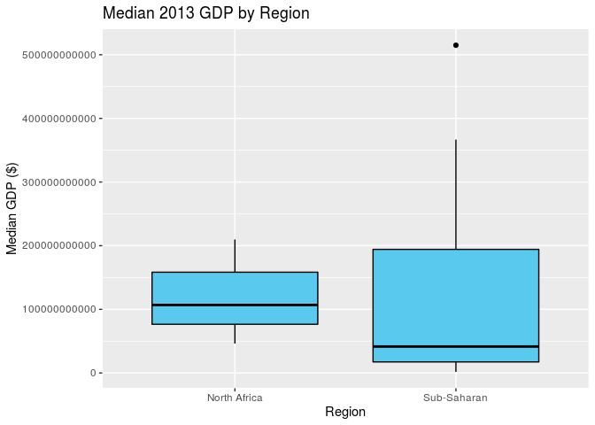

An Analysis of African Systemic Crises
================
Beck Addison, Jerry Lin, Isabella Swigart, Emma Hirschkop
12/13/2019

Your project writeup goes here\! Before you submit, make sure your
chunks are turned off with `echo = FALSE`.

## Introduction

Introduction goes
here.

## Data Analysis

## Question 1: How does independence impact a country’s economic stability?

As African countries made a transition to becoming independent states,
many were plagued by violence or political unrest. A bloody 10-year war
in Algeria culminated in its independence; lengthy wars were fought in
Angola and Mozambique, sectional divides fraught the Congo, and a
political revolt ocurred in Kenya. Many of these movements brought
economic instability to their countries. However, at the same time,
these independence movements were fought in the hopes that establishing
an independent nation would bring greater economic prosperity and
stability to their country.

Thus, on a broad level, we’d like to determine how these independence
movements ultimately affected the stability of their countries’
economies.

Let’s first do some exploratory data anlysis. For each country, let’s
ask: how many years after independence will a country typically
experience its next crisis?

<!-- -->

    ## # A tibble: 1 x 3
    ##     IQR median  mean
    ##   <dbl>  <dbl> <dbl>
    ## 1    11     30  31.3

We see that the median amount of years a country will first encounter a
banking crisis after they achieve independence is about 30 years, with
an interquartile range of 11 years and a mean of 31.3 years.

This is fascinating, but we’re more interested in seeing if there’s a
difference in the economic stability of independent vs. colonized
African countries. In particular, we’re wondering if post-independence
African countries see a higher proportion of systemic crises (per year)
compared to before independence, when they were colonized. Let’s examine
it:

    ## # A tibble: 25 x 3
    ## # Groups:   country [13]
    ##    country                  independence crisis_prop
    ##    <chr>                           <dbl>       <dbl>
    ##  1 Algeria                             0      0.0263
    ##  2 Algeria                             1      0.0638
    ##  3 Angola                              0      0     
    ##  4 Angola                              1      0     
    ##  5 Central African Republic            0      0     
    ##  6 Central African Republic            1      0.345 
    ##  7 Egypt                               1      0.0387
    ##  8 Ivory Coast                         0      0     
    ##  9 Ivory Coast                         1      0.0727
    ## 10 Kenya                               0      0     
    ## # … with 15 more rows

    ## # A tibble: 2 x 2
    ##   independence overall_crisis_prop
    ##          <dbl>               <dbl>
    ## 1            0             0.00422
    ## 2            1             0.0985

Based on our sample, we see that on average, there is a 0.42% chance of
a systemic crisis occurring in any given year for a non-independent
(i.e. colonized) country, while there is a 9.85% chance of a systemic
crisis occurring in any given year for an independent country. The
difference in these proportions is 0.094320737.

We’d like to conduct a hypothesis test to see if the proportion of years
with systemic crises for African countries is higher post-independence
compared to pre-independence. Our null hypothesis is that the proportion
of years with systemic crises between African countries
post-independence and pre-independence is the same; the observed
difference is due to chance. Our alternative hypothesis is that the
proportion of years with systemic crises for African countries is higher
post-independence than pre-independence.

Since we’re testing for independence, we’ll use permutation. We’ll
modify our dataset slightly by factoring success into a categorical
variable so that it’ll work nicely with infer. We also need to quickly
factor systemic\_crisis to be a categorical variable:

    ## # A tibble: 1 x 1
    ##   p_value
    ##     <dbl>
    ## 1       0

<!-- -->

Since our p-value of 0 is less than our significance level of 0.05, we
reject the null hypothesis. The data provides convincing evidence that
the proportion of years with systemic crises for African countries is
higher post-independence than pre-independence.

Ultimately, we can conclude that after gaining independence, African
countries experience greater economic instability compared to when they
were under colonial
rule.

## Question 2: Are there differences in economic development and stability between North African and sub-Saharan African Countries?

#### Is there a difference in GDP and frequency of systemic crises between North African and sub-Saharan African countries?

Today, many newspapers, academics, and policymakers classify Africa into
two broad regions. There’s North Africa, consisting of nations like
Algeria and Morocco, and sub-Saharan Africa, which conists of countries
ranging from the Central African Republic to Botswana. Traditionally,
people associate sub-Saharan Africa with being less developed and more
impoverished compared to the rest of the continent. In recent years,
reports by the World Bank have claimed that more and more of the world’s
poor are being concentrated into a few sub-Saharan countries.

We set out to see if this is claim is true; that is, if there’s a
noticeable difference in economic stability and prosperity between North
African and sub-Saharan African countries. We can evaluate these claims
in two ways: by analyzing our data on each country’s GDP and the
proportion of years with systemic crises for each country.

To answer this question, we need to label North African and sub-Saharan
countries in our Africa dataset.

Let’s calculate the median GDP for North African and sub-Saharan
countries.

When calculating GDP by region, we’ll use 2013 GDP data since it’s
recent and available for 11 of the 13 African countries in our dataset.
We can also perform some exploratory data analysis by visualising sample
median GDP.

    ## # A tibble: 2 x 2
    ##   region      med_gdp
    ##   <chr>         <dbl>
    ## 1 n      106826000000
    ## 2 s       41571094245

<!-- -->

The IQR for sub-Saharan countries is much larger than the IQR for North
African countries, demonstrating larger variability. The country with
the greatest GDP is a sub-Saharan country, which is an outlier for its
region. However, the median 2014 GDP for sub-Saharan countries is less
than North African countries.

The median GDP for North African countries is 106826000000; the median
GDP for sub-Saharan countries is 41571094245. Therefore, the difference
in median GDP between North African and sub-Saharan countries is
65254905755.

The first research question we’ll ask is: is the median GDP of North
African countries greater than the median GDP of sub-Saharan countries?

Our null hypothesis is that the median GDP of North African and
sub-Saharan countries is the same; the observed difference is due to
chance. Our alternative hypothesis is that the median GDP of North
African countries is greater than the median GDP of sub-Saharan African
countries.

Since we’re testing for independence, we’ll use permute.

    ## # A tibble: 1 x 1
    ##   p_value
    ##     <dbl>
    ## 1   0.339

<!-- -->

Since our p-value of 0.339 is greater than our significance level of
0.05, we fail to reject the null hypothesis. The data does not provide
convincing evidence that the median 2013 GDP of North African countries
is greater than the median GDP of sub-Saharan countries.

Next, let’s calculate the proportion of years with systemic crises for
North African and sub-Saharan countries.

    ## # A tibble: 2 x 2
    ##   region overall_crisis_prop
    ##   <chr>                <dbl>
    ## 1 n                   0.0436
    ## 2 s                   0.0972

The proportion of years with systemic crises for North African countries
is 0.0436; the proportion of years with systemic crises for sub-Saharan
countries is 0.0971. The difference is 0.0535702.

The second research question we’ll ask is: do sub-Saharan countries have
a greater proportion of years with systemic crises than North African
countries?

Our null hypothesis is that the proportion of years with systemic crises
between North African and sub-Saharan countries is the same; the
observed difference is due to chance. Our alternative hypothesis is that
the proportion of years with systemic crises for sub-Saharan countries
is greater than for North African countries.

Since we’re testing for independence, we’ll use permute.

    ## # A tibble: 1 x 1
    ##   p_value
    ##     <dbl>
    ## 1       0

<!-- -->

Since our p-value of 0 is less than the significance level of 0.05, we
reject the null hypothesis. The data provides convincing evidence that
sub-Saharan countries have a greater proportion of years with systemic
crises compared to North African countries.

From our results, we can conclude that historically — when accounting
for all years from the 19th century to today — sub-Saharan African
countries have been more prone to systemic crises than North African
countries. However, the data did not provide convincing evidence that
the median 2013 GDP of North African countries was greater than the
median 2013 GDP of sub-Saharan countries. That’s a positive sign; it
demonstrates that even though there have been historical disparities
between these two regions, in the 21st century, sub-Saharan Africa is
catching up, if not matching up to, North African economies.

## Conclusion

Conclusion goes here.
